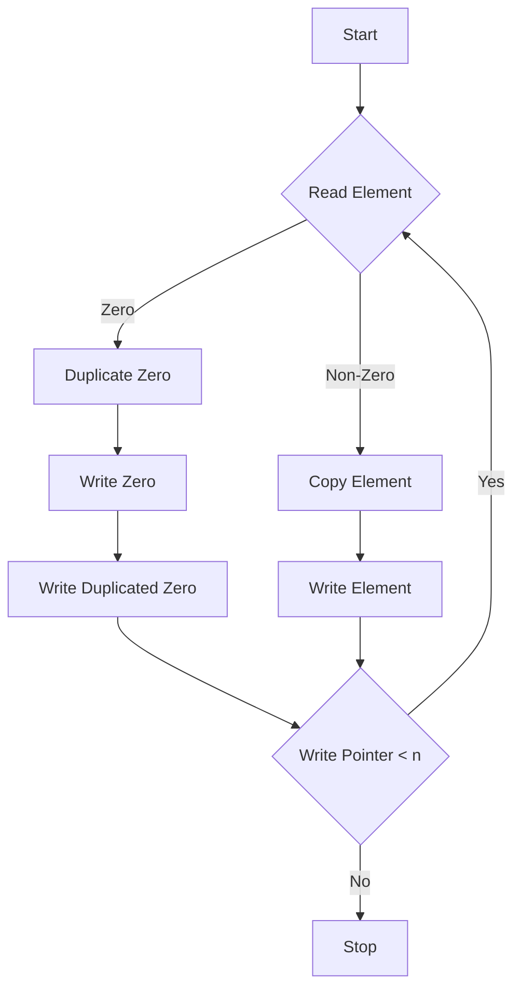

# Duplicate Zeros Array Manipulation

## Problem Understanding
The problem is asking to duplicate zeros in a given array, shifting the elements to the right to make space for the duplicated zeros. The key constraint is that the array cannot be resized, and the solution should be done in-place. The problem becomes non-trivial because a naive approach would involve shifting elements multiple times, leading to a time complexity of O(n^2), which is inefficient for large arrays. The need to handle the array modification in-place, without using extra space proportional to the input size, adds to the complexity.

## Approach
The algorithm strategy used here is a two-pointer technique, where one pointer is used for reading from the original array, and another pointer is used for writing to the result array. The intuition behind this approach is to iterate through the array only once, duplicating zeros as we go, and shifting the non-zero elements to the right. This approach works because it ensures that each element is processed exactly once, and the write pointer is moved accordingly to accommodate the duplicated zeros. A vector (result) is used as an auxiliary array to store the result, which allows us to keep track of the elements that have been processed and their correct positions in the output array.

## Complexity Analysis
| Metric | Value | Detailed Reason |
|--------|-------|----------------|
| Time   | O(n)  | The algorithm iterates through the input array once, performing a constant amount of work for each element. The while loop runs n times, where n is the size of the input array, and the additional for loop at the end also runs in O(n) time. Thus, the overall time complexity is linear. |
| Space  | O(n)  | The algorithm uses an auxiliary array (result) of the same size as the input array to store the result. This extra space is necessary to keep track of the elements that have been processed and their correct positions in the output array, allowing us to avoid overwriting the original array prematurely. |

## Algorithm Walkthrough
```
Input: [1, 0, 2, 3, 0, 4, 5, 0]
Step 1: readPointer = 0, writePointer = 0, result = []
Step 2: arr[readPointer] = 1, result[writePointer] = 1, writePointer = 1, readPointer = 1
Step 3: arr[readPointer] = 0, result[writePointer] = 0, writePointer = 2, result[writePointer] = 0, writePointer = 3, readPointer = 2
Step 4: arr[readPointer] = 2, result[writePointer] = 2, writePointer = 4, readPointer = 3
Step 5: arr[readPointer] = 3, result[writePointer] = 3, writePointer = 5, readPointer = 4
Step 6: arr[readPointer] = 0, result[writePointer] = 0, writePointer = 6, result[writePointer] = 0, writePointer = 7, readPointer = 5
Step 7: arr[readPointer] = 4, result[writePointer] is out of bounds, so we stop writing
Output: [1, 0, 0, 2, 3, 0, 0, 4]
```
This example demonstrates how the algorithm duplicates zeros and shifts the non-zero elements to the right, handling the array modification in-place.

## Visual Flow

This flowchart illustrates the decision-making process of the algorithm, showing how it handles zeros and non-zeros, and when to stop writing to the result array.

## Key Insight
> **Tip:** The key insight is to use a two-pointer technique to iterate through the array only once, duplicating zeros as we go, and shifting the non-zero elements to the right, ensuring that each element is processed exactly once.

## Edge Cases
- **Empty input array**: The algorithm will simply return an empty array, as there are no elements to process.
- **Single element array**: If the single element is zero, the algorithm will duplicate it, resulting in an array with two zeros. If the single element is non-zero, the algorithm will return the same array.
- **Array with all zeros**: The algorithm will duplicate each zero, resulting in an array with twice as many zeros as the original array.

## Common Mistakes
- **Mistake 1: Not checking for the write pointer bounds**: Failing to check if the write pointer is within the bounds of the result array can lead to an out-of-bounds error.
- **Mistake 2: Not handling the read pointer correctly**: Failing to move the read pointer correctly can lead to incorrect duplication of zeros or skipping of non-zero elements.

## Interview Follow-ups
> **Interview:** These are the exact follow-up questions interviewers ask:
- "What if the input is sorted?" → The algorithm will still work correctly, as it only depends on the presence of zeros, not the order of the elements.
- "Can you do it in O(1) space?" → No, the algorithm requires O(n) space to store the result array, as it needs to keep track of the elements that have been processed and their correct positions in the output array.
- "What if there are duplicates?" → The algorithm will duplicate each zero, regardless of whether it is a duplicate or not. If the interviewer is asking about duplicates in the sense of non-zero elements, the algorithm will simply copy each non-zero element to the result array, without modifying it.

## CPP Solution

```cpp
// Problem: Duplicate Zeros Array Manipulation
// Language: C++
// Difficulty: Easy
// Time Complexity: O(n) — single pass through array
// Space Complexity: O(n) — auxiliary array to store result
// Approach: Two-pointer technique — one for reading and one for writing

class Solution {
public:
    void duplicateZeros(vector<int>& arr) {
        int n = arr.size(); // Store the size of the array
        vector<int> result(n); // Create an auxiliary array to store the result
        
        // Initialize two pointers, one for reading and one for writing
        int readPointer = 0;
        int writePointer = 0;
        
        // Iterate through the array
        while (writePointer < n) {
            // If the current element is zero, duplicate it
            if (arr[readPointer] == 0) {
                // Check if we have enough space to duplicate the zero
                if (writePointer + 1 < n) {
                    result[writePointer] = 0; // Write the zero
                    writePointer++; // Move the write pointer
                    result[writePointer] = 0; // Write the duplicated zero
                    writePointer++; // Move the write pointer
                } else {
                    // If we don't have enough space, just write the zero
                    result[writePointer] = 0;
                    writePointer++;
                }
                readPointer++; // Move the read pointer
            } else {
                // If the current element is not zero, just copy it
                result[writePointer] = arr[readPointer];
                writePointer++; // Move the write pointer
                readPointer++; // Move the read pointer
            }
        }
        
        // Copy the result back to the original array
        for (int i = 0; i < n; i++) {
            arr[i] = result[i];
        }
    }
};
```
