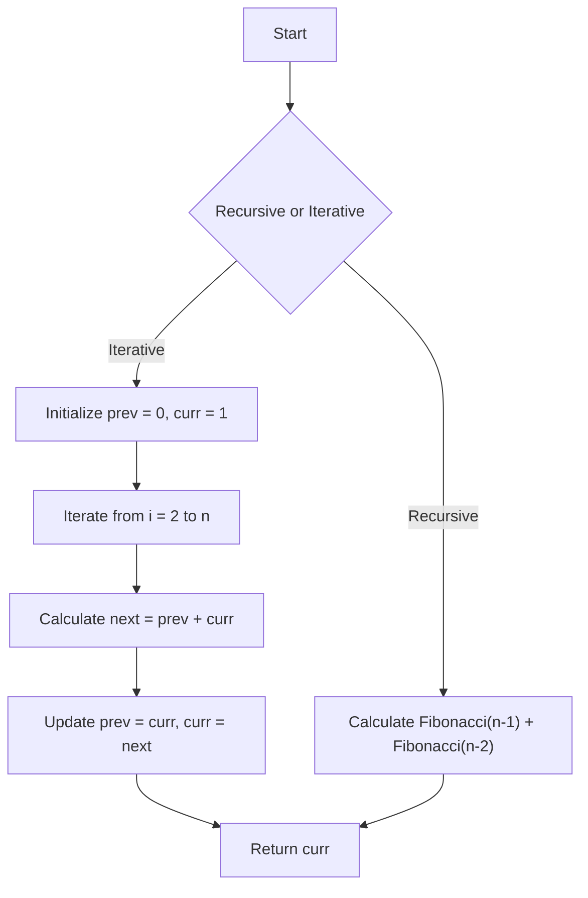

# Fibonacci using Recursion and Iteration

## Problem Understanding
The problem requires us to calculate the Fibonacci number at a given position using both recursive and iterative approaches. The Fibonacci sequence is a series of numbers where each number is the sum of the two preceding ones, usually starting with 0 and 1. The key constraint is that we need to implement both recursive and iterative methods, which have different time and space complexities. The recursive approach has an exponential time complexity due to repeated calculations, while the iterative approach has a linear time complexity. This problem is non-trivial because the naive recursive approach can lead to inefficient calculations, making the iterative approach more suitable for large inputs.

## Approach
The algorithm strategy involves using a recursive function to calculate the Fibonacci number by calling itself with decreasing values of n until it reaches the base case (n = 0 or n = 1). For the iterative approach, we use a loop to calculate the Fibonacci number by keeping track of the previous two numbers in the sequence. The mathematical reasoning behind this approach is based on the definition of the Fibonacci sequence, where each number is the sum of the two preceding ones. We use integer variables to store the previous two Fibonacci numbers and update them in each iteration. This approach handles the key constraint of calculating the Fibonacci number efficiently by avoiding repeated calculations.

## Complexity Analysis
| Metric | Value | Detailed Reason |
|--------|-------|----------------|
| Time   | O(n) for iterative, O(2^n) for recursive | The iterative approach has a linear time complexity because it only needs to iterate from 2 to n to calculate the Fibonacci number. The recursive approach has an exponential time complexity because it makes repeated calculations for the same values of n. |
| Space  | O(1) for iterative, O(n) for recursive | The iterative approach uses constant space because it only needs to store the previous two Fibonacci numbers. The recursive approach uses linear space because each recursive call adds a layer to the call stack, which can go up to n layers deep. |

## Algorithm Walkthrough
```
Input: n = 5
Step 1: Initialize prev = 0, curr = 1 (for iterative approach)
Step 2: Iterate from i = 2 to n (i = 2, 3, 4, 5)
  - Calculate next = prev + curr
  - Update prev = curr, curr = next
Step 3: Return curr (which is the Fibonacci number at position n)
Output: Fibonacci number at position 5 = 5
```

## Visual Flow


## Key Insight
> **Tip:** The key insight is that the iterative approach can avoid the repeated calculations of the recursive approach by keeping track of the previous two Fibonacci numbers, making it much more efficient for large inputs.

## Edge Cases
- **Empty/null input**: The function should handle invalid inputs by returning an error or a default value. In this case, we return -1 for negative inputs.
- **Single element**: The function should return the base case value (0 or 1) for inputs of 0 or 1.
- **Large input**: The function should be able to handle large inputs efficiently using the iterative approach.

## Common Mistakes
- **Mistake 1**: Using the recursive approach for large inputs, which can lead to a stack overflow due to the repeated calculations.
- **Mistake 2**: Not handling invalid inputs, such as negative numbers or non-integer values.

## Interview Follow-ups
> **Interview:** These are the exact follow-up questions interviewers ask:
- "What if the input is sorted?" → This is not applicable to the Fibonacci sequence problem, as the input is a single integer.
- "Can you do it in O(1) space?" → No, the iterative approach already uses O(1) space, and the recursive approach cannot be optimized to use O(1) space due to the recursive call stack.
- "What if there are duplicates?" → This is not applicable to the Fibonacci sequence problem, as each number in the sequence is unique.

## CPP Solution

```cpp
// Problem: Fibonacci using Recursion and Iteration
// Language: C++
// Difficulty: Easy
// Time Complexity: O(n) — for iterative approach, O(2^n) for recursive approach
// Space Complexity: O(1) — iterative approach uses constant space, O(n) for recursive call stack
// Approach: Fibonacci series calculation using both recursive and iterative methods

class Fibonacci {
public:
    // Recursive approach to calculate Fibonacci number
    int fibonacciRecursive(int n) {
        // Base case: if n is 0 or 1, return n
        if (n == 0 || n == 1) return n; // Base case for Fibonacci sequence
        // Recursive call: calculate Fibonacci number for n-1 and n-2
        return fibonacciRecursive(n-1) + fibonacciRecursive(n-2); // Calculate Fibonacci number recursively
    }

    // Iterative approach to calculate Fibonacci number
    int fibonacciIterative(int n) {
        // Edge case: if n is less than 0, return -1
        if (n < 0) return -1; // Handle negative input
        // Base case: if n is 0 or 1, return n
        if (n == 0 || n == 1) return n; // Base case for Fibonacci sequence
        // Initialize variables to store previous two Fibonacci numbers
        int prev = 0, curr = 1; // Initialize previous two Fibonacci numbers
        // Calculate Fibonacci number iteratively
        for (int i = 2; i <= n; i++) {
            // Calculate next Fibonacci number as sum of previous two
            int next = prev + curr; // Calculate next Fibonacci number
            // Update previous two Fibonacci numbers
            prev = curr; curr = next; // Update previous two Fibonacci numbers
        }
        return curr; // Return calculated Fibonacci number
    }
};

int main() {
    Fibonacci fib;
    // Test recursive approach
    int n = 10; // Input for Fibonacci calculation
    int resultRecursive = fib.fibonacciRecursive(n); // Calculate Fibonacci number using recursive approach
    // Test iterative approach
    int resultIterative = fib.fibonacciIterative(n); // Calculate Fibonacci number using iterative approach
    // Print results
    printf("Fibonacci number at position %d (recursive): %d\n", n, resultRecursive); // Print result for recursive approach
    printf("Fibonacci number at position %d (iterative): %d\n", n, resultIterative); // Print result for iterative approach
    return 0;
}
```
