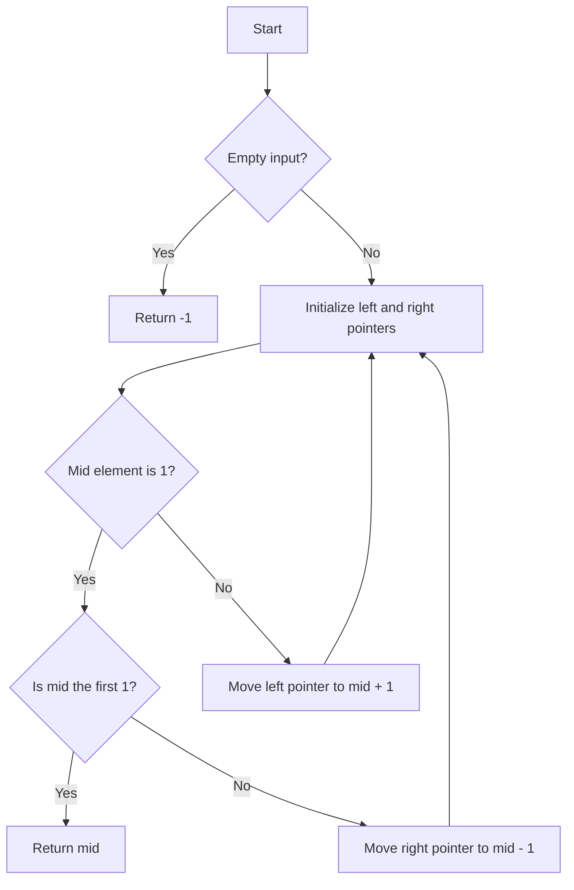

# Find Index of First 1 in Sorted Binary Array

## Problem Understanding
The problem asks to find the index of the first occurrence of 1 in a sorted binary array. The key constraint is that the array is sorted, which implies that all 0s are on the left side of the first 1, and all 1s are on the right side. This makes the problem non-trivial because a naive approach of scanning the array from left to right would have a time complexity of O(n), which is inefficient for large arrays.

## Approach
The algorithm strategy is to use a modified binary search to find the first occurrence of 1 in the sorted binary array. The intuition behind this approach is that binary search is efficient for finding elements in a sorted array, and by modifying it to find the first occurrence of 1, we can take advantage of the fact that the array is sorted. The approach works by maintaining two pointers, `left` and `right`, and iteratively moving them based on the value of the middle element. If the middle element is 1, we check if it is the first 1 by checking the previous element. If it is, we return the index of the first 1. If not, we continue searching in the left half. If the middle element is 0, we know that the first 1 must be in the right half, so we move the `left` pointer to the middle + 1.

## Complexity Analysis
| Metric | Value | Detailed Reason |
|--------|-------|----------------|
| Time   | O(log n) | The algorithm uses a modified binary search, which divides the search space in half at each step. This results in a logarithmic time complexity. The while loop runs until the `left` and `right` pointers meet, which takes O(log n) steps. |
| Space  | O(1) | The algorithm uses a constant amount of space to store the `left`, `right`, and `mid` indices, as well as the input array. The space complexity is O(1) because the space usage does not grow with the size of the input array. |

## Algorithm Walkthrough
```
Input: [0, 0, 0, 1, 1, 1]
Step 1: left = 0, right = 5
Step 2: mid = 2, nums[mid] = 0, so left = 3
Step 3: mid = 4, nums[mid] = 1, so we check if mid is the first 1
Step 4: Since nums[mid - 1] = 0, mid is the first 1, so we return mid = 3
Output: 3
```
This example illustrates how the algorithm finds the index of the first 1 in a sorted binary array.

## Visual Flow

This flowchart illustrates the decision-making process of the algorithm.

## Key Insight
> **Tip:** The key insight is to use a modified binary search to find the first occurrence of 1 in the sorted binary array, taking advantage of the fact that the array is sorted to reduce the search space.

## Edge Cases
- **Empty/null input**: If the input array is empty, the algorithm returns -1, indicating that there is no 1 in the array.
- **Single element**: If the input array has only one element, the algorithm returns 0 if the element is 1, and -1 if the element is 0.
- **All 0s**: If the input array contains only 0s, the algorithm returns -1, indicating that there is no 1 in the array.

## Common Mistakes
- **Mistake 1**: Not checking if the input array is empty before accessing its elements. To avoid this, always check if the input array is empty before proceeding with the algorithm.
- **Mistake 2**: Not updating the `left` and `right` pointers correctly. To avoid this, make sure to update the pointers based on the value of the middle element.

## Interview Follow-ups
> **Interview:** These are the exact follow-up questions interviewers ask:
- "What if the input is not sorted?" → The algorithm assumes that the input array is sorted, so if the input is not sorted, the algorithm may not work correctly. To handle this, we can sort the array before applying the algorithm, but this would increase the time complexity to O(n log n).
- "Can you do it in O(1) space?" → The algorithm already uses O(1) space, so this is not a concern.
- "What if there are duplicates?" → The algorithm is designed to find the first occurrence of 1, so if there are duplicates, the algorithm will still return the index of the first 1.

## CPP Solution

```cpp
// Problem: Find Index of First 1 in Sorted Binary Array
// Language: C++
// Difficulty: Easy
// Time Complexity: O(log n) — using binary search
// Space Complexity: O(1) — constant space
// Approach: Modified binary search — find the first occurrence of 1

class Solution {
public:
    int findFirst1Index(vector<int>& nums) {
        // Edge case: empty input → return -1
        if (nums.empty()) return -1;

        int left = 0; // left pointer
        int right = nums.size() - 1; // right pointer

        while (left <= right) {
            // calculate mid index
            int mid = left + (right - left) / 2;

            // if mid element is 1, we found a potential first 1
            if (nums[mid] == 1) {
                // if mid is the first element or the previous element is 0, mid is the first 1
                if (mid == 0 || nums[mid - 1] == 0) {
                    return mid; // return the index of the first 1
                }
                // if mid is not the first 1, continue searching in the left half
                else {
                    right = mid - 1; // move right pointer to mid - 1
                }
            }
            // if mid element is 0, the first 1 must be in the right half
            else {
                left = mid + 1; // move left pointer to mid + 1
            }
        }

        // Edge case: no 1 found in the array → return -1
        return -1;
    }
};
```
