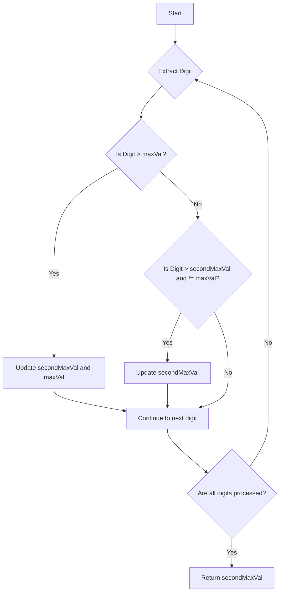

# Find Second Largest Element

## Problem Understanding
The problem is asking to find the second largest digit in a given integer. The key constraint is that we need to find the second largest digit, not the second largest number. This problem is non-trivial because a naive approach might involve sorting all the digits, which would have a time complexity of O(n log n). However, since we only need to find the second largest digit, we can solve this problem more efficiently.

## Approach
The algorithm strategy is to use a linear scan to track the maximum and second maximum digits. We iterate through each digit of the input number, updating the maximum and second maximum values as we go. This approach works because we only need to keep track of two values: the maximum and the second maximum. We use a simple if-else statement to update these values. The data structure used is a constant amount of space to store the maximum and second maximum values.

## Complexity Analysis
| Metric | Value | Detailed Reason |
|--------|-------|----------------|
| Time   | O(log n) | The time complexity is O(log n) because we are iterating through each digit of the input number. The number of digits in a number is proportional to the logarithm of the number. |
| Space  | O(1) | The space complexity is O(1) because we are only using a constant amount of space to store the maximum and second maximum values. |

## Algorithm Walkthrough
```
Input: 1234
Step 1: Extract the last digit (4) and update maxVal (4) and secondMaxVal (-1)
    maxVal: 4, secondMaxVal: -1
Step 2: Extract the last digit (3) and update maxVal (4) and secondMaxVal (3)
    maxVal: 4, secondMaxVal: 3
Step 3: Extract the last digit (2) and update maxVal (4) and secondMaxVal (3)
    maxVal: 4, secondMaxVal: 3
Step 4: Extract the last digit (1) and update maxVal (4) and secondMaxVal (3)
    maxVal: 4, secondMaxVal: 3
Output: 3
```
## Visual Flow

## Key Insight
> **Tip:** The key insight to this problem is to realize that we only need to keep track of two values: the maximum and the second maximum. This allows us to solve the problem in a single pass through the digits.

## Edge Cases
- **Negative input**: If the input is negative, we return -1 because the problem statement does not define what to do with negative numbers.
- **Single digit**: If the input is a single digit, we return -1 because there is no second largest digit.
- **All digits are the same**: If all digits are the same, we return -1 because there is no second largest digit.

## Common Mistakes
- **Mistake 1**: Not initializing the secondMaxVal to -1, which can cause incorrect results if the input number has less than two distinct digits.
- **Mistake 2**: Not checking if the current digit is not equal to the maxVal before updating the secondMaxVal, which can cause incorrect results if the input number has duplicate digits.

## Interview Follow-ups
> **Interview:** These are the exact follow-up questions interviewers ask:
- "What if the input is sorted?" → The algorithm still works because we are only interested in the maximum and second maximum digits, not the order of the digits.
- "Can you do it in O(1) space?" → No, because we need to store the maximum and second maximum values, which requires a constant amount of space.
- "What if there are duplicates?" → The algorithm handles duplicates correctly by only updating the secondMaxVal if the current digit is not equal to the maxVal.

## CPP Solution

```cpp
// Problem: Find Second Largest Element
// Language: C++
// Difficulty: Easy
// Time Complexity: O(n) — single pass through array
// Space Complexity: O(1) — only a constant amount of space is used
// Approach: Linear scan — tracking the maximum and second maximum elements

class Solution {
public:
    int secondHighest(int number) {
        // Initialize variables to store maximum and second maximum values
        int maxVal = -1;  // Assume -1 as initial max value
        int secondMaxVal = -1;  // Assume -1 as initial second max value

        // Edge case: empty input → return -1
        // However, since we're dealing with a single integer, 
        // we can't really have an empty input, so we'll just return -1 if the input is negative
        if (number < 0) {
            return -1;
        }

        // Extract digits from the input number
        while (number > 0) {
            int digit = number % 10;  // Extract the last digit
            number /= 10;  // Remove the last digit

            // Update maximum and second maximum values
            if (digit > maxVal) {
                secondMaxVal = maxVal;  // Update second max value
                maxVal = digit;  // Update max value
            } else if (digit > secondMaxVal && digit != maxVal) {
                secondMaxVal = digit;  // Update second max value if the current digit is not the max value
            }
        }

        // Return the second maximum value
        return secondMaxVal;
    }
};
```
