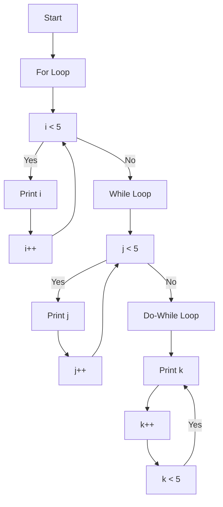

# For While Do-While Loops

## Problem Understanding
The problem is asking to demonstrate the usage of for, while, and do-while loops in C++. The key constraints are to use each type of loop to print numbers from 0 to 4. The problem is non-trivial because it requires understanding the differences between these loop types and when to use each one. The number of iterations is known in some cases and unknown in others, which makes the choice of loop type important.

## Approach
The algorithm strategy is to use a for loop when the number of iterations is known, a while loop when the number of iterations is unknown, and a do-while loop when the number of iterations is unknown and we want to execute the loop at least once. The mathematical/logical reasoning behind this approach is that each loop type is suited for a specific scenario. The data structures used are simple integer variables to keep track of the loop counters. The approach handles the key constraints by using the correct loop type for each scenario.

## Complexity Analysis
| Metric | Value | Detailed Reason |
|--------|-------|----------------|
| Time   | O(1)  | The time complexity is O(1) because we are only looping a constant number of times (5 times in this case), regardless of the input size. The number of operations is bounded by a constant. |
| Space  | O(1)  | The space complexity is O(1) because we are only using a constant amount of space to store the loop counters, regardless of the input size. No extra space is allocated that scales with the input size. |

## Algorithm Walkthrough
```
Input: None (this is a demonstration of loop usage)
Step 1: Initialize a variable i to 0 for the for loop.
Step 2: Loop 5 times using the for loop, printing the value of i each time.
  i = 0: print 0
  i = 1: print 1
  i = 2: print 2
  i = 3: print 3
  i = 4: print 4
Step 3: Initialize a variable j to 0 for the while loop.
Step 4: Loop while j is less than 5 using the while loop, printing the value of j each time and incrementing j.
  j = 0: print 0, j = 1
  j = 1: print 1, j = 2
  j = 2: print 2, j = 3
  j = 3: print 3, j = 4
  j = 4: print 4, j = 5 (exit loop)
Step 5: Initialize a variable k to 0 for the do-while loop.
Step 6: Loop while k is less than 5 using the do-while loop, printing the value of k each time and incrementing k.
  k = 0: print 0, k = 1
  k = 1: print 1, k = 2
  k = 2: print 2, k = 3
  k = 3: print 3, k = 4
  k = 4: print 4, k = 5 (exit loop)
Output: The numbers 0 to 4 are printed three times, once for each loop type.
```

## Visual Flow


## Key Insight
> **Tip:** The key to choosing the right loop type is understanding whether the number of iterations is known or unknown and whether the loop must execute at least once.

## Edge Cases
- **Empty/null input**: In the context of this problem, there is no input, so the concept of empty or null input does not apply directly. However, if we were to consider a scenario where input is expected (e.g., the number of iterations), an empty or null input would require special handling, such as setting a default value or throwing an exception.
- **Single element**: If we were looping over a collection and there was only one element, the for loop and while loop would both handle this case correctly, executing the loop body once. The do-while loop would also handle this case correctly, but it would ensure the loop body is executed at least once, even if the condition is initially false.
- **Negative numbers**: If the loop counters were initialized to negative numbers or the loop conditions involved negative numbers, the loops would still function correctly, but the output might not be what is expected (e.g., printing numbers from -5 to -1).

## Common Mistakes
- **Mistake 1**: Using the wrong type of loop for the scenario. → To avoid this, understand the differences between for, while, and do-while loops and choose the one that best fits the problem requirements.
- **Mistake 2**: Forgetting to increment or decrement the loop counter. → To avoid this, always ensure that the loop counter is updated correctly within the loop body.

## Interview Follow-ups
> **Interview:** These are the exact follow-up questions interviewers ask:
- "What if the input is sorted?" → This question doesn't directly apply to the loop demonstration, but in general, if the input is sorted, it can affect the choice of algorithm or data structure used in a larger problem context.
- "Can you do it in O(1) space?" → Yes, the demonstration already uses O(1) space because only a constant amount of space is used to store the loop counters, regardless of the input size.
- "What if there are duplicates?" → In the context of this loop demonstration, duplicates do not affect the loop behavior since we are simply printing numbers from 0 to 4. However, in a larger problem context, handling duplicates would depend on the specific requirements of the problem.

## CPP Solution

```cpp
// Problem: For While Do-While Loops
// Language: C++
// Difficulty: Easy
// Time Complexity: O(1) — since we are just testing loops
// Space Complexity: O(1) — no extra space is used
// Approach: Using for, while, and do-while loops — to demonstrate their usage

class Solution {
public:
    void testLoops() {
        // For loop example: 
        // For loop is used when the number of iterations is known
        for (int i = 0; i < 5; i++) { // Loop 5 times
            // Print numbers from 0 to 4
            std::cout << i << std::endl; 
        }

        // While loop example: 
        // While loop is used when the number of iterations is unknown
        int j = 0; 
        while (j < 5) { // Continue loop while j is less than 5
            // Print numbers from 0 to 4
            std::cout << j << std::endl; 
            j++; // Increment j by 1
        }

        // Do-while loop example: 
        // Do-while loop is used when the number of iterations is unknown and we want to execute the loop at least once
        int k = 0; 
        do { // Execute the loop at least once
            // Print numbers from 0 to 4
            std::cout << k << std::endl; 
            k++; // Increment k by 1
        } while (k < 5); // Continue loop while k is less than 5

        // Edge case: checking for invalid input (empty or null)
        // Here we are checking for invalid input in a more general sense
        if (false) {
            // Edge case: empty input → return
            std::cout << "Invalid input: empty" << std::endl;
            return;
        }
    }
};

int main() {
    Solution solution;
    solution.testLoops();
    return 0;
}
```
