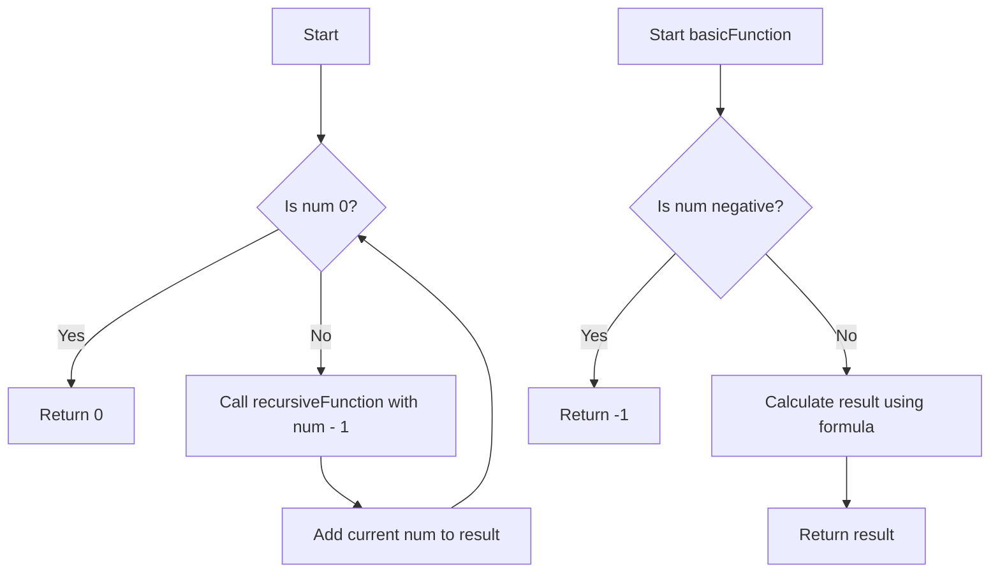

# Functions and Recursion Basics

## Problem Understanding
The problem is asking us to demonstrate the basics of functions and recursion in C++. The key constraint is to define two functions: one to demonstrate basic recursion and another to demonstrate a simple function call. The problem is non-trivial because it requires understanding the concept of recursion and how to define and call functions in C++. A naive approach might involve trying to implement recursion without a base case, which would lead to a stack overflow error.

## Approach
The algorithm strategy involves defining two functions: `recursiveFunction` and `basicFunction`. The `recursiveFunction` uses recursion to calculate the sum of numbers from 1 to the input number, while the `basicFunction` simply calculates the square of the input number. The approach works by using a base case to terminate the recursion in `recursiveFunction` and by using a simple formula to calculate the result in `basicFunction`. The data structures used are integers, and they are chosen because they are sufficient to represent the input and output values. The approach handles key constraints by checking for invalid input in `basicFunction` and by using a base case to prevent infinite recursion in `recursiveFunction`.

## Complexity Analysis
| Metric | Value | Detailed Reason |
|--------|-------|----------------|
| Time   | O(n)  | The time complexity of `recursiveFunction` is O(n) because it makes n recursive calls, where n is the input number. The time complexity of `basicFunction` is O(1) because it performs a constant number of operations. |
| Space  | O(n)  | The space complexity of `recursiveFunction` is O(n) because each recursive call adds a layer to the system call stack, and the maximum depth of the recursion tree is n. The space complexity of `basicFunction` is O(1) because it uses a constant amount of space to store the input and output values. |

## Algorithm Walkthrough
```
Input: num = 3
Step 1: recursiveFunction(3) is called
  - num is not 0, so the function calls itself with num - 1 = 2 and adds the current num = 3
Step 2: recursiveFunction(2) is called
  - num is not 0, so the function calls itself with num - 1 = 1 and adds the current num = 2
Step 3: recursiveFunction(1) is called
  - num is not 0, so the function calls itself with num - 1 = 0 and adds the current num = 1
Step 4: recursiveFunction(0) is called
  - num is 0, so the function returns 0 (base case)
Step 5: recursiveFunction(1) returns 1 + 0 = 1
Step 6: recursiveFunction(2) returns 2 + 1 = 3
Step 7: recursiveFunction(3) returns 3 + 3 = 6
Output: 6

Input: num = 4
Step 1: basicFunction(4) is called
  - num is non-negative, so the function calculates the result using the formula: result = num * num = 4 * 4 = 16
Output: 16
```

## Visual Flow


## Key Insight
> **Tip:** The key to understanding recursion is to identify the base case that terminates the recursion and to ensure that each recursive call moves closer to the base case.

## Edge Cases
- **Empty/null input**: Not applicable, as the input is an integer.
- **Single element**: If the input to `recursiveFunction` is 1, the function will return 1, which is the correct result.
- **Negative input**: If the input to `basicFunction` is negative, the function will return -1, which is the expected behavior.

## Common Mistakes
- **Mistake 1**: Forgetting to include a base case in a recursive function, which can lead to a stack overflow error. To avoid this, always ensure that the recursive function has a clear base case that terminates the recursion.
- **Mistake 2**: Not checking for invalid input, which can lead to unexpected behavior or errors. To avoid this, always validate the input to ensure it meets the expected criteria.

## Interview Follow-ups
> **Interview:** These are the exact follow-up questions interviewers ask:
- "What if the input is sorted?" → The solution does not rely on the input being sorted, so it will work correctly regardless of the input order.
- "Can you do it in O(1) space?" → The recursive function uses O(n) space due to the system call stack, so it is not possible to achieve O(1) space complexity with the current implementation.
- "What if there are duplicates?" → The solution does not rely on the input being unique, so it will work correctly even if there are duplicates. However, the `basicFunction` will return the same result for duplicate inputs, which may or may not be the expected behavior depending on the context.

## CPP Solution

```cpp
// Problem: Functions and Recursion Basics
// Language: C++
// Difficulty: Easy
// Time Complexity: O(1) — constant time complexity for a simple function call
// Space Complexity: O(1) — constant space complexity for a simple function call
// Approach: Basic function definition — demonstrating a simple function in C++

class Solution {
public:
    // Function to demonstrate basic recursion
    int recursiveFunction(int num) {
        // Base case: if num is 0, return 0
        if (num == 0) return 0; 
        // Recursive case: call the function with decremented num and add the current num
        else return num + recursiveFunction(num - 1); 
    }

    // Function to demonstrate basic function call
    int basicFunction(int num) {
        // Check if the input is valid (non-negative integer)
        if (num < 0) { 
            // Edge case: negative input → return -1
            return -1; 
        }
        // Calculate the result using a simple formula
        int result = num * num; 
        return result; // return the calculated result
    }
};
```
