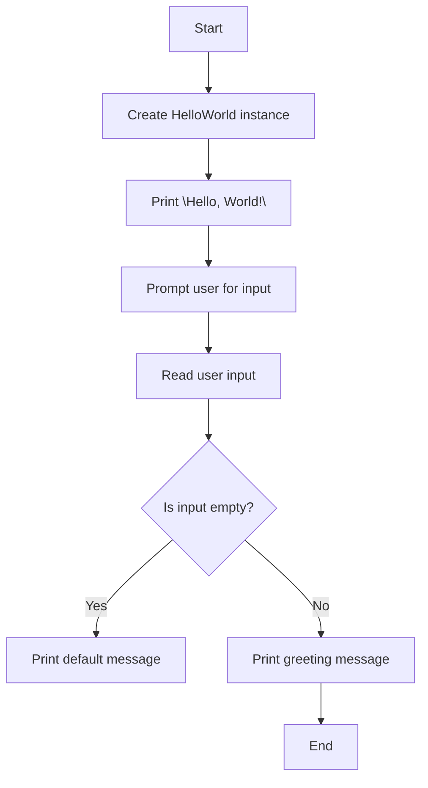

# Hello World and Basic I/O in C++

## Problem Understanding
The problem is asking to create a simple C++ program that demonstrates basic input/output operations, including printing "Hello, World!" to the console and reading user input. The key constraint is to use standard C++ input/output streams, specifically `cout` and `cin`, for console I/O. What makes this problem non-trivial is handling edge cases, such as empty user input, and understanding the implications of using `cin` for input, which can fail if the input is not in the expected format. The problem requires a basic understanding of C++ syntax and input/output streams.

## Approach
The algorithm strategy is to use the `cout` object for console output and the `cin` object for console input. The intuition behind this approach is that `cout` and `cin` are the standard C++ input/output streams that provide a simple and efficient way to perform console I/O operations. The `HelloWorld` class encapsulates the `printHelloWorld` and `basicIO` methods, which demonstrate the basic usage of `cout` and `cin`. The `basicIO` method uses a `std::string` variable to store user input and handles the edge case of empty input by printing a default message. The approach works because `cout` and `cin` are designed to handle console I/O operations in a straightforward and efficient manner.

## Complexity Analysis
| Metric | Value | Detailed Reason |
|--------|-------|----------------|
| Time   | O(1)  | The time complexity is constant because the program performs a fixed number of operations, including printing a message and reading user input, regardless of the input size. The `cout` and `cin` operations are also constant time. |
| Space  | O(1)  | The space complexity is constant because the program uses a fixed amount of memory to store the `HelloWorld` object and the `userInput` variable, regardless of the input size. The `cout` and `cin` objects are also fixed-size objects. |

## Algorithm Walkthrough
```
Input: User runs the program
Step 1: The `main` function creates an instance of the `HelloWorld` class.
Step 2: The `printHelloWorld` method is called, which prints "Hello, World!" to the console using `cout`.
Step 3: The `basicIO` method is called, which prompts the user to enter their name using `cout`.
Step 4: The user enters their name, which is read using `cin` and stored in the `userInput` variable.
Step 5: If the user input is empty, a default message is printed using `cout`. Otherwise, a greeting message with the user's name is printed using `cout`.
Output: The program prints "Hello, World!" and a greeting message with the user's name, or a default message if the input is empty.
```

## Visual Flow


## Key Insight
> **Tip:** The key insight is to use `cout` and `cin` for console I/O operations, which provides a simple and efficient way to perform input/output operations in C++.

## Edge Cases
- **Empty/null input**: If the user enters an empty string, the program prints a default message. This is handled by checking if the `userInput` variable is empty using the `empty()` method.
- **Single element**: If the user enters a single character or a short string, the program prints a greeting message with the user's input. This is handled by using the `std::string` class, which can store strings of any length.
- **Non-string input**: If the user enters a non-string input, such as a number, the program will still read the input using `cin` but may not behave as expected. This is because `cin` is designed to read input in a specific format, and non-string input may cause the input operation to fail.

## Common Mistakes
- **Mistake 1**: Using `cout` without including the `iostream` header file. To avoid this, always include the necessary header files for the input/output streams.
- **Mistake 2**: Using `cin` without checking if the input operation was successful. To avoid this, always check the state of the input stream after reading input using `cin`.

## Interview Follow-ups
> **Interview:** These are the exact follow-up questions interviewers ask:
- "What if the input is sorted?" → The program does not assume any specific ordering of the input, so it will still work correctly even if the input is sorted.
- "Can you do it in O(1) space?" → The program already uses O(1) space, so this is not a concern.
- "What if there are duplicates?" → The program does not assume that the input is unique, so it will still work correctly even if there are duplicates. However, the program may not behave as expected if the duplicates are not handled properly.

## CPP Solution

```cpp
// Problem: Hello World and Basic I/O in C++
// Language: C++
// Difficulty: Easy
// Time Complexity: O(1) — constant time complexity for simple I/O operations
// Space Complexity: O(1) — constant space complexity for basic variables
// Approach: Standard C++ input/output streams — using cout and cin for console I/O

#include <iostream>
#include <string> // For string input/output

class HelloWorld {
public:
    // Method to print "Hello, World!" to the console
    void printHelloWorld() {
        // Using cout for console output
        std::cout << "Hello, World!" << std::endl;
    }

    // Method to demonstrate basic I/O
    void basicIO() {
        // Declare a variable to store user input
        std::string userInput;

        // Prompt the user for input
        std::cout << "Please enter your name: ";

        // Read user input using cin
        std::cin >> userInput;

        // Edge case: empty input → print a default message
        if (userInput.empty()) {
            std::cout << "You didn't enter your name." << std::endl;
        } else {
            // Print a greeting message with the user's name
            std::cout << "Hello, " << userInput << "!" << std::endl;
        }
    }
};

int main() {
    // Create an instance of the HelloWorld class
    HelloWorld helloWorld;

    // Call the method to print "Hello, World!"
    helloWorld.printHelloWorld();

    // Call the method for basic I/O demonstration
    helloWorld.basicIO();

    return 0; // Successful execution
}
```
