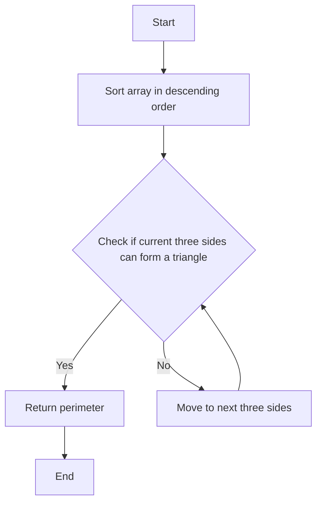

# Largest Perimeter Triangle Sorting

## Problem Understanding
The problem is asking to find the largest possible perimeter of a triangle given an array of integers representing the sides of the triangle. The key constraint is that the sides must satisfy the triangle inequality theorem, which states that the sum of the lengths of any two sides of a triangle must be greater than the length of the third side. This problem is non-trivial because a naive approach of checking all possible combinations of sides would result in a time complexity of O(n^3), which is inefficient. The given solution code uses a sorting and two-pointer technique to solve the problem efficiently.

## Approach
The algorithm strategy is to sort the array in descending order and then iterate over the array to find the largest perimeter triangle. The intuition behind this approach is that the largest possible perimeter will be formed by the largest sides, so sorting the array in descending order allows us to find the largest perimeter triangle first. The triangle inequality theorem is used to check if the current three sides can form a triangle. The approach handles the key constraint by checking the triangle inequality theorem for each set of three sides. The data structure used is a vector, which is chosen because it allows for efficient sorting and iteration.

## Complexity Analysis
| Metric | Value | Detailed Reason |
|--------|-------|----------------|
| Time   | O(n log n) | The time complexity is O(n log n) because the array is sorted using the `sort` function, which has a time complexity of O(n log n). The subsequent iteration over the array has a time complexity of O(n), but it is dominated by the sorting step. |
| Space  | O(1) | The space complexity is O(1) because the algorithm only uses a constant amount of space to store the indices and the perimeter, and does not use any data structures that grow with the size of the input. |

## Algorithm Walkthrough
```
Input: [3, 6, 2, 3]
Step 1: Sort the array in descending order: [6, 3, 3, 2]
Step 2: Check if the first three sides can form a triangle: 6 < 3 + 3 = 6 (no)
Step 3: Check if the next three sides can form a triangle: 3 < 3 + 2 = 5 (yes)
Step 4: Return the perimeter: 3 + 3 + 2 = 8
Output: 8
```
This example exercises the main logic path of the algorithm, which is to sort the array and then check for the largest perimeter triangle.

## Visual Flow

This flowchart shows the decision flow of the algorithm, which checks if the current three sides can form a triangle and returns the perimeter if they can.

## Key Insight
> **Tip:** The key insight is to sort the array in descending order to find the largest possible perimeter triangle first, and then use the triangle inequality theorem to check if the current three sides can form a triangle.

## Edge Cases
- **Empty input**: If the input array is empty, the algorithm returns 0 because no triangle can be formed.
- **Single element**: If the input array has only one element, the algorithm returns 0 because a triangle must have at least three sides.
- **Duplicate sides**: If the input array has duplicate sides, the algorithm will still work correctly because the sorting step will group the duplicate sides together, and the triangle inequality theorem will be checked for each set of three sides.

## Common Mistakes
- **Mistake 1**: Not checking for the triangle inequality theorem when checking if the current three sides can form a triangle. To avoid this mistake, make sure to check if the sum of the lengths of any two sides is greater than the length of the third side.
- **Mistake 2**: Not sorting the array in descending order before checking for the largest perimeter triangle. To avoid this mistake, make sure to sort the array in descending order using the `sort` function.

## Interview Follow-ups
> **Interview:** These are the exact follow-up questions interviewers ask:
- "What if the input is sorted?" → The algorithm will still work correctly, but the time complexity will be O(n) because the sorting step will be skipped.
- "Can you do it in O(1) space?" → No, the algorithm cannot be done in O(1) space because the input array must be sorted, which requires O(n log n) space in the worst case.
- "What if there are duplicates?" → The algorithm will still work correctly because the sorting step will group the duplicate sides together, and the triangle inequality theorem will be checked for each set of three sides.

## CPP Solution

```cpp
// Problem: Largest Perimeter Triangle Sorting
// Language: cpp
// Difficulty: Easy
// Time Complexity: O(n log n) — sorting the array
// Space Complexity: O(1) — not using any extra space
// Approach: Sorting and two-pointer technique — sorting the array and then checking for the largest perimeter triangle

class Solution {
public:
    int largestPerimeter(vector<int>& nums) {
        // Sorting the array in descending order
        sort(nums.rbegin(), nums.rend()); // This is to get the largest possible perimeter
        
        // Edge case: empty input → return 0
        if (nums.size() < 3) return 0; // A triangle must have at least 3 sides

        // Iterate over the array to find the largest perimeter triangle
        for (int i = 0; i < nums.size() - 2; i++) {
            // Check if the current three sides can form a triangle
            if (nums[i] < nums[i + 1] + nums[i + 2]) { // Triangle inequality theorem
                // If they can form a triangle, return the perimeter
                return nums[i] + nums[i + 1] + nums[i + 2]; // This is the largest possible perimeter
            }
        }
        
        // If no such triangle is found, return 0
        return 0; // No triangle can be formed
    }
};
```
