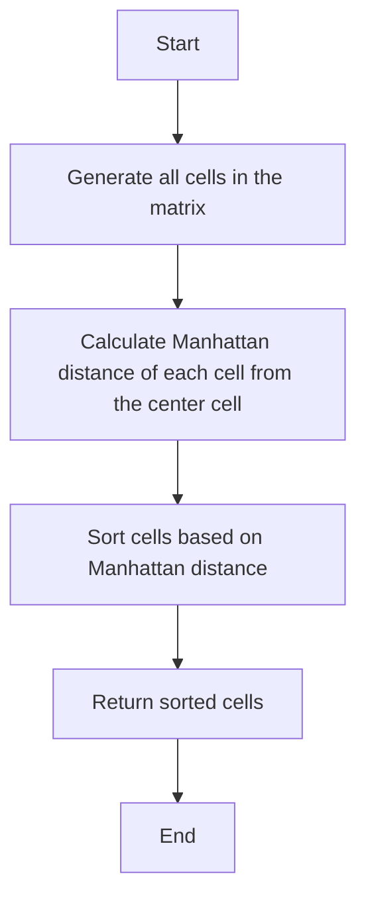

# Matrix Cells in Distance Order Sorting

## Problem Understanding
The problem requires sorting matrix cells in distance order from a given center cell. The key constraint is that the distance between two cells is calculated using the Manhattan distance (also known as L1 distance), which is the sum of the absolute differences in their x and y coordinates. This problem is non-trivial because it involves calculating the distance of each cell from the center cell and then sorting the cells based on these distances, which cannot be achieved through a simple naive approach.

## Approach
The algorithm strategy is to generate all the cells in the matrix and then sort them based on their Manhattan distance from the given center cell. The intuition behind this approach is that it allows us to efficiently calculate the distance of each cell from the center and then sort the cells based on these distances. A lambda function is used as the comparison function for the sort, which calculates the Manhattan distance of each cell from the center cell. The approach handles the key constraint of calculating the Manhattan distance by using the absolute difference in x and y coordinates.

## Complexity Analysis
| Metric | Value | Detailed Reason |
|--------|-------|----------------|
| Time   | O(m * n * log(m * n)) | The time complexity is dominated by the sorting operation, which has a time complexity of O(n log n) in C++. Here, n is the total number of cells in the matrix, which is m * n, where m is the number of rows and n is the number of columns. The sorting operation is performed on all cells, resulting in a time complexity of O(m * n * log(m * n)). |
| Space  | O(m * n) | The space complexity is O(m * n) because we need to store all the cells in the result vector. |

## Algorithm Walkthrough
```
Input: rows = 2, cols = 2, rCenter = 0, cCenter = 0
Step 1: Generate all the cells in the matrix
    - cells = [[0, 0], [0, 1], [1, 0], [1, 1]]
Step 2: Calculate the Manhattan distance of each cell from the center cell
    - dist[[0, 0]] = abs(0 - 0) + abs(0 - 0) = 0
    - dist[[0, 1]] = abs(0 - 0) + abs(1 - 0) = 1
    - dist[[1, 0]] = abs(1 - 0) + abs(0 - 0) = 1
    - dist[[1, 1]] = abs(1 - 0) + abs(1 - 0) = 2
Step 3: Sort the cells based on their Manhattan distance from the center cell
    - sorted_cells = [[0, 0], [0, 1], [1, 0], [1, 1]]
Output: [[0, 0], [0, 1], [1, 0], [1, 1]]
```

## Visual Flow


## Key Insight
> **Tip:** The key insight is to use the Manhattan distance (L1 distance) to calculate the distance between two cells, which allows for efficient sorting of the cells based on their distance from the center cell.

## Edge Cases
- **Empty matrix**: If the matrix is empty (i.e., rows = 0 or cols = 0), the function will return an empty vector.
- **Single cell**: If the matrix contains only one cell, the function will return a vector containing that single cell.
- **Center cell at the boundary**: If the center cell is at the boundary of the matrix, the function will still correctly calculate the Manhattan distance of each cell from the center cell.

## Common Mistakes
- **Mistake 1**: Using the Euclidean distance instead of the Manhattan distance to calculate the distance between two cells. To avoid this, use the absolute difference in x and y coordinates to calculate the Manhattan distance.
- **Mistake 2**: Not sorting the cells based on their Manhattan distance from the center cell. To avoid this, use a sorting algorithm (such as the sort function in C++) to sort the cells based on their Manhattan distance.

## Interview Follow-ups
> **Interview:** These are the exact follow-up questions interviewers ask:
- "What if the input is sorted?" → The time complexity would still be O(m * n * log(m * n)) because the sorting operation is still required to sort the cells based on their Manhattan distance.
- "Can you do it in O(1) space?" → No, it is not possible to solve this problem in O(1) space because we need to store all the cells in the result vector, which requires O(m * n) space.
- "What if there are duplicates?" → If there are duplicate cells, the function will still correctly calculate the Manhattan distance of each cell from the center cell and sort the cells based on their distance. However, the duplicates will be preserved in the sorted output.

## CPP Solution

```cpp
// Problem: Matrix Cells in Distance Order Sorting
// Language: C++
// Difficulty: Easy
// Time Complexity: O(m * n * log(m * n)) — sorting the cells based on distance
// Space Complexity: O(m * n) — storing the cells in the result vector
// Approach: Priority queue or sorting — sorting the cells based on their distance from the given cell

class Solution {
public:
    vector<vector<int>> allCellsDistOrder(int rows, int cols, int rCenter, int cCenter) {
        // Generate all the cells in the matrix
        vector<vector<int>> cells;
        for (int i = 0; i < rows; i++) {  // Loop through each row
            for (int j = 0; j < cols; j++) {  // Loop through each column
                cells.push_back({i, j});  // Add the cell to the result vector
            }
        }

        // Sort the cells based on their distance from the given cell
        sort(cells.begin(), cells.end(), [rCenter, cCenter](const vector<int>& a, const vector<int>& b) {
            // Calculate the distance of each cell from the given cell
            int distA = abs(a[0] - rCenter) + abs(a[1] - cCenter);  // Manhattan distance of cell a
            int distB = abs(b[0] - rCenter) + abs(b[1] - cCenter);  // Manhattan distance of cell b
            return distA < distB;  // Sort based on the distance
        });

        return cells;  // Return the sorted cells
    }
};
```
