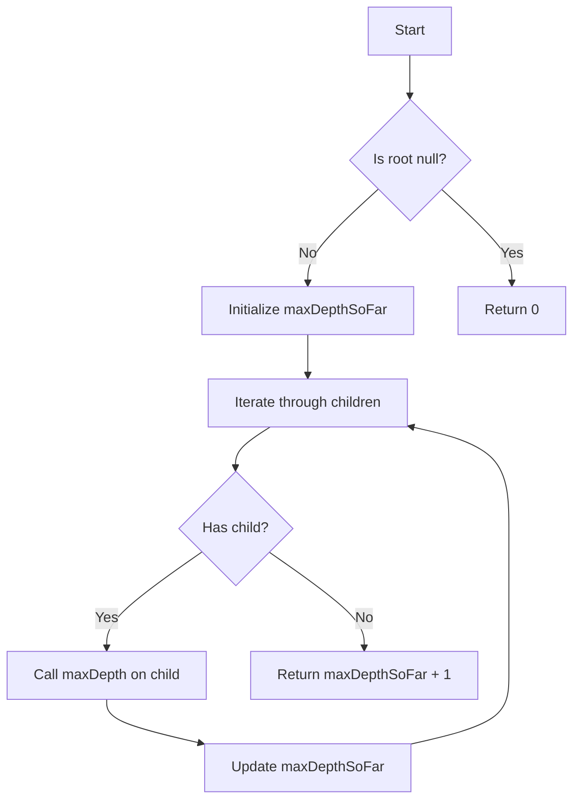

# Maximum Depth of N-ary Tree BFS/DFS

## Problem Understanding
The problem is asking to find the maximum depth of an N-ary tree, which is a tree where each node can have any number of children. The key constraint is that we need to visit each node once to calculate its depth. The problem becomes non-trivial when we have to handle trees with varying depths and a large number of nodes, making a naive approach of simply counting the depth of each node inefficient. The problem requires a systematic approach to traverse the tree and calculate the maximum depth.

## Approach
The algorithm strategy used here is Depth-First Search (DFS), where we recursively calculate the depth of each subtree. The intuition behind this approach is to traverse the tree depth-first, keeping track of the maximum depth encountered so far. We use a recursive function to calculate the depth of each child subtree and update the maximum depth if the current child's depth is greater. The data structure used is a recursive call stack, which is chosen because it naturally fits the tree structure and allows for efficient depth-first traversal. This approach handles the key constraint of visiting each node once and calculates the maximum depth efficiently.

## Complexity Analysis
| Metric | Value | Detailed Reason |
|--------|-------|----------------|
| Time   | O(n)  | We visit each node once, where n is the number of nodes in the tree. The time complexity is linear because we perform a constant amount of work for each node. |
| Space  | O(n)  | The maximum recursion depth is equal to the height of the tree, which in the worst case is n (when the tree is skewed). The space complexity is linear because we need to store the recursive call stack, which can grow up to n levels deep. |

## Algorithm Walkthrough
```
Input: 
     1
   / | \
  3  2  4
 / \
5   6

Step 1: maxDepth(1) is called
  - maxDepthSoFar = 0
  - Iterate through children of 1: [3, 2, 4]
  - Call maxDepth(3)
    - maxDepthSoFar = 0
    - Iterate through children of 3: [5, 6]
    - Call maxDepth(5) and maxDepth(6)
    - maxDepthSoFar = max(0, maxDepth(5), maxDepth(6)) = 1
    - Return maxDepthSoFar + 1 = 2
  - Call maxDepth(2) and maxDepth(4)
  - maxDepthSoFar = max(0, maxDepth(3), maxDepth(2), maxDepth(4)) = 2
  - Return maxDepthSoFar + 1 = 3

Output: 3
```
This walkthrough demonstrates how the algorithm calculates the maximum depth of the tree by recursively traversing each subtree and keeping track of the maximum depth encountered.

## Visual Flow

This flowchart illustrates the decision flow of the algorithm, showing how it handles the base case of an empty tree and recursively calculates the maximum depth of each subtree.

## Key Insight
> **Tip:** The key insight is to use a recursive approach to traverse the tree depth-first, keeping track of the maximum depth encountered so far, which allows for efficient calculation of the maximum depth.

## Edge Cases
- **Empty/null input**: If the input tree is empty (i.e., the root is null), the algorithm returns 0, which is the correct maximum depth for an empty tree.
- **Single element**: If the input tree has only one node (i.e., the root has no children), the algorithm returns 1, which is the correct maximum depth for a tree with a single node.
- **Tree with only one level of children**: If the input tree has only one level of children (i.e., the root has children, but none of the children have children), the algorithm returns 2, which is the correct maximum depth for such a tree.

## Common Mistakes
- **Mistake 1**: Not handling the base case of an empty tree correctly. To avoid this, make sure to check if the root is null and return 0 in that case.
- **Mistake 2**: Not updating the maximum depth correctly. To avoid this, make sure to use the `max` function to update the maximum depth with the depth of each child subtree.

## Interview Follow-ups
> **Interview:** 
- "What if the input is sorted?" → The algorithm does not rely on the input being sorted, so it will still work correctly even if the input is not sorted.
- "Can you do it in O(1) space?" → No, the algorithm requires O(n) space to store the recursive call stack, so it is not possible to do it in O(1) space.
- "What if there are duplicates?" → The algorithm does not care about duplicates, as it only cares about the depth of each node. If there are duplicate nodes, the algorithm will still return the correct maximum depth.

## CPP Solution

```cpp
// Problem: Maximum Depth of N-ary Tree BFS/DFS
// Language: C++
// Difficulty: Easy
// Time Complexity: O(n) — visiting each node once
// Space Complexity: O(n) — maximum recursion depth or queue size
// Approach: Depth-First Search (DFS) — recursively calculating depth of each subtree

/**
 * Definition for a Node.
 * struct Node {
 *     int val;
 *     vector<Node*> children;
 *     Node() : val(0) {}
 *     Node(int _val) : val(_val) {}
 *     Node(int _val, vector<Node*> _children) : val(_val), children(_children) {}
 * };
 */

class Solution {
public:
    int maxDepth(Node* root) {
        // Edge case: empty tree → return 0
        if (root == nullptr) return 0;
        
        int maxDepthSoFar = 0; // to store the maximum depth encountered
        
        // Iterate through each child of the root node
        for (Node* child : root->children) {
            // Recursively calculate the depth of each child subtree
            int childDepth = maxDepth(child);
            
            // Update maxDepthSoFar if the current child's depth is greater
            maxDepthSoFar = max(maxDepthSoFar, childDepth);
        }
        
        // Return the maximum depth found plus 1 (for the root node itself)
        return maxDepthSoFar + 1;
    }
};
```
