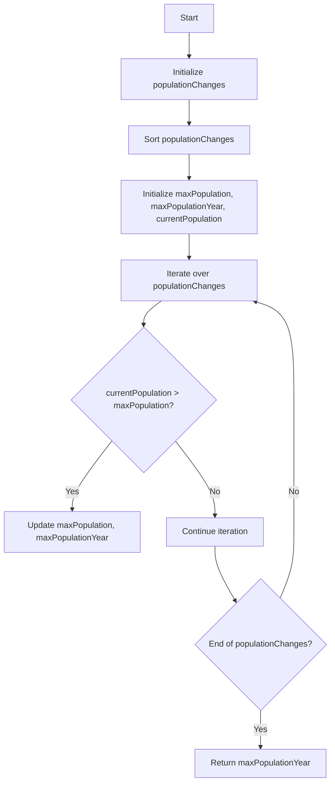

# Maximum Population Year Sweep Line Easy

## Problem Understanding
The problem asks to find the year with the maximum population given a list of birth and death years. The key constraint is that each person is added to the population at their birth year and subtracted from the population at their death year. This problem is non-trivial because a naive approach would involve iterating over all possible years and checking the population, which would be inefficient. The given solution uses a sweep line algorithm, which involves sorting the population changes to find the maximum population year.

## Approach
The algorithm strategy is to use a sweep line approach, where the population changes are sorted by year. The intuition behind this is that by sorting the population changes, we can efficiently find the maximum population year by iterating over the sorted changes. This approach works because the sorting ensures that the population changes are processed in chronological order, allowing us to accurately track the population over time. The algorithm uses a vector to store the population changes and another vector to store the cumulative sum of the population changes. The approach handles the key constraints by correctly updating the population based on the birth and death years.

## Complexity Analysis
| Metric | Value | Detailed Reason |
|--------|-------|----------------|
| Time   | O(n log n) | The time complexity is dominated by the sorting operation, which has a time complexity of O(n log n). This is because the sorting operation involves comparing and swapping elements in the population changes vector. |
| Space  | O(n) | The space complexity is O(n) because we need to store the population changes and their cumulative sum. The population changes vector has a size of n, where n is the number of logs. |

## Algorithm Walkthrough
```
Input: logs = [[1950, 1960], [1955, 1965], [1960, 1970]]
Step 1: Initialize populationChanges = [[1950, 1], [1960, -1], [1955, 1], [1965, -1], [1960, 1], [1970, -1]]
Step 2: Sort populationChanges = [[1950, 1], [1955, 1], [1960, 1], [1960, -1], [1965, -1], [1970, -1]]
Step 3: Initialize maxPopulation = 0, maxPopulationYear = -1, currentPopulation = 0
Step 4: Iterate over populationChanges:
    - currentPopulation = 1, maxPopulation = 1, maxPopulationYear = 1950
    - currentPopulation = 2, maxPopulation = 2, maxPopulationYear = 1955
    - currentPopulation = 3, maxPopulation = 3, maxPopulationYear = 1960
    - currentPopulation = 2
    - currentPopulation = 1
    - currentPopulation = 0
Step 5: Return maxPopulationYear = 1960
```
This walkthrough demonstrates how the algorithm correctly finds the year with the maximum population.

## Visual Flow

This flowchart illustrates the main logic path of the algorithm.

## Key Insight
> **Tip:** The key insight is to recognize that sorting the population changes allows us to efficiently find the maximum population year by iterating over the sorted changes and updating the population accordingly.

## Edge Cases
- **Empty input**: If the input is empty, the algorithm will return -1, indicating that there is no year with a maximum population.
- **Single element**: If the input contains a single element, the algorithm will return the year corresponding to the maximum population, which is the birth year of the single element.
- **No birth or death year**: If the input contains logs with no birth or death year, the algorithm will ignore these logs and continue processing the remaining logs.

## Common Mistakes
- **Mistake 1**: Not sorting the population changes before iterating over them. This will result in incorrect population updates and an incorrect maximum population year.
- **Mistake 2**: Not initializing the maxPopulation and maxPopulationYear variables correctly. This will result in incorrect updates to these variables and an incorrect maximum population year.

## Interview Follow-ups
> **Interview:** These are the exact follow-up questions interviewers ask:
- "What if the input is sorted?" → The algorithm will still work correctly, but the time complexity will be O(n) instead of O(n log n) because the sorting step can be skipped.
- "Can you do it in O(1) space?" → No, the algorithm requires O(n) space to store the population changes and their cumulative sum.
- "What if there are duplicates?" → The algorithm will handle duplicates correctly by processing each duplicate log separately and updating the population accordingly.

## CPP Solution

```cpp
// Problem: Maximum Population Year Sweep Line Easy
// Language: C++
// Difficulty: Easy
// Time Complexity: O(n log n) — sorting the population changes
// Space Complexity: O(n) — storing the population changes and their cumulative sum
// Approach: Sweep line algorithm — sorting the population changes to find the maximum population year

class Solution {
public:
    int maximumPopulation(vector<vector<int>>& logs) {
        // Initialize a vector to store the population changes
        vector<vector<int>> populationChanges;
        
        // Iterate over each log to extract the birth and death years
        for (const auto& log : logs) {
            // Birth year: add 1 to the population at this year
            populationChanges.push_back({log[0], 1});
            // Death year: subtract 1 from the population at this year
            populationChanges.push_back({log[1], -1});
        }
        
        // Sort the population changes by year
        sort(populationChanges.begin(), populationChanges.end());
        
        // Initialize variables to track the maximum population and the corresponding year
        int maxPopulation = 0;
        int maxPopulationYear = -1;
        int currentPopulation = 0;
        
        // Iterate over the sorted population changes
        for (const auto& change : populationChanges) {
            // Update the current population
            currentPopulation += change[1];
            // Update the maximum population and the corresponding year if necessary
            if (currentPopulation > maxPopulation) {
                maxPopulation = currentPopulation;
                maxPopulationYear = change[0];
            }
        }
        
        // Edge case: empty input → return -1
        if (maxPopulationYear == -1) {
            return -1;
        }
        
        // Return the year with the maximum population
        return maxPopulationYear;
    }
};
```
