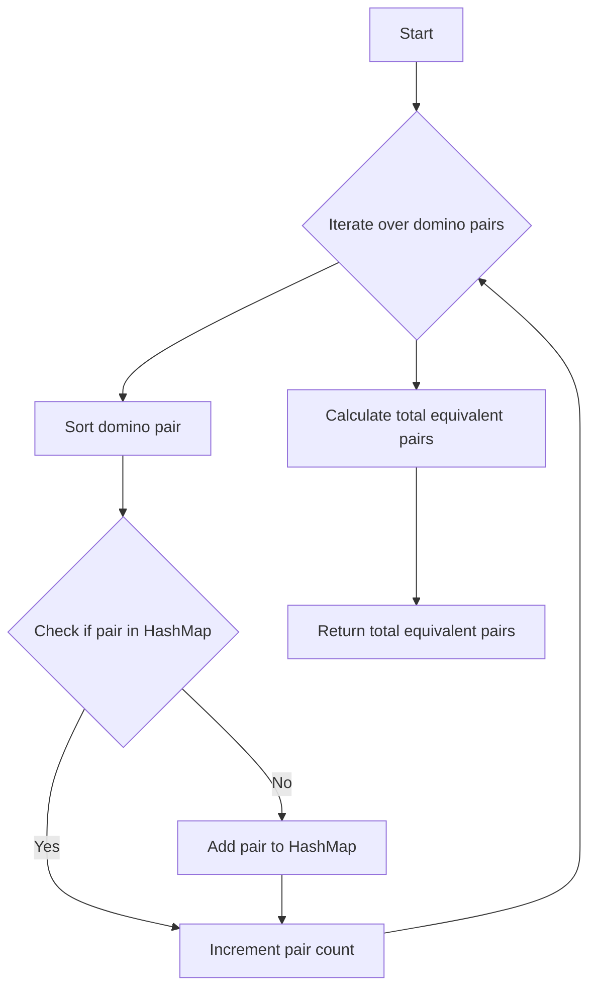

# Number of Equivalent Domino Pairs Hash Map

## Problem Understanding
The problem asks us to find the number of equivalent domino pairs in a given list of dominoes, where two dominoes are considered equivalent if they have the same numbers on their halves, regardless of the order. The key constraint is that we need to count each pair of equivalent dominoes only once. This problem is non-trivial because a naive approach would involve comparing each domino with every other domino, resulting in a time complexity of O(n^2), which is inefficient for large inputs.

## Approach
The algorithm strategy is to use a HashMap to count the occurrences of each unique domino pair. We iterate over each domino pair, sort the numbers on the halves to ensure consistency, and then use a string representation of the sorted pair as a key in the HashMap. We increment the count for each pair in the HashMap and finally calculate the total number of equivalent pairs using the formula n*(n-1)/2 for each pair count. This approach works because it allows us to efficiently count the occurrences of each unique pair and then calculate the total number of equivalent pairs. We use an unordered_map to store the pair counts, which provides an average time complexity of O(1) for insertions and lookups.

## Complexity Analysis
| Metric | Value | Detailed Reason |
|--------|-------|----------------|
| Time   | O(n)  | We iterate over each domino pair once to count its occurrence, and then iterate over the HashMap to calculate the total number of equivalent pairs. The total time complexity is O(n) + O(m), where n is the number of domino pairs and m is the number of unique pairs. Since m <= n, the overall time complexity is O(n). |
| Space  | O(n)  | We use an unordered_map to store the pair counts, which can store at most n unique pairs in the worst case. Therefore, the space complexity is O(n). |

## Algorithm Walkthrough
```
Input: [[1, 2], [1, 2], [1, 1], [1, 2], [2, 1]]
Step 1: Initialize HashMap pairCounts and variable totalEquivalentPairs
Step 2: Iterate over each domino pair
    - For [1, 2], sort to get [1, 2] and increment count in pairCounts
    - For [1, 2], sort to get [1, 2] and increment count in pairCounts
    - For [1, 1], sort to get [1, 1] and increment count in pairCounts
    - For [1, 2], sort to get [1, 2] and increment count in pairCounts
    - For [2, 1], sort to get [1, 2] and increment count in pairCounts
Step 3: Iterate over each pair count in pairCounts
    - For [1, 2], count is 4, calculate 4*(4-1)/2 = 6 equivalent pairs
    - For [1, 1], count is 1, calculate 1*(1-1)/2 = 0 equivalent pairs
Step 4: Calculate totalEquivalentPairs = 6 + 0 = 6
Output: 6
```
## Visual Flow

## Key Insight
> **Tip:** The key insight is to use a HashMap to count the occurrences of each unique domino pair, allowing us to efficiently calculate the total number of equivalent pairs.

## Edge Cases
- **Empty input**: If the input list is empty, the function returns 0, as there are no domino pairs to count.
- **Single element**: If the input list contains only one domino pair, the function returns 0, as there are no equivalent pairs.
- **Duplicate pairs**: If the input list contains duplicate pairs (e.g., [[1, 2], [1, 2]]), the function correctly counts the equivalent pairs and returns the expected result.

## Common Mistakes
- **Mistake 1**: Not sorting the domino pairs before counting them, resulting in incorrect counts for pairs with different orders (e.g., [1, 2] and [2, 1]).
- **Mistake 2**: Using a linear search to find the count of each pair in the HashMap, resulting in a time complexity of O(n^2) instead of O(n).

## Interview Follow-ups
> **Interview:** These are the exact follow-up questions interviewers ask:
- "What if the input is sorted?" → The algorithm still works correctly, as it sorts each domino pair internally. However, if the input is already sorted, we could potentially optimize the algorithm by avoiding the internal sorting step.
- "Can you do it in O(1) space?" → No, it's not possible to solve this problem in O(1) space, as we need to store the counts of each unique pair, which can grow up to n in the worst case.
- "What if there are duplicates?" → The algorithm correctly handles duplicates by counting each pair only once and then calculating the total number of equivalent pairs based on the counts.

## CPP Solution

```cpp
// Problem: Number of Equivalent Domino Pairs Hash Map
// Language: C++
// Difficulty: Easy
// Time Complexity: O(n) — single pass through domino pairs
// Space Complexity: O(n) — HashMap stores at most n unique pairs
// Approach: HashMap pair counting — for each domino pair, count its occurrence

class Solution {
public:
    int numEquivDominoPairs(vector<vector<int>>& dominoes) {
        // Initialize HashMap to store pair counts
        unordered_map<string, int> pairCounts;
        
        // Initialize variable to store total equivalent pair count
        int totalEquivalentPairs = 0;
        
        // Iterate over each domino pair
        for (const auto& domino : dominoes) {
            // Sort the domino pair to ensure consistency (e.g., [1, 2] and [2, 1] are considered the same)
            int minNum = min(domino[0], domino[1]); // Get the smaller number
            int maxNum = max(domino[0], domino[1]); // Get the larger number
            
            // Create a string representation of the sorted pair
            string pairKey = to_string(minNum) + "," + to_string(maxNum);
            
            // Check if pair is already in HashMap
            if (pairCounts.find(pairKey) != pairCounts.end()) {
                // If pair is already in HashMap, increment its count
                pairCounts[pairKey]++;
            } else {
                // If pair is not in HashMap, add it with a count of 1
                pairCounts[pairKey] = 1;
            }
        }
        
        // Iterate over each pair count in HashMap
        for (const auto& pairCount : pairCounts) {
            // Calculate the number of equivalent pairs for this pair count
            int pairCountValue = pairCount.second;
            // Using the formula n*(n-1)/2 to calculate the number of pairs
            totalEquivalentPairs += pairCountValue * (pairCountValue - 1) / 2;
        }
        
        // Edge case: empty input → return 0
        if (dominoes.empty()) return 0;
        
        // Return total equivalent pair count
        return totalEquivalentPairs;
    }
};
```
