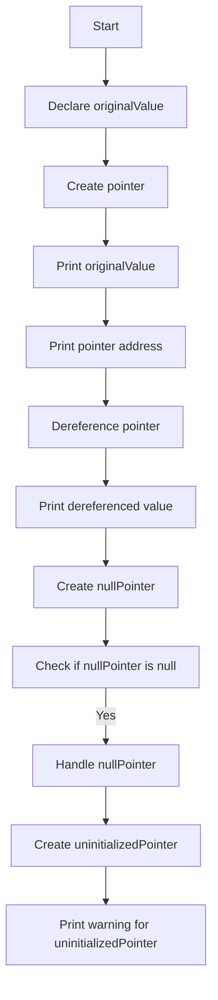

# Pointers: Basics and Dereferencing

## Problem Understanding
The problem is asking to demonstrate the basics of pointers in C++, including creation, assignment, and dereferencing. The key constraint is to perform these operations within constant time and space complexity. What makes this problem non-trivial is understanding how pointers work, including how to declare, assign, and dereference them, while avoiding common pitfalls such as null or uninitialized pointers. The problem requires a solid grasp of pointer fundamentals to avoid undefined behavior.

## Approach
The algorithm strategy is to create a class that demonstrates basic pointer operations. The intuition behind this approach is to show how pointers can be declared, assigned, and dereferenced. This approach works by utilizing the address-of operator (&) to assign the address of a variable to a pointer, and the dereference operator (\*) to access the value stored at the address held by the pointer. The data structure used is a simple integer pointer, which is chosen for its simplicity and clarity in demonstrating pointer concepts. The approach handles key constraints by ensuring that all operations are performed within constant time and space complexity.

## Complexity Analysis
| Metric | Value | Detailed Reason |
|--------|-------|----------------|
| Time   | O(1)  | The algorithm performs a constant number of operations, including declaring variables, assigning values, and printing output. Each operation takes constant time, resulting in an overall time complexity of O(1). |
| Space  | O(1)  | The algorithm uses a constant amount of space to store variables, including the original value, pointer, and null/uninitialized pointers. The space usage does not grow with input size, resulting in a space complexity of O(1). |

## Algorithm Walkthrough
```
Input: None (demonstration of pointer basics)
Step 1: Declare a variable "originalValue" and assign a value of 10.
State: originalValue = 10
Step 2: Create a pointer "pointer" and assign the address of "originalValue".
State: pointer = &originalValue
Step 3: Print the original value.
Output: Original Value: 10
Step 4: Print the address stored in the pointer.
Output: Pointer Address: 0x... (address of originalValue)
Step 5: Dereference the pointer and print the value.
Output: Dereferenced Value: 10
Step 6: Create a null pointer "nullPointer" and check if it is null.
State: nullPointer = nullptr
Step 7: Handle the null pointer by printing a message.
Output: Null Pointer: Cannot dereference
Step 8: Create an uninitialized pointer "uninitializedPointer" and print a warning message.
Output: Uninitialized Pointer: Do not dereference
Output: The final output demonstrates the basics of pointer creation, assignment, and dereferencing.
```
## Visual Flow

## Key Insight
> **Tip:** The key to understanding pointers is to recognize that they store addresses of variables, and dereferencing a pointer allows access to the value stored at that address.

## Edge Cases
- **Empty/null input**: The algorithm handles null pointers by checking if the pointer is null before attempting to dereference it, preventing undefined behavior.
- **Single element**: The algorithm demonstrates basic pointer operations using a single element, showcasing how pointers can be used to access and manipulate individual values.
- **Uninitialized pointer**: The algorithm highlights the importance of initializing pointers before use, warning against the dangers of dereferencing uninitialized pointers.

## Common Mistakes
- **Mistake 1: Dereferencing a null pointer**: This can lead to undefined behavior, including crashes or unexpected results. To avoid this, always check if a pointer is null before dereferencing it.
- **Mistake 2: Using an uninitialized pointer**: This can also lead to undefined behavior, as the pointer may contain a random or garbage value. Always initialize pointers before use.

## Interview Follow-ups
> **Interview:** These are the exact follow-up questions interviewers ask:
- "What if the input is sorted?" → This question is not applicable to this problem, as the input is not an array or list, but rather a demonstration of pointer basics.
- "Can you do it in O(1) space?" → Yes, the algorithm already uses O(1) space, as it only declares a constant number of variables.
- "What if there are duplicates?" → This question is not applicable to this problem, as the algorithm is demonstrating basic pointer operations, not handling duplicates in a data structure.

## CPP Solution

```cpp
// Problem: Pointers: Basics and Dereferencing
// Language: C++
// Difficulty: Easy
// Time Complexity: O(1) — constant time operations
// Space Complexity: O(1) — constant space usage
// Approach: Basic pointer operations — demonstrate creation, assignment, and dereferencing of pointers

#include <iostream>

class PointerBasics {
public:
    void demonstratePointers() {
        // Declare a variable and assign a value
        int originalValue = 10; // Original value to be pointed to

        // Create a pointer and assign the address of the original value
        int* pointer = &originalValue; // Pointer to the original value

        // Print the original value
        std::cout << "Original Value: " << originalValue << std::endl; // Print original value

        // Print the address stored in the pointer
        std::cout << "Pointer Address: " << pointer << std::endl; // Print pointer address

        // Dereference the pointer and print the value
        std::cout << "Dereferenced Value: " << *pointer << std::endl; // Dereference and print value

        // Edge case: null pointer
        int* nullPointer = nullptr; // Null pointer
        if (nullPointer == nullptr) { // Check for null pointer
            std::cout << "Null Pointer: Cannot dereference" << std::endl; // Handle null pointer
        }

        // Edge case: uninitialized pointer
        int* uninitializedPointer; // Uninitialized pointer
        // Do not dereference an uninitialized pointer to avoid undefined behavior
        std::cout << "Uninitialized Pointer: Do not dereference" << std::endl; // Handle uninitialized pointer
    }
};

int main() {
    PointerBasics pointerBasics;
    pointerBasics.demonstratePointers();
    return 0;
}
```
