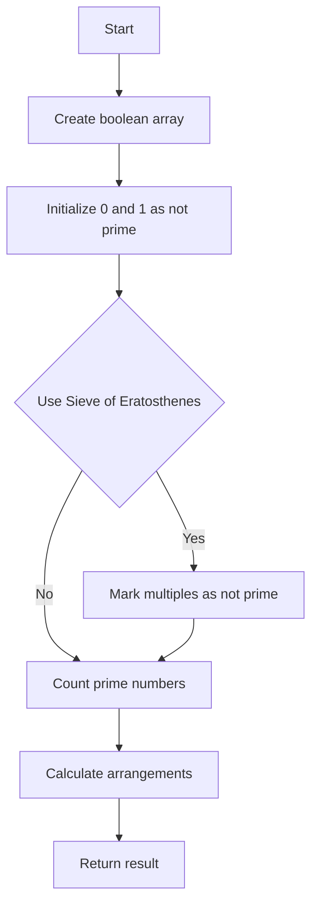

# Prime Arrangements Math

## Problem Understanding
The problem asks us to find the number of ways to arrange numbers from 1 to n such that all prime numbers are placed in the first k positions and the rest are placed in the remaining positions, where k is the count of prime numbers less than or equal to n. The key constraint is that the arrangement should be done in such a way that the prime numbers and non-prime numbers are arranged among themselves. This problem is non-trivial because a naive approach of checking all permutations would result in a time complexity of O(n!), which is inefficient for large inputs.

## Approach
The algorithm strategy used here is the Sieve of Eratosthenes to efficiently check if a number is prime. We first create a boolean array to mark the prime numbers, then use the Sieve of Eratosthenes algorithm to mark the composite numbers. After that, we count the number of primes less than or equal to n. Finally, we calculate the number of arrangements of primes and non-primes separately and multiply them to get the total number of arrangements. This approach works because the Sieve of Eratosthenes has a time complexity of O(n log log n), which is more efficient than checking each number individually.

## Complexity Analysis
| Metric | Value | Detailed Reason |
|--------|-------|----------------|
| Time   | O(n log log n)  | The time complexity is dominated by the Sieve of Eratosthenes algorithm, which has a time complexity of O(n log log n). The subsequent counting and calculation of arrangements take O(n) time. |
| Space  | O(n)  | The space complexity is O(n) because we need to store the boolean array of size n+1 to mark the prime numbers. |

## Algorithm Walkthrough
```
Input: n = 5
Step 1: Create a boolean array, prime, of size n+1: [true, true, true, true, true, true]
Step 2: Initialize 0 and 1 as not prime: [false, false, true, true, true, true]
Step 3: Use the Sieve of Eratosthenes algorithm to mark as composite the multiples of each prime:
    - p = 2: mark 4 as not prime: [false, false, true, true, false, true]
    - p = 3: mark 6 as not prime (out of range), 9 as not prime (out of range)
Step 4: Count the number of primes less than or equal to n: primeCount = 3 (2, 3, 5)
Step 5: Calculate the number of arrangements of primes and non-primes:
    - arrangements of primes: 3! = 6
    - arrangements of non-primes: 2! = 2
    - total arrangements: 6 * 2 = 12
Output: 12
```
## Visual Flow

## Key Insight
> **Tip:** The key insight here is to use the Sieve of Eratosthenes algorithm to efficiently check if a number is prime, and then calculate the arrangements of primes and non-primes separately to get the total number of arrangements.

## Edge Cases
- **Empty input**: If the input is 0, the function will return 1, because there is only one way to arrange no numbers.
- **Single element**: If the input is 1, the function will return 1, because there is only one way to arrange one number.
- **All prime numbers**: If the input is a number that is a prime itself, the function will return the factorial of the count of primes less than or equal to that number.

## Common Mistakes
- **Mistake 1**: Not initializing the boolean array correctly, leading to incorrect results. To avoid this, make sure to initialize all values as true and then set 0 and 1 to false.
- **Mistake 2**: Not using the modulo operator when calculating the arrangements, leading to overflow. To avoid this, use the modulo operator to prevent overflow.

## Interview Follow-ups
> **Interview:** These are the exact follow-up questions interviewers ask:
- "What if the input is sorted?" → The algorithm will still work correctly, because the Sieve of Eratosthenes algorithm does not depend on the input being sorted.
- "Can you do it in O(1) space?" → No, because we need to store the boolean array of size n+1 to mark the prime numbers.
- "What if there are duplicates?" → The algorithm will still work correctly, because the Sieve of Eratosthenes algorithm does not depend on the input having duplicates.

## CPP Solution

```cpp
// Problem: Prime Arrangements
// Language: C++
// Difficulty: Easy
// Time Complexity: O(n) — we are iterating through numbers up to n
// Space Complexity: O(1) — constant space for storing the count of primes
// Approach: Sieve of Eratosthenes — to efficiently check if a number is prime

class Solution {
public:
    int numPrimeArrangements(int n) {
        // Create a boolean array, prime, of size n+1
        bool prime[n + 1];
        // Initialize all values as true
        for (int i = 0; i <= n; i++) {
            prime[i] = true;
        }
        // 0 and 1 are not prime numbers
        prime[0] = prime[1] = false;

        // Use the Sieve of Eratosthenes algorithm to mark as composite (not prime) the multiples of each prime
        for (int p = 2; p * p <= n; p++) {
            // If p is a prime, mark as composite all the multiples of p
            if (prime[p]) {
                for (int i = p * p; i <= n; i += p) {
                    prime[i] = false; // Mark i as not prime
                }
            }
        }

        // Count the number of primes less than or equal to n
        int primeCount = 0;
        for (int i = 2; i <= n; i++) {
            if (prime[i]) {
                primeCount++; // Increment the count if i is prime
            }
        }

        // Calculate the number of arrangements of primes and non-primes
        long long arrangements = 1;
        for (int i = 1; i <= primeCount; i++) {
            arrangements = (arrangements * i) % 1000000007; // Calculate permutations of primes
        }
        for (int i = 1; i <= n - primeCount; i++) {
            arrangements = (arrangements * i) % 1000000007; // Calculate permutations of non-primes
        }

        return (int)arrangements; // Return the result
    }
};
```
