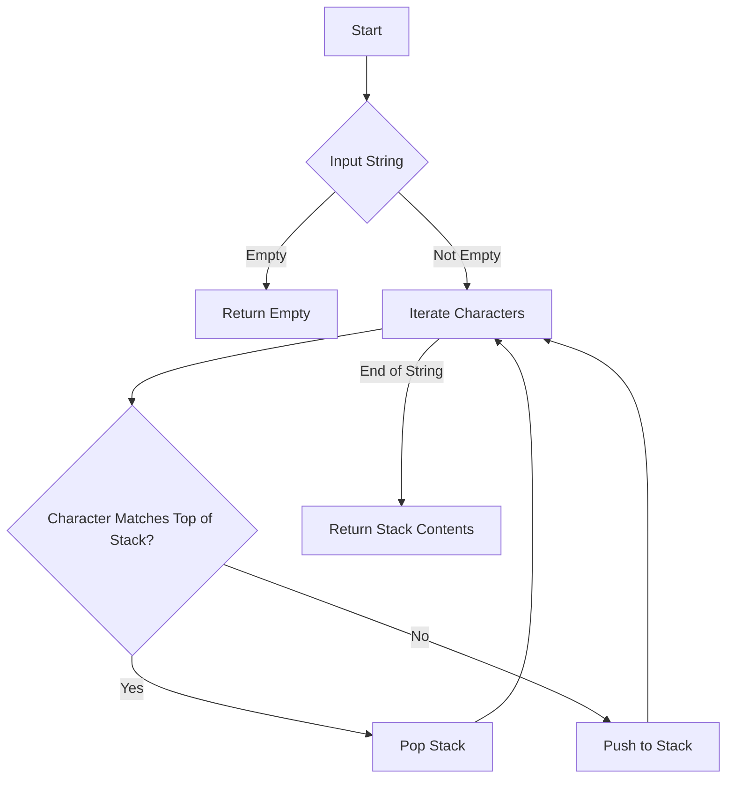

# Remove All Adjacent Duplicates In String Stack

## Problem Understanding
The problem requires removing all adjacent duplicates from a given string using a stack. This means that if two consecutive characters in the string are the same, they should be removed. The key constraint here is that only adjacent duplicates should be removed, and the solution should use a stack data structure. What makes this problem non-trivial is that a naive approach of simply iterating through the string and removing duplicates as they are found would not work because it would not handle cases where removing one pair of duplicates creates a new pair of duplicates.

## Approach
The algorithm strategy used here is a stack-based character removal approach. For each character in the input string, the algorithm checks if it matches the top of the stack. If it does, the top of the stack is popped, effectively removing the duplicate character. If it does not match, the character is pushed onto the stack. This approach works because a stack is a Last-In-First-Out (LIFO) data structure, which allows for efficient removal of the most recently added character. The `string` class in C++ is used as the stack, with `push_back` and `pop_back` operations simulating push and pop operations on a traditional stack.

## Complexity Analysis
| Metric | Value | Detailed Reason |
|--------|-------|----------------|
| Time   | O(n)  | The algorithm makes a single pass through the input string, where n is the length of the string. Each operation (push and pop) on the stack takes constant time, so the overall time complexity is linear. |
| Space  | O(n)  | In the worst-case scenario, the stack will store all characters from the input string, which requires O(n) space. This occurs when there are no adjacent duplicates in the string. |

## Algorithm Walkthrough
```
Input: "abbaca"
Step 1: Initialize an empty stack.
Step 2: Iterate through the string, character by character.
  - 'a' is added to the stack: stack = "a"
  - 'b' is added to the stack: stack = "ab"
  - 'b' matches the top of the stack, so the top is popped: stack = "a"
  - 'a' matches the top of the stack, so the top is popped: stack = ""
  - 'c' is added to the stack: stack = "c"
  - 'a' is added to the stack: stack = "ca"
Step 3: The final stack contents are returned as the result.
Output: "ca"
```

## Visual Flow


## Key Insight
> **Tip:** The key insight here is that using a stack allows for efficient removal of adjacent duplicates by leveraging the LIFO property of stacks, ensuring that the most recently added character is the first one to be removed if it matches the next character in the string.

## Edge Cases
- **Empty/null input**: If the input string is empty, the function returns an empty string because there are no characters to process.
- **Single element**: If the input string contains only one character, the function returns the same string because there are no adjacent duplicates to remove.
- **No duplicates**: If the input string does not contain any adjacent duplicates, the function returns the original string because no characters are removed.

## Common Mistakes
- **Mistake 1**: Not checking for an empty stack before attempting to pop from it, which can lead to runtime errors. To avoid this, always check if the stack is empty before popping.
- **Mistake 2**: Not handling the case where the input string is null or empty. To avoid this, add a check at the beginning of the function to return immediately if the input string is empty.

## Interview Follow-ups
> **Interview:** 
- "What if the input is sorted?" → The algorithm still works correctly because it only considers adjacent characters, regardless of the overall order of the string.
- "Can you do it in O(1) space?" → No, because we need to store the characters in a stack, which requires O(n) space in the worst case.
- "What if there are duplicates that are not adjacent?" → The algorithm will not remove non-adjacent duplicates because it only checks for and removes duplicates that are immediately next to each other.

## CPP Solution

```cpp
// Problem: Remove All Adjacent Duplicates In String Stack
// Language: C++
// Difficulty: Easy
// Time Complexity: O(n) — single pass through string using stack
// Space Complexity: O(n) — stack stores at most n characters
// Approach: Stack-based character removal — for each character, check if it matches the top of the stack

class Solution {
public:
    string removeDuplicates(string s) {
        // Create a stack to store characters
        string stack;
        
        // Edge case: empty input → return empty string
        if (s.empty()) return "";

        // Iterate over each character in the string
        for (char c : s) {
            // If the stack is not empty and the current character matches the top of the stack, pop the stack
            if (!stack.empty() && stack.back() == c) {
                stack.pop_back();  // Remove the duplicate character
            } else {
                stack.push_back(c);  // Add the character to the stack
            }
        }

        // Return the resulting string
        return stack;
    }
};
```
