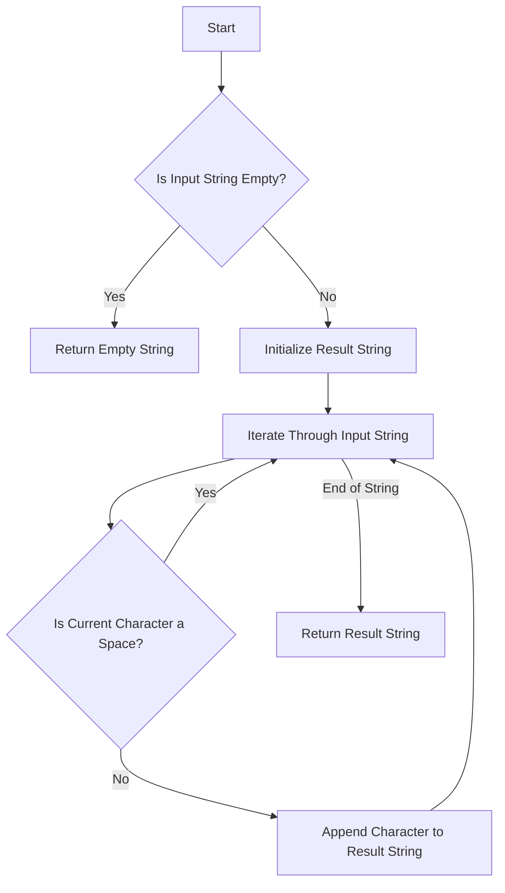

# Remove Spaces from String

## Problem Understanding
The problem is asking to remove all spaces from a given string, which seems like a straightforward task but has implications on the approach due to the need to handle strings of varying lengths and potentially empty strings. A key constraint is the requirement to efficiently remove spaces without altering the original order of non-space characters. What makes this problem non-trivial is the need to balance efficiency (in terms of time and space complexity) with correctness, especially when considering edge cases such as empty strings or strings containing only spaces. The naive approach of simply iterating through the string and skipping spaces could work but may not be optimal in terms of performance or memory usage.

## Approach
The algorithm strategy used here is the two-pointer technique, although it's slightly modified since we're not strictly using two pointers but rather iterating through the string and conditionally appending characters to a new string. The intuition behind this approach is to separate the concern of reading the input string from the concern of writing the output string, thus allowing for a clean and efficient removal of spaces. This approach works because it ensures that each character in the input string is examined exactly once, and only non-space characters are copied to the output string. The data structure used is a new string (`std::string result`), which is chosen because it provides a convenient and efficient way to build the output string by appending characters. The alternative solution uses `std::remove` and `std::string::erase`, which provides a more concise way to achieve the same result by shifting non-space characters to the front of the string and then removing the trailing spaces.

## Complexity Analysis
| Metric | Value | Detailed Reason |
|--------|-------|----------------|
| Time   | O(n)  | The algorithm iterates through the input string once, where n is the length of the string. Each operation within the loop (comparing a character to a space and appending to the result string) takes constant time. Therefore, the total time complexity is linear with respect to the size of the input. |
| Space  | O(n)  | The algorithm creates a new string to hold the result, which in the worst case (when the input string contains no spaces) will be of the same length as the input string. Thus, the space complexity is also linear with respect to the size of the input. |

## Algorithm Walkthrough
```
Input: "Hello World"
Step 1: Initialize result string as empty.
Step 2: Iterate through each character in the input string:
  - 'H' is not a space, append to result: "H"
  - 'e' is not a space, append to result: "He"
  - 'l' is not a space, append to result: "Hel"
  - 'l' is not a space, append to result: "Hell"
  - 'o' is not a space, append to result: "Hello"
  - ' ' is a space, skip.
  - 'W' is not a space, append to result: "HelloW"
  - 'o' is not a space, append to result: "HelloWo"
  - 'r' is not a space, append to result: "HelloWor"
  - 'l' is not a space, append to result: "HelloWorl"
  - 'd' is not a space, append to result: "HelloWorld"
Step 3: Return the result string: "HelloWorld"
```

## Visual Flow


## Key Insight
> **Tip:** The key insight here is that by iterating through the string once and conditionally appending characters to a new string, we can efficiently remove all spaces from the input string while preserving the order of non-space characters.

## Edge Cases
- **Empty/null input**: If the input string is empty, the function will return an empty string, as there are no characters (including spaces) to process.
- **Single element**: If the input string contains only one character (which could be a space), the function will return either the single non-space character or an empty string if the single character is a space.
- **String containing only spaces**: If the input string contains only spaces, the function will return an empty string, as all characters are skipped during the iteration.

## Common Mistakes
- **Mistake 1**: Forgetting to handle the edge case where the input string is empty, which could lead to unnecessary processing or errors.
- **Mistake 2**: Incorrectly appending characters to the result string, such as appending spaces or failing to append non-space characters, which would result in an incorrect output.

## Interview Follow-ups
> **Interview:** These are the exact follow-up questions interviewers ask:
- "What if the input is sorted?" → The sorting of the input string does not affect the removal of spaces, as the algorithm iterates through each character and checks if it's a space regardless of the input's order.
- "Can you do it in O(1) space?" → The current implementation uses O(n) space because it creates a new string to hold the result. Achieving O(1) space complexity would require modifying the input string in-place, which is not directly possible with standard C++ strings due to their dynamic nature and the need to potentially shrink the string.
- "What if there are duplicates?" → The presence of duplicate characters (including spaces) does not affect the algorithm's correctness or efficiency, as it treats each character individually and removes spaces regardless of their frequency.

## CPP Solution

```cpp
// Problem: Remove Spaces from String
// Language: C++
// Difficulty: Easy
// Time Complexity: O(n) — single pass through string
// Space Complexity: O(n) — new string without spaces
// Approach: Two-pointer technique — one for reading and one for writing

class Solution {
public:
    /**
     * Removes all spaces from a given string.
     * 
     * @param str The input string.
     * @return The string without spaces.
     */
    std::string removeSpaces(std::string str) {
        // Edge case: empty string → return empty string
        if (str.empty()) return str;
        
        std::string result = "";  // Initialize result string
        for (char c : str) {  // Iterate through each character in the string
            if (c != ' ') {  // Check if the character is not a space
                result += c;  // If not a space, append to result string
            }
        }
        return result;  // Return the result string
    }

    // Alternative solution using std::remove and std::string::erase
    std::string removeSpacesAlt(std::string str) {
        // Edge case: empty string → return empty string
        if (str.empty()) return str;
        
        // Use std::remove to shift all non-space characters to the front
        auto newEnd = std::remove(str.begin(), str.end(), ' ');
        // Use std::string::erase to remove the trailing spaces
        str.erase(newEnd, str.end());
        return str;  // Return the modified string
    }
};
```
