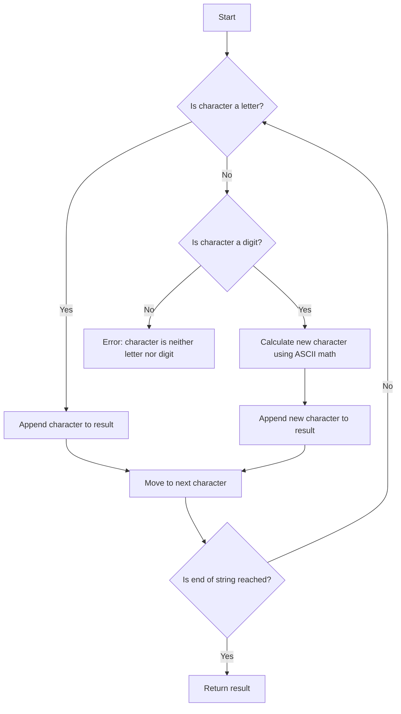

# Replace All Digits with Characters ASCII Math

## Problem Understanding
The problem requires replacing all digits in a given string with characters based on ASCII math. The replacement rule is that if a digit is encountered, it is replaced by a character that is a certain number of positions ahead of the previous character in the ASCII table, where the number of positions is the value of the digit. The key constraint is that the string may contain both letters and digits, and the replacement should only occur for digits. This problem is non-trivial because it involves understanding how to manipulate ASCII values in a programming language and how to handle the edge case where the input string is empty.

## Approach
The algorithm strategy is to iterate through the input string and check each character to see if it is a letter or a digit. If it is a letter, it is appended to the result string as is. If it is a digit, the algorithm calculates the ASCII value of the character to be replaced by adding the value of the digit to the ASCII value of the previous character. This approach works because the ASCII values for characters are contiguous, so adding a certain number of positions to the ASCII value of a character will give the ASCII value of the character that is a certain number of positions ahead. The approach handles the key constraint of replacing only digits by using the `isalpha` function to check if a character is a letter.

## Complexity Analysis
| Metric | Value | Detailed Reason |
|--------|-------|----------------|
| Time   | O(n)  | The algorithm makes a single pass through the input string, performing a constant amount of work for each character. The `isalpha` function and the calculation of the new ASCII value are both constant-time operations. |
| Space  | O(n)  | The algorithm creates a new string to store the result, which has the same length as the input string. In the worst case, every character in the input string could be replaced, so the space complexity is linear. |

## Algorithm Walkthrough
```
Input: "a1c2"
Step 1: Initialize an empty result string
Result: ""
Step 2: Iterate to the first character "a"
Result: "a" (append "a" to result)
Step 3: Iterate to the second character "1"
Previous character: "a"
New character: "a" + ("1" - '0') = "b"
Result: "ab" (append "b" to result)
Step 4: Iterate to the third character "c"
Result: "abc" (append "c" to result)
Step 5: Iterate to the fourth character "2"
Previous character: "c"
New character: "c" + ("2" - '0') = "e"
Result: "abe" (append "e" to result)
Output: "abe"
```
This walkthrough shows how the algorithm replaces the digits in the input string with characters based on ASCII math.

## Visual Flow

This flowchart shows the decision flow of the algorithm, including the checks for letters and digits, the calculation of the new character using ASCII math, and the appending of characters to the result string.

## Key Insight
> **Tip:** The key to solving this problem is understanding how to manipulate ASCII values to replace digits with characters, and using the `isalpha` function to check if a character is a letter.

## Edge Cases
- **Empty input**: If the input string is empty, the algorithm will return an empty string, as there are no characters to process.
- **Single element**: If the input string contains only one character, the algorithm will return the same string, as there are no digits to replace.
- **Input string with only digits**: If the input string contains only digits, the algorithm will throw an error, as there is no previous character to use for the ASCII math calculation.

## Common Mistakes
- **Mistake 1**: Forgetting to check if the input string is empty before processing it, which can lead to errors.
- **Mistake 2**: Not using the `isalpha` function to check if a character is a letter, which can lead to incorrect replacements.

## Interview Follow-ups
> **Interview:** These are the exact follow-up questions interviewers ask:
- "What if the input is sorted?" → The algorithm will still work correctly, as it only depends on the ASCII values of the characters, not on the order of the characters.
- "Can you do it in O(1) space?" → No, the algorithm requires O(n) space to store the result string, as it needs to create a new string with the same length as the input string.
- "What if there are duplicates?" → The algorithm will handle duplicates correctly, as it replaces each digit with a character based on the ASCII value of the previous character, regardless of whether the previous character is a duplicate or not.

## CPP Solution

```cpp
// Problem: Replace All Digits with Characters ASCII Math
// Language: C++
// Difficulty: Easy
// Time Complexity: O(n) — single pass through string
// Space Complexity: O(n) — resulting string has same length as input
// Approach: ASCII value manipulation — use ASCII values to replace digits with characters

class Solution {
public:
    string replaceDigits(string s) {
        // Initialize an empty string to store the result
        string result = "";
        
        // Iterate over the input string
        for (int i = 0; i < s.length(); i++) {
            // If the current character is a letter, append it to the result
            if (isalpha(s[i])) {
                result += s[i]; // Append the character as is
            } else {
                // If the current character is a digit, replace it with the corresponding character
                // Get the ASCII value of the previous character
                char prevChar = s[i - 1];
                // Calculate the ASCII value of the character to be replaced
                char newChar = prevChar + (s[i] - '0'); // Subtract '0' to get the integer value of the digit
                result += newChar; // Append the new character
            }
        }
        
        // Edge case: empty input → return empty string
        if (s.empty()) {
            return "";
        }
        
        return result; // Return the resulting string
    }
};
```
