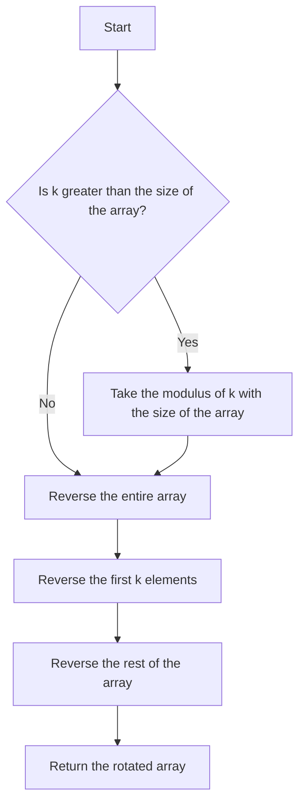

# Rotate Array by K

## Problem Understanding
The problem is asking to rotate an array by a given number of steps, k, where each step shifts the last element of the array to the first position. The key constraints are that the rotation should be performed in-place, meaning no extra space should be used, and k can be greater than the size of the array. What makes this problem non-trivial is that a naive approach of shifting elements one by one would result in a time complexity of O(n*k), which is inefficient for large arrays. The problem requires a more efficient solution that can handle large inputs.

## Approach
The algorithm strategy is to use a three-step reversal approach. The intuition behind this approach is to reverse the entire array, then reverse the first k elements, and finally reverse the rest of the array. This approach works because reversing the entire array and then reversing the first k elements effectively moves the last k elements to the beginning of the array, and reversing the rest of the array puts the remaining elements in their correct positions. The `reverse` function is used to reverse the array in-place, and the `swap` function is used to swap elements during the reversal process. The approach handles the key constraint of k being greater than the size of the array by taking the modulus of k with the size of the array.

## Complexity Analysis
| Metric | Value | Detailed Reason |
|--------|-------|----------------|
| Time   | O(n)  | The algorithm performs three reversals of the array, each taking O(n) time. The `reverse` function has a time complexity of O(n) because it iterates over the array once. The `swap` function has a constant time complexity of O(1), but it is called n times, resulting in a total time complexity of O(n). |
| Space  | O(1)  | The algorithm uses a constant amount of space to store the start and end indices of the subarray to be reversed, resulting in a space complexity of O(1). The `reverse` function is implemented in-place, meaning it does not use any extra space that scales with the input size. |

## Algorithm Walkthrough
```
Input: nums = [1, 2, 3, 4, 5, 6, 7], k = 3
Step 1: Reverse the entire array
nums = [7, 6, 5, 4, 3, 2, 1]
Step 2: Reverse the first k elements (k = 3)
nums = [5, 6, 7, 4, 3, 2, 1]
Step 3: Reverse the rest of the array
nums = [5, 6, 7, 1, 2, 3, 4]
Output: [5, 6, 7, 1, 2, 3, 4]
```
This walkthrough demonstrates the three-step reversal process, where the entire array is reversed, followed by the reversal of the first k elements, and finally the reversal of the rest of the array.

## Visual Flow

This flowchart illustrates the decision flow of the algorithm, where the modulus of k is taken if k is greater than the size of the array, and the three-step reversal process is performed.

## Key Insight
> **Tip:** The key insight is to use the three-step reversal approach to rotate the array, which reduces the time complexity from O(n*k) to O(n) and avoids using extra space.

## Edge Cases
- **Empty/null input**: If the input array is empty or null, the algorithm will not perform any operations and will return the original input. This is because the `reverse` function checks for the start and end indices before performing the reversal.
- **Single element**: If the input array has only one element, the algorithm will not perform any operations and will return the original input. This is because the `reverse` function does not swap any elements when the start and end indices are the same.
- **k is equal to the size of the array**: If k is equal to the size of the array, the algorithm will simply return the original input. This is because rotating the array by its own size does not change the array.

## Common Mistakes
- **Mistake 1**: Using a naive approach that shifts elements one by one, resulting in a time complexity of O(n*k). To avoid this, use the three-step reversal approach.
- **Mistake 2**: Not taking the modulus of k with the size of the array when k is greater than the size of the array. To avoid this, use the modulus operator to reduce k to its equivalent value within the range of the array size.

## Interview Follow-ups
> **Interview:** These are the exact follow-up questions interviewers ask:
- "What if the input is sorted?" → The algorithm will still work correctly, because the three-step reversal approach does not rely on the input being sorted.
- "Can you do it in O(1) space?" → The algorithm already uses O(1) space, because the `reverse` function is implemented in-place and does not use any extra space that scales with the input size.
- "What if there are duplicates?" → The algorithm will still work correctly, because the three-step reversal approach does not rely on the input having unique elements.

## CPP Solution

```cpp
// Problem: Rotate Array by K
// Language: cpp
// Difficulty: Easy
// Time Complexity: O(n) — three reversals of the array
// Space Complexity: O(1) — in-place reversal
// Approach: Three-step reversal — reverse the entire array, then reverse the first k elements, and finally reverse the rest

class Solution {
public:
    void rotate(vector<int>& nums, int k) {
        // Edge case: k is greater than the size of the array → take the modulus to reduce k
        k = k % nums.size();
        
        // Reverse the entire array
        reverse(nums.begin(), nums.end()); // In-place reversal
        
        // Reverse the first k elements
        reverse(nums.begin(), nums.begin() + k); // In-place reversal
        
        // Reverse the rest of the array
        reverse(nums.begin() + k, nums.end()); // In-place reversal
    }
};

// Helper function for reversing a subarray
void reverse(vector<int>& nums, int start, int end) {
    while (start < end) {
        // Swap the elements at start and end indices
        swap(nums[start], nums[end]);
        start++; // Move the start pointer forward
        end--; // Move the end pointer backward
    }
}
```
