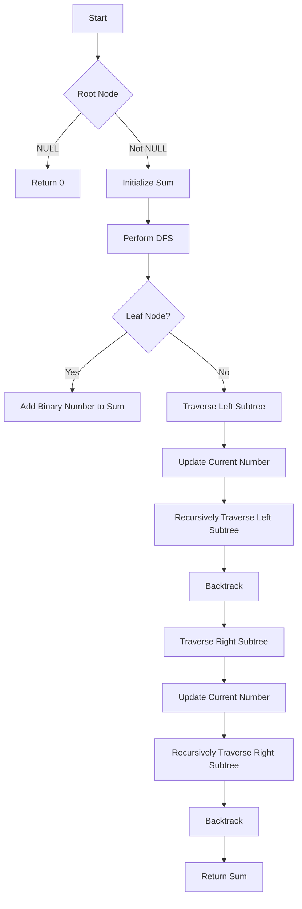

# Sum of Root To Leaf Binary Numbers

## Problem Understanding
The problem asks us to calculate the sum of all binary numbers from the root to leaf nodes in a binary tree, where each node's value represents a binary digit. The key constraint is that the binary numbers are formed by traversing the tree from the root to the leaf nodes. This problem is non-trivial because a naive approach might try to convert each path to a binary number separately, resulting in inefficient code. The given solution uses a depth-first search (DFS) approach to recursively traverse the tree and calculate the sum of binary numbers.

## Approach
The algorithm strategy is to use a recursive DFS approach to traverse the binary tree, starting from the root node. The intuition behind this approach is to keep track of the current binary number as we traverse the tree, updating it at each node by shifting the current number to the left and adding the node's value. We use a helper function `dfs` to perform the recursive traversal, and a reference to the `sum` variable is passed to this function to accumulate the sum of binary numbers. The key data structure used is the recursive call stack, which allows us to efficiently traverse the tree and calculate the binary numbers.

## Complexity Analysis
| Metric | Value | Detailed Reason |
|--------|-------|----------------|
| Time   | O(n)  | The time complexity is O(n), where n is the number of nodes in the tree, because we visit each node once during the DFS traversal. The recursive function calls are proportional to the number of nodes, and each node is visited only once. |
| Space  | O(h)  | The space complexity is O(h), where h is the height of the tree, because that's the maximum depth of the recursive call stack. In the worst case, the tree is skewed, and the height is equal to the number of nodes, resulting in O(n) space complexity. However, for a balanced tree, the height is logarithmic in the number of nodes, resulting in O(log n) space complexity. |

## Algorithm Walkthrough
```
Input: 
     1
    / \
   0   1
  / \ / \
 0  1 0  1
Step 1: Initialize sum to 0 and start DFS traversal from the root node (1)
Step 2: Traverse to the left subtree, updating the current number to (0 * 2) + 1 = 1
Step 3: Traverse to the left subtree of the left child, updating the current number to (1 * 2) + 0 = 2
Step 4: The current node is a leaf node, so add its binary number to the sum: sum += (2 * 2) + 0 = 4
Step 5: Backtrack to the left child and traverse to its right subtree, updating the current number to (1 * 2) + 1 = 3
Step 6: The current node is a leaf node, so add its binary number to the sum: sum += (3 * 2) + 1 = 7
Step 7: Backtrack to the root node and traverse to its right subtree, updating the current number to (0 * 2) + 1 = 1
Step 8: Traverse to the left subtree of the right child, updating the current number to (1 * 2) + 0 = 2
Step 9: The current node is a leaf node, so add its binary number to the sum: sum += (2 * 2) + 0 = 4
Step 10: Backtrack to the right child and traverse to its right subtree, updating the current number to (1 * 2) + 1 = 3
Step 11: The current node is a leaf node, so add its binary number to the sum: sum += (3 * 2) + 1 = 7
Output: sum = 4 + 7 + 4 + 7 = 22
```
## Visual Flow

## Key Insight
> **Tip:** The key insight is to use a recursive DFS approach to traverse the binary tree, keeping track of the current binary number as we traverse the tree, and updating it at each node by shifting the current number to the left and adding the node's value.

## Edge Cases
- **Empty/null input**: If the input tree is empty (i.e., the root node is NULL), the function returns 0, as there are no binary numbers to sum.
- **Single element**: If the input tree has only one node (i.e., the root node with no children), the function returns the binary number represented by the root node's value.
- **Skewed tree**: If the input tree is skewed (i.e., each node has only one child), the function still works correctly, traversing the tree and calculating the sum of binary numbers.

## Common Mistakes
- **Mistake 1**: Forgetting to handle the edge case where the input tree is empty. → To avoid this, we should explicitly check for NULL input and return 0.
- **Mistake 2**: Not updating the current binary number correctly during the DFS traversal. → To avoid this, we should ensure that we shift the current number to the left and add the node's value at each step.

## Interview Follow-ups
> **Interview:** These are the exact follow-up questions interviewers ask:
- "What if the input is sorted?" → The algorithm still works correctly, as it doesn't rely on the input being sorted. The time complexity remains O(n), where n is the number of nodes in the tree.
- "Can you do it in O(1) space?" → No, the algorithm requires O(h) space, where h is the height of the tree, to store the recursive call stack. We cannot reduce the space complexity to O(1) because we need to keep track of the current binary number and the recursive function calls.
- "What if there are duplicates?" → The algorithm still works correctly, as it doesn't rely on the input being unique. The time complexity remains O(n), where n is the number of nodes in the tree.

## CPP Solution

```cpp
// Problem: Sum of Root To Leaf Binary Numbers
// Language: C++
// Difficulty: Easy
// Time Complexity: O(n) — single pass through tree, visiting each node once
// Space Complexity: O(h) — maximum recursion depth, where h is the height of the tree
// Approach: Depth-First Search (DFS) — recursively traverse the tree, calculating binary numbers from root to leaf nodes

/**
 * Definition for a binary tree node.
 * struct TreeNode {
 *     int val;
 *     TreeNode *left;
 *     TreeNode *right;
 *     TreeNode(int x) : val(x), left(NULL), right(NULL) {}
 * };
 */
class Solution {
public:
    int sumRootToLeaf(TreeNode* root) {
        // Edge case: empty tree → return 0
        if (root == NULL) {
            return 0;
        }
        
        // Initialize sum to 0
        int sum = 0;
        
        // Perform DFS traversal starting from the root node
        dfs(root, 0, sum);
        
        // Return the calculated sum
        return sum;
    }
    
    // Helper function to perform DFS traversal
    void dfs(TreeNode* node, int currentNumber, int& sum) {
        // If the current node is a leaf node, add its binary number to the sum
        if (node->left == NULL && node->right == NULL) {
            // Calculate the binary number by shifting the current number to the left and adding the node's value
            sum += (currentNumber * 2) + node->val;
            return;
        }
        
        // Recursively traverse the left subtree
        if (node->left != NULL) {
            // Update the current number by shifting it to the left and adding the node's value
            dfs(node->left, (currentNumber * 2) + node->val, sum);
        }
        
        // Recursively traverse the right subtree
        if (node->right != NULL) {
            // Update the current number by shifting it to the left and adding the node's value
            dfs(node->right, (currentNumber * 2) + node->val, sum);
        }
    }
};
```
