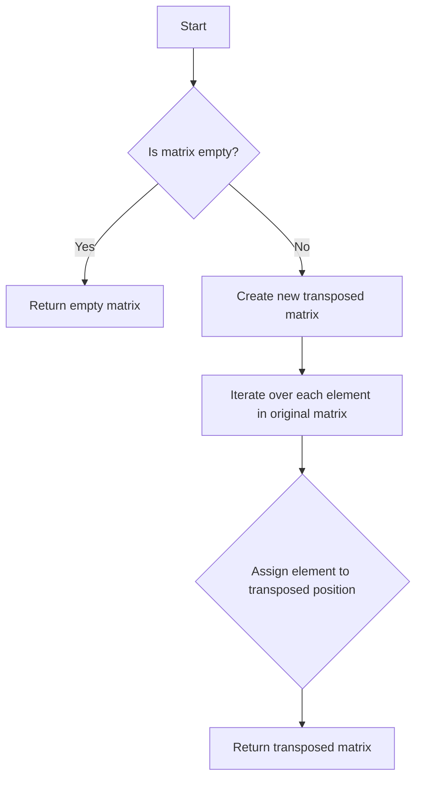

# Transpose Matrix Iteration

## Problem Understanding
The problem is asking to transpose a given matrix, which means swapping its rows with columns. The key constraint is that the input matrix can be of any size, and we need to handle edge cases like empty matrices. What makes this problem non-trivial is that a naive approach might try to transpose the matrix in-place, which can be complex and error-prone, especially for matrices with different numbers of rows and columns. The problem requires a straightforward yet efficient solution that can handle matrices of any size.

## Approach
The algorithm strategy is to create a new matrix with the number of rows and columns swapped compared to the original matrix. The intuition behind this approach is that by swapping the row and column indices of each element, we can effectively transpose the matrix. This approach works because it ensures that each element in the original matrix is assigned to its corresponding transposed position in the new matrix. We use a vector of vectors to represent the matrices, which allows us to easily access and modify elements. The approach handles key constraints by checking for empty matrices and creating a new matrix with the correct size.

## Complexity Analysis
| Metric | Value | Detailed Reason |
|--------|-------|----------------|
| Time   | O(m*n) | The algorithm iterates over each element in the matrix once, where m is the number of rows and n is the number of columns. The time complexity is linear with respect to the total number of elements in the matrix. |
| Space  | O(m*n) | The algorithm creates a new matrix with the same number of elements as the original matrix, resulting in a space complexity that is linear with respect to the total number of elements in the matrix. |

## Algorithm Walkthrough
```
Input: [[1, 2, 3], [4, 5, 6]]
Step 1: rows = 2, cols = 3
Step 2: Create a new matrix transposedMatrix with size 3x2: [[0, 0], [0, 0], [0, 0]]
Step 3: Iterate over each element in the original matrix:
  - transposedMatrix[0][0] = matrix[0][0] = 1
  - transposedMatrix[1][0] = matrix[0][1] = 2
  - transposedMatrix[2][0] = matrix[0][2] = 3
  - transposedMatrix[0][1] = matrix[1][0] = 4
  - transposedMatrix[1][1] = matrix[1][1] = 5
  - transposedMatrix[2][1] = matrix[1][2] = 6
Output: [[1, 4], [2, 5], [3, 6]]
```
This example demonstrates how the algorithm transposes a 2x3 matrix into a 3x2 matrix.

## Visual Flow

This flowchart shows the decision flow of the algorithm, including the handling of empty matrices and the iteration over each element in the original matrix.

## Key Insight
> **Tip:** The key insight is to create a new matrix with the correct size and iterate over each element in the original matrix, assigning it to its corresponding transposed position in the new matrix.

## Edge Cases
- **Empty/null input**: If the input matrix is empty, the algorithm returns an empty matrix. This is because there are no elements to transpose, and the resulting matrix should also be empty.
- **Single element**: If the input matrix has only one element, the algorithm returns a 1x1 matrix with the same element. This is because a single element can be considered as a 1x1 matrix, and its transpose is the same.
- **Square matrix**: If the input matrix is a square matrix (i.e., it has the same number of rows and columns), the algorithm returns a matrix with the same size. This is because the transpose of a square matrix is also a square matrix with the same size.

## Common Mistakes
- **Mistake 1**: Not checking for empty matrices before attempting to transpose them. To avoid this, always check if the input matrix is empty before proceeding with the transposition.
- **Mistake 2**: Trying to transpose the matrix in-place without creating a new matrix. To avoid this, create a new matrix with the correct size and iterate over each element in the original matrix, assigning it to its corresponding transposed position in the new matrix.

## Interview Follow-ups
> **Interview:** These are the exact follow-up questions interviewers ask:
- "What if the input is sorted?" → The algorithm still works correctly, as the transposition operation does not depend on the sortedness of the input matrix.
- "Can you do it in O(1) space?" → No, it is not possible to transpose a matrix in O(1) space, as we need to create a new matrix with the same number of elements as the original matrix.
- "What if there are duplicates?" → The algorithm still works correctly, as the transposition operation does not depend on the presence of duplicates in the input matrix.

## CPP Solution

```cpp
// Problem: Transpose Matrix Iteration
// Language: cpp
// Difficulty: Easy
// Time Complexity: O(m*n) — iterating over each element in the matrix
// Space Complexity: O(m*n) — creating a new matrix for the transpose
// Approach: Matrix iteration and swapping — for each element, assign it to its corresponding transposed position

class Solution {
public:
    vector<vector<int>> transpose(vector<vector<int>>& matrix) {
        int rows = matrix.size(); // Get the number of rows in the matrix
        int cols = matrix[0].size(); // Get the number of columns in the matrix
        
        // Edge case: empty input → return empty matrix
        if (rows == 0 || cols == 0) return {};

        vector<vector<int>> transposedMatrix(cols, vector<int>(rows, 0)); // Create a new matrix for the transpose
        
        // Iterate over each element in the original matrix and assign it to its corresponding transposed position
        for (int i = 0; i < rows; i++) {
            for (int j = 0; j < cols; j++) {
                transposedMatrix[j][i] = matrix[i][j]; // Swap row and column indices to transpose
            }
        }
        
        return transposedMatrix; // Return the transposed matrix
    }
};
```
