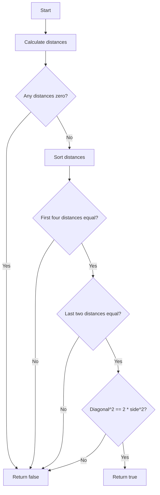

# Valid Square Coordinate Geometry

## Problem Understanding
The problem asks to determine whether four given points in a 2D plane form a valid square. The key constraint is that the points must form a square, meaning all sides must have the same length, and the diagonals must also have the same length. The problem becomes non-trivial because a naive approach would involve checking all possible combinations of point pairs, resulting in inefficient time complexity. Additionally, the problem requires handling edge cases such as identical points, collinear points, and points that do not form a square.

## Approach
The algorithm strategy is to calculate the distances between all pairs of points and compare them. The intuition behind this approach is that a square has four equal sides and two equal diagonals. By sorting the distances, we can easily check if the first four distances (sides) are equal and the last two distances (diagonals) are equal. We use a fixed amount of space to store the distances and points, resulting in a constant space complexity. The approach handles key constraints by checking for identical points, sorting the distances, and verifying the relationships between the sides and diagonals.

## Complexity Analysis
| Metric | Value | Detailed Reason |
|--------|-------|----------------|
| Time   | O(1)  | The algorithm has a constant number of operations, including calculating distances, sorting, and comparing values. Although the sorting operation has a time complexity of O(n log n), in this case, n is fixed (6 distances), making the overall time complexity constant. |
| Space  | O(1)  | The algorithm uses a fixed amount of space to store the points, distances, and other variables, resulting in a constant space complexity. |

## Algorithm Walkthrough
```
Input: p1 = [0, 0], p2 = [2, 2], p3 = [2, 0], p4 = [0, 2]
Step 1: Calculate distances between all pairs of points
  - dist_p1_p2 = sqrt((0-2)^2 + (0-2)^2) = sqrt(8) = 2.828
  - dist_p1_p3 = sqrt((0-2)^2 + (0-0)^2) = sqrt(4) = 2
  - dist_p1_p4 = sqrt((0-0)^2 + (0-2)^2) = sqrt(4) = 2
  - dist_p2_p3 = sqrt((2-2)^2 + (2-0)^2) = sqrt(4) = 2
  - dist_p2_p4 = sqrt((2-0)^2 + (2-2)^2) = sqrt(4) = 2
  - dist_p3_p4 = sqrt((2-0)^2 + (0-2)^2) = sqrt(8) = 2.828
Step 2: Sort the distances
  - distances = [2, 2, 2, 2, 2.828, 2.828]
Step 3: Check if the first four distances are equal (sides of the square)
  - distances[0] == distances[1] == distances[2] == distances[3] == 2
Step 4: Check if the last two distances are equal (diagonals of the square)
  - distances[4] == distances[5] == 2.828
Step 5: Check if the square of the diagonal is equal to twice the square of the side
  - distances[4]^2 == 2 * distances[0]^2
Output: true
```
## Visual Flow

## Key Insight
> **Tip:** The key insight is that a square has four equal sides and two equal diagonals, and by sorting the distances, we can easily check these conditions.

## Edge Cases
- **Empty/null input**: If any of the input points are empty or null, the algorithm will throw an error. To handle this, we can add input validation to check for empty or null points.
- **Single element**: If only one point is provided, the algorithm will return false because a single point cannot form a square. To handle this, we can add a check for the number of input points.
- **Collinear points**: If all four points are collinear, the algorithm will return false because collinear points cannot form a square. To handle this, we can add a check for collinearity by calculating the slopes between points.

## Common Mistakes
- **Mistake 1**: Not checking for identical points, which can result in division by zero or incorrect distance calculations. To avoid this, we can add a check for identical points at the beginning of the algorithm.
- **Mistake 2**: Not sorting the distances correctly, which can result in incorrect comparisons. To avoid this, we can use a reliable sorting algorithm or library function.

## Interview Follow-ups
> **Interview:** These are the exact follow-up questions interviewers ask:
- "What if the input is sorted?" → The algorithm still works correctly because it sorts the distances internally.
- "Can you do it in O(1) space?" → The algorithm already uses O(1) space because it uses a fixed amount of space to store the points and distances.
- "What if there are duplicates?" → The algorithm handles duplicates by checking for identical points and returning false if any are found.

## CPP Solution

```cpp
// Problem: Valid Square Coordinate Geometry
// Language: cpp
// Difficulty: Easy
// Time Complexity: O(1) — constant time since we are dealing with a fixed number of points
// Space Complexity: O(1) — constant space since we are using a fixed amount of space
// Approach: Distance calculation and comparison — calculate distances between points and compare them

class Solution {
public:
    bool validSquare(vector<int>& p1, vector<int>& p2, vector<int>& p3, vector<int>& p4) {
        // Calculate distances between all pairs of points
        double dist_p1_p2 = calculateDistance(p1, p2); // distance between p1 and p2
        double dist_p1_p3 = calculateDistance(p1, p3); // distance between p1 and p3
        double dist_p1_p4 = calculateDistance(p1, p4); // distance between p1 and p4
        double dist_p2_p3 = calculateDistance(p2, p3); // distance between p2 and p3
        double dist_p2_p4 = calculateDistance(p2, p4); // distance between p2 and p4
        double dist_p3_p4 = calculateDistance(p3, p4); // distance between p3 and p4

        // Edge case: if any of the distances are zero, it means the points are the same
        if (dist_p1_p2 == 0 || dist_p1_p3 == 0 || dist_p1_p4 == 0 || dist_p2_p3 == 0 || dist_p2_p4 == 0 || dist_p3_p4 == 0) {
            return false; // return false if any of the distances are zero
        }

        // Sort the distances
        double distances[] = {dist_p1_p2, dist_p1_p3, dist_p1_p4, dist_p2_p3, dist_p2_p4, dist_p3_p4};
        sort(distances, distances + 6); // sort the distances in ascending order

        // Check if the first four distances are equal (sides of the square)
        if (distances[0] != distances[1] || distances[1] != distances[2] || distances[2] != distances[3]) {
            return false; // return false if the first four distances are not equal
        }

        // Check if the last two distances are equal (diagonals of the square)
        if (distances[4] != distances[5]) {
            return false; // return false if the last two distances are not equal
        }

        // Check if the square of the diagonal is equal to twice the square of the side
        if (distances[4] * distances[4] != 2 * distances[0] * distances[0]) {
            return false; // return false if the square of the diagonal is not equal to twice the square of the side
        }

        return true; // return true if all conditions are met
    }

    double calculateDistance(vector<int>& p1, vector<int>& p2) {
        // Calculate the distance between two points using the Euclidean distance formula
        return sqrt(pow(p1[0] - p2[0], 2) + pow(p1[1] - p2[1], 2)); // calculate the distance between p1 and p2
    }
};
```
