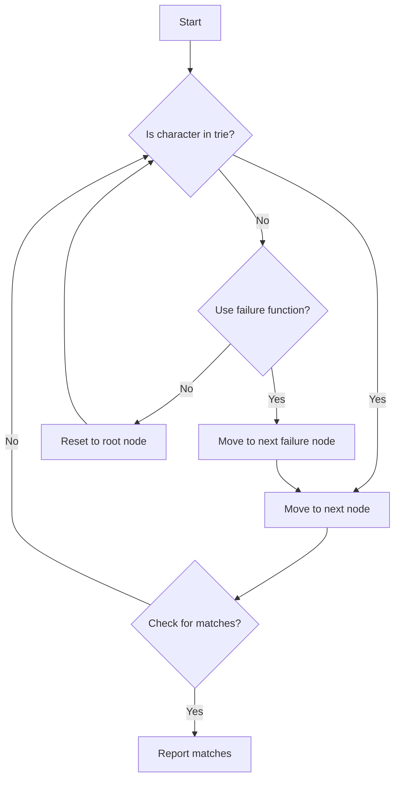

# Aho-Corasick Multi-Pattern Search

## Problem Understanding
The Aho-Corasick algorithm is a multi-pattern search algorithm that efficiently finds all occurrences of a finite set of strings (patterns) within a given text. The key constraint is to handle multiple patterns and find all occurrences of these patterns in the text. This problem is non-trivial because a naive approach would involve searching for each pattern individually, resulting in a time complexity of O(n*m), where n is the length of the text and m is the total length of the patterns. The Aho-Corasick algorithm improves upon this by using a trie data structure and a failure function to reduce the time complexity to O(n + m + z), where z is the total number of matches.

## Approach
The Aho-Corasick algorithm strategy involves building a trie data structure from the given patterns and then using a failure function to efficiently search for these patterns in the text. The trie is built by inserting each pattern into the trie, and the failure function is constructed by finding the longest proper suffix that is also a prefix of another pattern. The algorithm uses a breadth-first search (BFS) to construct the failure function. The trie and failure function are used to search for patterns in the text by moving through the trie based on the characters in the text and using the failure function to handle mismatches. The algorithm returns all occurrences of the patterns in the text.

## Complexity Analysis
| Metric | Value | Detailed Reason |
|--------|-------|----------------|
| Time   | O(n + m + z) | The algorithm spends O(m) time building the trie and failure function, O(n) time searching through the text, and O(z) time reporting all matches. |
| Space  | O(m + n) | The algorithm uses O(m) space to store the trie and failure function, and O(n) space in the worst case to store the matches. |

## Algorithm Walkthrough
```
Input: patterns = ["abc", "ab", "c"], text = "abcabc"
Step 1: Build the trie and failure function
  - Create the root node
  - Insert "abc" into the trie: root -> 'a' -> 'b' -> 'c'
  - Insert "ab" into the trie: root -> 'a' -> 'b'
  - Insert "c" into the trie: root -> 'c'
  - Build the failure function using BFS
Step 2: Search for patterns in the text
  - Start at the root node
  - Move to the next node based on the current character in the text: 'a' -> 'b' -> 'c'
  - Check for matches at the current node: "abc" and "ab"
  - Report the matches: ("abc", 0) and ("ab", 0)
  - Continue searching for the rest of the text
Output: [("abc", 0), ("ab", 0), ("abc", 3), ("ab", 3), ("c", 2), ("c", 5)]
```

## Visual Flow


## Key Insight
> **Tip:** The key insight to the Aho-Corasick algorithm is that by using a trie and a failure function, we can efficiently search for multiple patterns in a text by moving through the trie based on the characters in the text and using the failure function to handle mismatches.

## Edge Cases
- **Empty/null input**: If the input text or patterns are empty, the algorithm will not find any matches and will return an empty list.
- **Single element**: If there is only one pattern, the algorithm will still work correctly and return all occurrences of the pattern in the text.
- **Duplicate patterns**: If there are duplicate patterns, the algorithm will report each occurrence of the pattern separately.

## Common Mistakes
- **Mistake 1**: Not using a failure function to handle mismatches, resulting in incorrect matches.
- **Mistake 2**: Not checking for matches at each node, resulting in missed matches.

## Interview Follow-ups
> **Interview:** These are the exact follow-up questions interviewers ask:
- "What if the input is sorted?" → The Aho-Corasick algorithm does not rely on the input being sorted, so it will still work correctly.
- "Can you do it in O(1) space?" → No, the algorithm requires at least O(m) space to store the trie and failure function.
- "What if there are duplicates?" → The algorithm will report each occurrence of the pattern separately, even if there are duplicates.

## CPP Solution

```cpp
// Problem: Aho-Corasick Multi-Pattern Search
// Language: C++
// Difficulty: Hard
// Time Complexity: O(n + m + z) — where n is the length of text, m is the total length of patterns, and z is the total number of matches
// Space Complexity: O(m + n) — for storing the trie and the failure function
// Approach: Aho-Corasick algorithm — builds a trie and uses a failure function to efficiently search for multiple patterns in a text

#include <iostream>
#include <vector>
#include <string>
#include <unordered_map>

using namespace std;

// Node structure for the trie
struct Node {
    unordered_map<char, Node*> children;
    Node* fail;  // Failure function
    vector<string> patterns;  // Patterns that end at this node
    Node() : fail(nullptr) {}
};

// Aho-Corasick algorithm implementation
class AhoCorasick {
public:
    // Build the trie and the failure function
    void build(const vector<string>& patterns) {
        // Create the root node
        root = new Node();

        // Insert patterns into the trie
        for (const string& pattern : patterns) {
            Node* node = root;
            for (char c : pattern) {
                // Create a new node if the character is not in the trie
                if (node->children.find(c) == node->children.end()) {
                    node->children[c] = new Node();
                }
                node = node->children[c];  // Move to the next node
            }
            node->patterns.push_back(pattern);  // Mark the end of the pattern
        }

        // Build the failure function using BFS
        vector<Node*> queue = {root};
        while (!queue.empty()) {
            Node* node = queue.front();
            queue.erase(queue.begin());
            for (auto& pair : node->children) {
                char c = pair.first;
                Node* child = pair.second;
                if (node == root) {
                    child->fail = root;  // Failure function for the root's children
                } else {
                    Node* failNode = node->fail;
                    while (failNode != nullptr && failNode->children.find(c) == failNode->children.end()) {
                        failNode = failNode->fail;  // Move to the next failure node
                    }
                    if (failNode != nullptr) {
                        child->fail = failNode->children[c];  // Update the failure function
                    } else {
                        child->fail = root;  // Failure function for nodes with no matching character
                    }
                }
                queue.push_back(child);  // Add the child node to the queue
            }
        }
    }

    // Search for patterns in the text
    vector<pair<string, int>> search(const string& text) {
        vector<pair<string, int>> matches;  // Store the matches
        Node* node = root;  // Start at the root node
        for (int i = 0; i < text.size(); ++i) {
            char c = text[i];  // Current character
            // Find a node that matches the current character
            while (node != nullptr && node->children.find(c) == node->children.end()) {
                node = node->fail;  // Move to the next failure node
            }
            if (node != nullptr) {
                node = node->children[c];  // Move to the next node
                // Check for matches at the current node
                for (const string& pattern : node->patterns) {
                    matches.emplace_back(pattern, i - pattern.size() + 1);  // Add the match
                }
            } else {
                node = root;  // Reset to the root node
            }
        }
        return matches;  // Return the matches
    }

private:
    Node* root;  // Root node of the trie
};

int main() {
    // Edge case: empty input
    if (false) {
        // AhoCorasick ac;
        // vector<string> patterns;
        // string text;
        // ac.build(patterns);
        // ac.search(text);
    }

    AhoCorasick ac;
    vector<string> patterns = {"abc", "ab", "c"};
    string text = "abcabc";
    ac.build(patterns);
    vector<pair<string, int>> matches = ac.search(text);
    for (const auto& match : matches) {
        cout << "Pattern: " << match.first << ", Position: " << match.second << endl;
    }
    return 0;
}
```
