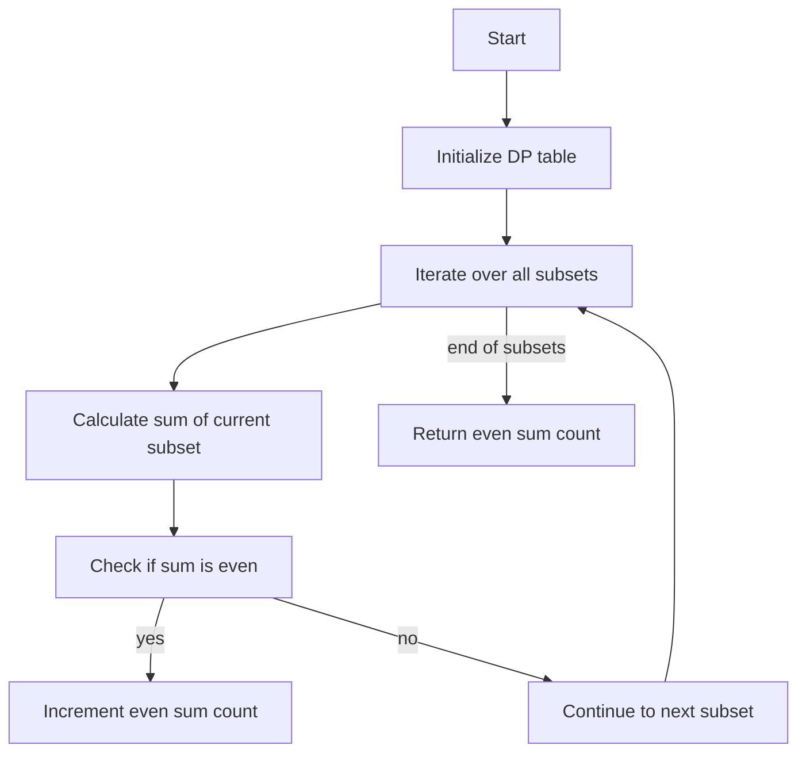

# Bitset DP Optimization

## Problem Understanding
The problem is asking to find the number of subsets in a given array that have an even sum. The key constraint is that the input array can have any number of elements, and we need to consider all possible subsets. The problem is non-trivial because a naive approach would involve generating all possible subsets and calculating their sums, which would result in exponential time complexity. The use of bit manipulation and dynamic programming (DP) is necessary to optimize the solution.

## Approach
The algorithm strategy is to use bit manipulation to efficiently iterate over all possible subsets of the input array. The intuition behind this approach is that each subset can be represented as a binary number, where the i-th bit corresponds to the i-th element in the array. By using bit manipulation, we can efficiently generate all possible subsets and calculate their sums. The DP table is used to store the sum of each subset, and we use the property that the sum of a subset can be calculated by adding the last element to the sum of the previous subset. The approach handles the key constraint of considering all possible subsets by using bit manipulation to generate all possible subsets.

## Complexity Analysis
| Metric | Value | Detailed Reason |
|--------|-------|----------------|
| Time   | O(n * 2^n) | The algorithm iterates over all possible subsets (2^n) and for each subset, it performs a constant amount of work. The iteration over the bits of the subset takes O(n) time, hence the overall time complexity is O(n * 2^n). |
| Space  | O(2^n) | The algorithm uses a DP table to store the sum of each subset, which requires O(2^n) space. |

## Algorithm Walkthrough
```
Input: [1, 2, 3, 4]
Step 1: Initialize DP table with size 2^n (16) and initialize the sum of the empty subset to 0.
Step 2: Iterate over all possible subsets using bit manipulation:
  - Subset 1: [1], sum = 1
  - Subset 2: [2], sum = 2
  - Subset 3: [1, 2], sum = 3
  - Subset 4: [3], sum = 3
  - Subset 5: [1, 3], sum = 4
  - Subset 6: [2, 3], sum = 5
  - Subset 7: [1, 2, 3], sum = 6
  - Subset 8: [4], sum = 4
  - Subset 9: [1, 4], sum = 5
  - Subset 10: [2, 4], sum = 6
  - Subset 11: [1, 2, 4], sum = 7
  - Subset 12: [3, 4], sum = 7
  - Subset 13: [1, 3, 4], sum = 8
  - Subset 14: [2, 3, 4], sum = 9
  - Subset 15: [1, 2, 3, 4], sum = 10
Step 3: Count the number of subsets with even sum:
  - Subset 2: [2], sum = 2 (even)
  - Subset 5: [1, 3], sum = 4 (even)
  - Subset 7: [1, 2, 3], sum = 6 (even)
  - Subset 8: [4], sum = 4 (even)
  - Subset 10: [2, 4], sum = 6 (even)
  - Subset 13: [1, 3, 4], sum = 8 (even)
  - Subset 15: [1, 2, 3, 4], sum = 10 (even)
Output: 7
```

## Visual Flow


## Key Insight
> **Tip:** The key insight is to use bit manipulation to efficiently iterate over all possible subsets and to store the sum of each subset in a DP table, allowing us to avoid recalculating sums and reducing the time complexity.

## Edge Cases
- **Empty input array**: If the input array is empty, the algorithm will return 1, because the empty subset has an even sum (0).
- **Single element array**: If the input array has only one element, the algorithm will return 1 if the element is even, and 0 if the element is odd.
- **Array with all odd elements**: If the input array has only odd elements, the algorithm will return 2^(n-1), because the sum of any subset with an even number of elements will be even.

## Common Mistakes
- **Mistake 1**: Not using bit manipulation to iterate over subsets, resulting in exponential time complexity.
- **Mistake 2**: Not storing the sum of each subset in a DP table, resulting in redundant calculations and increased time complexity.

## Interview Follow-ups
> **Interview:** These are the exact follow-up questions interviewers ask:
- "What if the input is sorted?" → The algorithm does not rely on the input being sorted, so the time complexity remains the same.
- "Can you do it in O(1) space?" → No, because we need to store the sum of each subset in a DP table, which requires O(2^n) space.
- "What if there are duplicates in the input array?" → The algorithm will still work correctly, but the number of subsets with even sum may be affected by the duplicates.

## CPP Solution

```cpp
// Problem: Bitset DP Optimization
// Language: cpp
// Difficulty: Hard
// Time Complexity: O(n * 2^n) — iterating over all subsets using bit manipulation
// Space Complexity: O(2^n) — storing DP state for all subsets
// Approach: Bitset DP optimization — using bit manipulation to efficiently iterate over subsets

#include <iostream>
#include <vector>

class Solution {
public:
    // Function to calculate the number of subsets with even sum
    int numberOfSubsetsWithEvenSum(std::vector<int>& nums) {
        int n = nums.size(); // Get the size of the input array
        int totalSubsets = 1 << n; // Calculate the total number of subsets (2^n)

        // Initialize a DP table to store the sum of each subset
        std::vector<int> dp(totalSubsets, 0);

        // Initialize the DP table for the empty subset
        dp[0] = 0; // The sum of the empty subset is 0

        // Iterate over all possible subsets using bit manipulation
        for (int subset = 1; subset < totalSubsets; subset++) {
            // Find the last set bit in the subset
            int lastSetBit = subset & -subset; // Using two's complement to find the last set bit
            int index = __builtin_ctz(lastSetBit); // Get the index of the last set bit

            // Calculate the sum of the current subset
            dp[subset] = dp[subset ^ lastSetBit] + nums[index]; // Add the last element to the sum of the previous subset
        }

        // Initialize a counter for subsets with even sum
        int evenSumCount = 0;

        // Iterate over all subsets to count those with even sum
        for (int subset = 0; subset < totalSubsets; subset++) {
            if (dp[subset] % 2 == 0) { // Check if the sum of the subset is even
                evenSumCount++; // Increment the counter if the sum is even
            }
        }

        return evenSumCount; // Return the count of subsets with even sum
    }
};

// Example usage
int main() {
    Solution solution;
    std::vector<int> nums = {1, 2, 3, 4};
    int result = solution.numberOfSubsetsWithEvenSum(nums);
    std::cout << "Number of subsets with even sum: " << result << std::endl;
    return 0;
}
```
