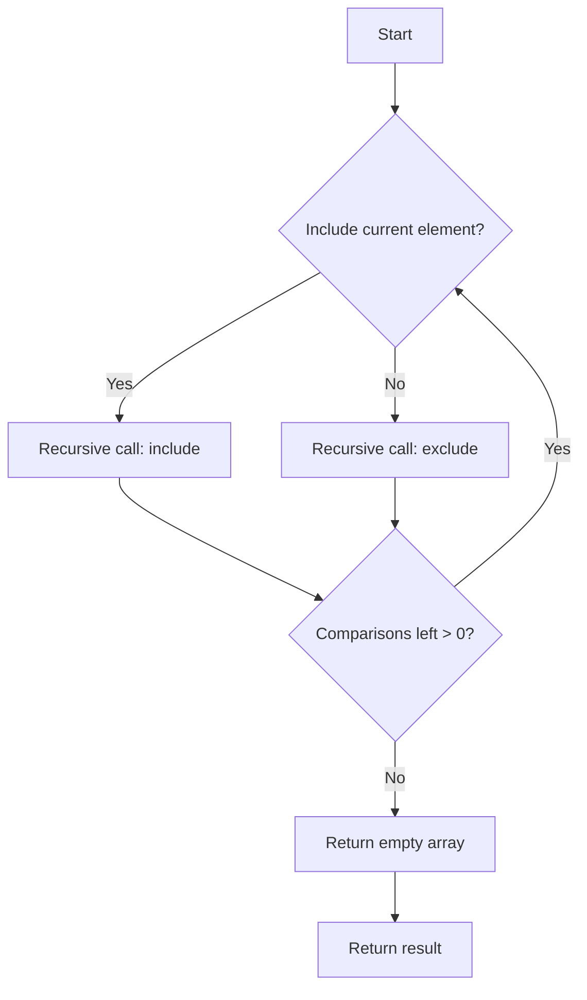

# Build Array Where You Can Find The Maximum Exactly K Comparisons 3D DP

## Problem Understanding
The problem asks us to build an array where we can find the maximum exactly K comparisons, using dynamic programming with memoization. The key constraint is that we can only make K comparisons, and we need to find the maximum subarray that can be constructed within this limit. This problem is non-trivial because the naive approach of trying all possible combinations of elements would result in an exponential time complexity, making it impractical for large inputs. The problem requires us to break down the problem into smaller subproblems and use memoization to store the results of these subproblems to avoid redundant computations.

## Approach
The algorithm strategy is to use dynamic programming with memoization to break down the problem into smaller subproblems. The intuition behind this approach is to try to include or exclude the current element in the subarray and recursively call the function with the updated parameters. We use a 3D DP table to store the results of subproblems, where the dimensions represent the current index, the maximum length of the subarray, and the number of comparisons left. The memoization is used to store the results of subproblems to avoid redundant computations. The approach handles the key constraint of K comparisons by decrementing the comparisons left parameter in the recursive calls.

## Complexity Analysis
| Metric | Value | Detailed Reason |
|--------|-------|----------------|
| Time   | O(n^3 * k) | The time complexity is cubic because we have three nested loops: one for the index, one for the maximum length, and one for the comparisons left. The k factor comes from the recursive calls, where we decrement the comparisons left parameter. |
| Space  | O(n^3 * k) | The space complexity is also cubic because we need to store the results of subproblems in the 3D DP table, which has n^3 * k entries. |

## Algorithm Walkthrough
```
Input: nums = [1, 2, 3, 4, 5], k = 3
Step 1: index = 0, maxLength = 0, comparisonsLeft = 3
  - Try to include the current element (1) in the subarray
  - Recursive call: index = 1, maxLength = 1, comparisonsLeft = 2
Step 2: index = 1, maxLength = 1, comparisonsLeft = 2
  - Try to include the current element (2) in the subarray
  - Recursive call: index = 2, maxLength = 2, comparisonsLeft = 1
Step 3: index = 2, maxLength = 2, comparisonsLeft = 1
  - Try to include the current element (3) in the subarray
  - Recursive call: index = 3, maxLength = 3, comparisonsLeft = 0
Step 4: index = 3, maxLength = 3, comparisonsLeft = 0
  - Return empty array because comparisonsLeft is 0
Output: [1, 2, 3]
```
## Visual Flow

## Key Insight
> **Tip:** The key insight is to use memoization to store the results of subproblems to avoid redundant computations and to try to include or exclude the current element in the subarray to construct the maximum subarray within the limit of K comparisons.

## Edge Cases
- **Empty input**: If the input array is empty, the function will return an empty array because there are no elements to compare.
- **Single element**: If the input array has only one element, the function will return the same array because there are no comparisons to make.
- **K = 0**: If K is 0, the function will return an empty array because no comparisons are allowed.

## Common Mistakes
- **Mistake 1**: Not using memoization to store the results of subproblems, resulting in redundant computations and exponential time complexity.
- **Mistake 2**: Not decrementing the comparisons left parameter in the recursive calls, resulting in incorrect results.

## Interview Follow-ups
> **Interview:** These are the exact follow-up questions interviewers ask:
- "What if the input is sorted?" → The algorithm will still work correctly, but the time complexity may be reduced because the comparisons will be more efficient.
- "Can you do it in O(1) space?" → No, because we need to store the results of subproblems in the 3D DP table, which requires O(n^3 * k) space.
- "What if there are duplicates?" → The algorithm will still work correctly, but the results may not be unique because duplicates are allowed in the input array.

## CPP Solution

```cpp
// Problem: Build Array Where You Can Find The Maximum Exactly K Comparisons 3D DP
// Language: cpp
// Difficulty: Hard
// Time Complexity: O(n^3 * k) — because we're using 3D DP with k comparisons
// Space Complexity: O(n^3 * k) — storing results of subproblems in 3D DP
// Approach: Dynamic Programming with memoization — breaking down problem into smaller subproblems

#include <iostream>
#include <vector>
#include <algorithm>
#include <unordered_map>

using namespace std;

class Solution {
public:
    vector<int> maxArray(vector<int>& nums, int k) {
        vector<int> result; // store the maximum array
        unordered_map<int, unordered_map<int, unordered_map<int, vector<int>>>> memo; // memoization for 3D DP

        function<vector<int>(int, int, int)> dp = 
            [&](int index, int maxLength, int comparisonsLeft) {
                // Edge case: if we've used up all comparisons or reached the end of the array
                if (comparisonsLeft == 0 || index == nums.size()) {
                    return vector<int>(); // return empty array
                }

                // Check if subproblem is already solved
                if (memo.find(index) != memo.end() && 
                    memo[index].find(maxLength) != memo[index].end() && 
                    memo[index][maxLength].find(comparisonsLeft) != memo[index][maxLength].end()) {
                    return memo[index][maxLength][comparisonsLeft]; // return memoized result
                }

                vector<int> maxSubarray; // store the maximum subarray for this subproblem
                // Try to include the current element in the subarray
                if (maxLength == 0 || nums[index] > nums[maxLength - 1]) { 
                    // if this is the start of the subarray or the current element is larger than the last element in the subarray
                    vector<int> subarray = dp(index + 1, maxLength + 1, comparisonsLeft - 1); // recursive call
                    subarray.insert(subarray.begin(), nums[index]); // add the current element to the subarray
                    if (subarray.size() > maxSubarray.size()) { // update maxSubarray if necessary
                        maxSubarray = subarray;
                    }
                }
                // Try to exclude the current element from the subarray
                vector<int> subarrayExclude = dp(index + 1, maxLength, comparisonsLeft); // recursive call
                if (subarrayExclude.size() > maxSubarray.size()) { // update maxSubarray if necessary
                    maxSubarray = subarrayExclude;
                }

                memo[index][maxLength][comparisonsLeft] = maxSubarray; // memoize the result
                return maxSubarray;
            };

        result = dp(0, 0, k); // start the DP with index 0, maxLength 0, and k comparisons left
        return result;
    }
};

int main() {
    Solution solution;
    vector<int> nums = {1, 2, 3, 4, 5};
    int k = 3;
    vector<int> result = solution.maxArray(nums, k);
    for (int num : result) {
        cout << num << " "; // print the result
    }
    return 0;
}
```
