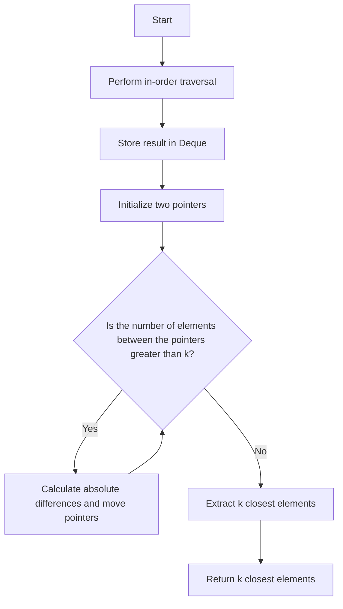

# Closest Binary Search Tree Value II Tree Traversal + Deque

## Problem Understanding
The problem is asking to find the k closest values to a given target in a Binary Search Tree (BST). The key constraint is that we need to find the k closest elements, which implies that we need to consider the absolute differences between the target and the elements in the BST. What makes this problem non-trivial is that a naive approach of simply traversing the BST and calculating the absolute differences would not be efficient, especially for large BSTs. The problem requires a more efficient approach that takes advantage of the properties of a BST.

## Approach
The algorithm strategy is to perform an in-order traversal of the BST and store the result in a Deque. This approach works because an in-order traversal of a BST visits the nodes in ascending order, which allows us to efficiently find the k closest elements. The intuition behind this approach is that the in-order traversal result will be a sorted list of elements, and we can then use two pointers to find the k closest elements. We use a Deque to store the in-order traversal result because it allows us to efficiently extract the k closest elements. The approach handles the key constraint of finding the k closest elements by using the two pointers to narrow down the search space.

## Complexity Analysis
| Metric | Value | Detailed Reason |
|--------|-------|----------------|
| Time   | O(n)  | The time complexity is O(n) because we perform an in-order traversal of the BST, which visits each node once. The subsequent while loop has a time complexity of O(n) in the worst case, but since we only iterate over the Deque once, the overall time complexity remains O(n). |
| Space  | O(n)  | The space complexity is O(n) because we store the in-order traversal result in a Deque, which requires O(n) space. |

## Algorithm Walkthrough
```
Input: 
  root = [4, 2, 5, 1, 3], target = 3.714286, k = 2
Step 1: 
  Perform in-order traversal of the BST and store the result in a Deque: [1, 2, 3, 4, 5]
Step 2: 
  Initialize two pointers, one at the beginning and one at the end of the Deque: left = 0, right = 4
Step 3: 
  Continue the loop until we find the k closest elements:
    - Calculate the absolute differences between the target and the elements at the left and right pointers: leftDiff = 2.714286, rightDiff = 1.285714
    - Since leftDiff > rightDiff, move the left pointer to the right: left = 1
    - Repeat the loop until we find the k closest elements
Step 4: 
  Extract the k closest elements from the Deque: [3, 4]
Output: 
  [3, 4]
```

## Visual Flow


## Key Insight
> **Tip:** The key insight is to use an in-order traversal of the BST to get a sorted list of elements, and then use two pointers to efficiently find the k closest elements.

## Edge Cases
- **Empty/null input**: If the input BST is empty, the in-order traversal result will be an empty Deque, and the function will return an empty vector.
- **Single element**: If the input BST has only one element, the in-order traversal result will be a Deque with one element, and the function will return a vector with that element if it is one of the k closest elements.
- **Target is equal to an element in the BST**: If the target is equal to an element in the BST, the function will return a vector with that element and the k-1 closest elements.

## Common Mistakes
- **Mistake 1**: Not handling the case where the target is equal to an element in the BST. To avoid this, we need to consider the case where the target is equal to an element in the BST and return the correct result.
- **Mistake 2**: Not using a Deque to store the in-order traversal result. To avoid this, we need to use a Deque to store the in-order traversal result, which allows us to efficiently extract the k closest elements.

## Interview Follow-ups
> **Interview:** These are the exact follow-up questions interviewers ask:
- "What if the input is sorted?" → The input BST is already sorted, so the in-order traversal result will be a sorted list of elements.
- "Can you do it in O(1) space?" → No, we need to use a Deque to store the in-order traversal result, which requires O(n) space.
- "What if there are duplicates?" → If there are duplicates in the BST, the in-order traversal result will contain duplicates. To handle this, we can modify the function to ignore duplicates when calculating the absolute differences.

## CPP Solution

```cpp
// Problem: Closest Binary Search Tree Value II
// Language: C++
// Difficulty: Hard
// Time Complexity: O(n) — in-order traversal of the BST
// Space Complexity: O(n) — storing the in-order traversal result
// Approach: In-order traversal + Deque — storing the in-order traversal result in a Deque and then finding the k closest elements

/**
 * Definition for a binary tree node.
 * struct TreeNode {
 *     int val;
 *     TreeNode *left;
 *     TreeNode *right;
 *     TreeNode(int x) : val(x), left(NULL), right(NULL) {}
 * };
 */
class Solution {
public:
    vector<int> closestKValues(TreeNode* root, double target, int k) {
        // Initialize an empty Deque to store the in-order traversal result
        deque<int> result;
        
        // Perform in-order traversal and store the result in the Deque
        inOrderTraversal(root, result);
        
        // Initialize two pointers, one at the beginning and one at the end of the Deque
        int left = 0, right = result.size() - 1;
        
        // Continue the loop until we find the k closest elements
        while (right - left + 1 > k) {
            // Calculate the absolute difference between the target and the elements at the left and right pointers
            double leftDiff = abs(result[left] - target);
            double rightDiff = abs(result[right] - target);
            
            // If the left element is closer to the target, move the right pointer to the left
            if (leftDiff < rightDiff) {
                right--; // Move the right pointer to the left
            } 
            // If the right element is closer to the target, move the left pointer to the right
            else {
                left++; // Move the left pointer to the right
            }
        }
        
        // Extract the k closest elements from the Deque and store them in a vector
        vector<int> closestKValues(result.begin() + left, result.begin() + right + 1);
        
        return closestKValues;
    }
    
    // Helper function to perform in-order traversal of the BST
    void inOrderTraversal(TreeNode* root, deque<int>& result) {
        if (root == NULL) return; // Edge case: empty tree
        
        inOrderTraversal(root->left, result); // Traverse the left subtree
        result.push_back(root->val); // Push the current node's value into the Deque
        inOrderTraversal(root->right, result); // Traverse the right subtree
    }
};
```
