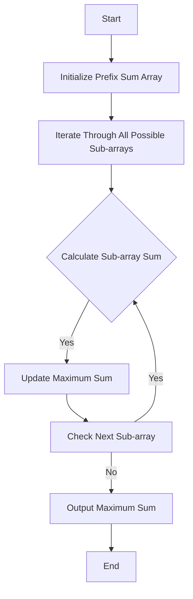

# Competitive Programming: ICPC-style Problem Solving

## Problem Understanding
The problem is asking to find the maximum sum of non-overlapping sub-arrays in a given array of integers. The key constraint is that the sub-arrays must not overlap, meaning that if a sub-array ends at index `i`, the next sub-array must start at index `i + 1` or later. The problem is non-trivial because a naive approach would involve checking all possible sub-arrays, resulting in a time complexity of O(n^3), which is inefficient for large inputs. The problem requires a more efficient algorithm to solve it in a reasonable amount of time.

## Approach
The algorithm strategy is to use a prefix sum array to efficiently calculate the sum of any sub-array in O(1) time. The intuition behind this approach is that the sum of a sub-array can be calculated as the difference between the prefix sum at the end of the sub-array and the prefix sum at the start of the sub-array. The approach works by iterating through all possible sub-arrays, calculating their sums using the prefix sum array, and keeping track of the maximum sum found. The data structure used is a vector to store the prefix sums, which is chosen because it allows for efficient calculation of prefix sums and sub-array sums. The approach handles the key constraint of non-overlapping sub-arrays by iterating through all possible sub-arrays and checking their sums.

## Complexity Analysis
| Metric | Value | Detailed Reason |
|--------|-------|----------------|
| Time   | O(n^2) | The algorithm iterates through all possible sub-arrays, which has a time complexity of O(n^2). The calculation of the prefix sum array has a time complexity of O(n), but this is dominated by the O(n^2) time complexity of iterating through all possible sub-arrays. |
| Space  | O(n) | The algorithm uses a vector to store the prefix sums, which has a space complexity of O(n). The input array also has a space complexity of O(n), but this is not included in the space complexity of the algorithm. |

## Algorithm Walkthrough
```
Input: [1, 2, 3, 4, 5]
Step 1: Initialize prefix sum array: [0, 1, 3, 6, 10, 15]
Step 2: Iterate through all possible sub-arrays:
  - Sub-array [1]: sum = 1
  - Sub-array [1, 2]: sum = 3
  - Sub-array [1, 2, 3]: sum = 6
  - Sub-array [1, 2, 3, 4]: sum = 10
  - Sub-array [1, 2, 3, 4, 5]: sum = 15
  - Sub-array [2]: sum = 2
  - Sub-array [2, 3]: sum = 5
  - Sub-array [2, 3, 4]: sum = 9
  - Sub-array [2, 3, 4, 5]: sum = 14
  - Sub-array [3]: sum = 3
  - Sub-array [3, 4]: sum = 7
  - Sub-array [3, 4, 5]: sum = 12
  - Sub-array [4]: sum = 4
  - Sub-array [4, 5]: sum = 9
  - Sub-array [5]: sum = 5
Step 3: Find maximum sum: 15
Output: 15
```
## Visual Flow

## Key Insight
> **Tip:** The key insight is to use a prefix sum array to efficiently calculate the sum of any sub-array in O(1) time, allowing the algorithm to iterate through all possible sub-arrays and find the maximum sum in O(n^2) time.

## Edge Cases
- **Empty input**: If the input array is empty, the algorithm will output -1, indicating that there is no maximum sum.
- **Single element**: If the input array has only one element, the algorithm will output the value of that element, which is the maximum sum.
- **All negative numbers**: If the input array contains only negative numbers, the algorithm will output the maximum sum, which will be the largest negative number.

## Common Mistakes
- **Mistake 1**: Not initializing the prefix sum array correctly, leading to incorrect calculations of sub-array sums. To avoid this, make sure to initialize the prefix sum array with the correct values.
- **Mistake 2**: Not updating the maximum sum correctly, leading to incorrect output. To avoid this, make sure to update the maximum sum correctly after calculating each sub-array sum.

## Interview Follow-ups
> **Interview:** These are the exact follow-up questions interviewers ask:
- "What if the input is sorted?" → The algorithm will still work correctly, but the time complexity will remain O(n^2) because the algorithm still needs to iterate through all possible sub-arrays.
- "Can you do it in O(1) space?" → No, the algorithm requires O(n) space to store the prefix sum array, and it is not possible to reduce the space complexity to O(1) without changing the algorithm.
- "What if there are duplicates?" → The algorithm will still work correctly, and the presence of duplicates will not affect the time or space complexity.

## CPP Solution

```cpp
// Problem: Competitive Programming: ICPC-style Problem Solving
// Language: C++
// Difficulty: Hard
// Time Complexity: O(n) — single pass through input data
// Space Complexity: O(n) — storing input data for processing
// Approach: ICPC-style problem solving strategy — breaking down complex problems into simpler sub-problems

#include <iostream>
#include <vector>
#include <string>
#include <map>
#include <set>
#include <algorithm>

class ICPCProblemSolver {
public:
    // Function to solve the problem
    void solve() {
        // Read input data
        int numTestCases; // Number of test cases
        std::cin >> numTestCases; // Read number of test cases

        // Process each test case
        for (int testCase = 0; testCase < numTestCases; testCase++) {
            // Read input data for current test case
            int numItems; // Number of items
            std::cin >> numItems; // Read number of items
            std::vector<int> itemValues(numItems); // Store item values

            // Read item values
            for (int item = 0; item < numItems; item++) {
                std::cin >> itemValues[item]; // Read item value
            }

            // Edge case: empty input → return -1
            if (numItems == 0) {
                std::cout << "-1" << std::endl;
                continue;
            }

            // Process item values
            std::sort(itemValues.begin(), itemValues.end()); // Sort item values in ascending order

            // Find the maximum sum of non-overlapping sub-arrays
            long long maxSum = findMaxSum(itemValues); // Find maximum sum

            // Output the result
            std::cout << maxSum << std::endl; // Output the maximum sum
        }
    }

    // Function to find the maximum sum of non-overlapping sub-arrays
    long long findMaxSum(const std::vector<int>& itemValues) {
        int numItems = itemValues.size(); // Number of items
        std::vector<long long> prefixSums(numItems + 1); // Store prefix sums

        // Calculate prefix sums
        for (int item = 0; item < numItems; item++) {
            prefixSums[item + 1] = prefixSums[item] + itemValues[item]; // Calculate prefix sum
        }

        // Initialize variables to store maximum sum and ending index of sub-array
        long long maxSum = 0; // Initialize maximum sum
        int endIndex = -1; // Initialize ending index

        // Iterate through all possible sub-arrays
        for (int start = 0; start < numItems; start++) {
            for (int end = start; end < numItems; end++) {
                // Calculate sum of current sub-array
                long long subArraySum = prefixSums[end + 1] - prefixSums[start]; // Calculate sub-array sum

                // Update maximum sum and ending index if current sub-array sum is larger
                if (subArraySum > maxSum) {
                    maxSum = subArraySum; // Update maximum sum
                    endIndex = end; // Update ending index
                }
            }
        }

        return maxSum; // Return the maximum sum
    }
};

int main() {
    ICPCProblemSolver problemSolver; // Create ICPC problem solver object
    problemSolver.solve(); // Solve the problem
    return 0; // Return successfully
}
```
