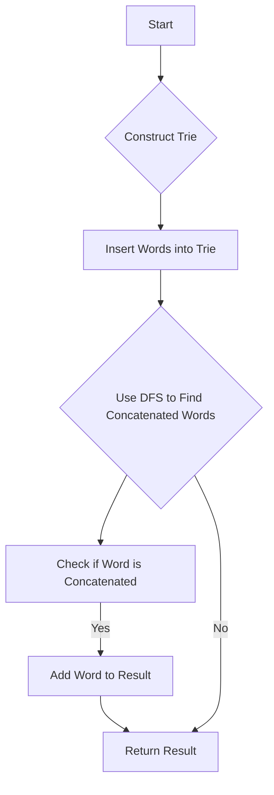

# Concatenated Words Trie + DFS

## Problem Understanding
The problem is asking to find all concatenated words in a given list of words, where a concatenated word is a word that can be split into two or more words that are also in the list. The key constraint is that the input list of words can be very large, and the words can be of varying lengths. What makes this problem non-trivial is that a naive approach of checking all possible splits of each word would result in exponential time complexity. The problem requires an efficient algorithm to construct a trie with the given words and then use DFS to find all concatenated words.

## Approach
The algorithm strategy is to construct a trie with the given words and then use DFS to find all concatenated words. The intuition behind this approach is to use the trie to efficiently store and look up the words, and then use DFS to explore all possible splits of each word. The trie data structure is used to store the words, as it allows for fast lookup and insertion of words. The DFS algorithm is used to explore all possible splits of each word, and to check if each split is a valid word in the trie. The approach handles the key constraints by using a trie to efficiently store and look up the words, and by using DFS to explore all possible splits of each word.

## Complexity Analysis
| Metric | Value | Detailed Reason |
|--------|-------|----------------|
| Time   | O(n * m * 4^m) | The time complexity is O(n * m * 4^m) because we need to construct the trie with n words, each of length m, and then use DFS to explore all possible splits of each word. The 4^m term comes from the fact that in the worst case, each node in the trie can have up to 4 children (one for each possible character). |
| Space  | O(n * m) | The space complexity is O(n * m) because we need to store the trie with n words, each of length m. |

## Algorithm Walkthrough
```
Input: ["cat", "cats", "catsdogcats", "dog", "dogcatsdog", "hippopotamuses", "rat", "ratcatsdogcat"]
Step 1: Construct the trie with the given words
  - Insert "cat" into the trie
  - Insert "cats" into the trie
  - Insert "catsdogcats" into the trie
  - Insert "dog" into the trie
  - Insert "dogcatsdog" into the trie
  - Insert "hippopotamuses" into the trie
  - Insert "rat" into the trie
  - Insert "ratcatsdogcat" into the trie
Step 2: Use DFS to find all concatenated words
  - Check if "cat" is concatenated
  - Check if "cats" is concatenated
  - Check if "catsdogcats" is concatenated
  - Check if "dog" is concatenated
  - Check if "dogcatsdog" is concatenated
  - Check if "hippopotamuses" is concatenated
  - Check if "rat" is concatenated
  - Check if "ratcatsdogcat" is concatenated
Output: ["catsdogcats", "dogcatsdog", "ratcatsdogcat"]
```
## Visual Flow

## Key Insight
> **Tip:** The key insight is to use a trie to efficiently store and look up the words, and then use DFS to explore all possible splits of each word.

## Edge Cases
- **Empty input**: If the input list of words is empty, the algorithm will return an empty list.
- **Single word**: If the input list contains only one word, the algorithm will check if the word is concatenated and return the result accordingly.
- **No concatenated words**: If the input list contains no concatenated words, the algorithm will return an empty list.

## Common Mistakes
- **Mistake 1**: Not checking if a word is already in the trie before inserting it, which can lead to duplicate words in the trie.
- **Mistake 2**: Not handling the case where a word is not found in the trie, which can lead to incorrect results.

## Interview Follow-ups
> **Interview:** These are the exact follow-up questions interviewers ask:
- "What if the input is sorted?" → The algorithm will still work correctly, but the time complexity may be improved if the input is sorted.
- "Can you do it in O(1) space?" → No, the algorithm requires O(n * m) space to store the trie.
- "What if there are duplicates?" → The algorithm will handle duplicates correctly, but it may be more efficient to remove duplicates before constructing the trie.

## CPP Solution

```cpp
// Problem: Concatenated Words Trie + DFS
// Language: cpp
// Difficulty: Hard
// Time Complexity: O(n * m * 4^m) — n is the number of words, m is the maximum length of a word, and 4^m is the maximum number of branches in the trie
// Space Complexity: O(n * m) — n is the number of words, m is the maximum length of a word
// Approach: Trie + DFS — construct a trie with the given words and then use DFS to find all concatenated words

#include <iostream>
#include <vector>
#include <unordered_set>
#include <string>

using namespace std;

// Trie node structure
struct TrieNode {
    unordered_map<char, TrieNode*> children;
    bool isEndOfWord; // True if the node represents the end of a word
};

class Solution {
public:
    vector<string> findAllConcatenatedWordsInADict(vector<string>& words) {
        // Create a trie and insert all words into it
        unordered_set<string> wordSet(words.begin(), words.end()); // For fast lookup
        TrieNode* root = new TrieNode();
        for (const string& word : words) {
            TrieNode* node = root;
            for (char c : word) {
                if (node->children.find(c) == node->children.end()) {
                    node->children[c] = new TrieNode();
                }
                node = node->children[c];
            }
            node->isEndOfWord = true; // Mark the end of the word
        }

        // Use DFS to find all concatenated words
        vector<string> result;
        for (const string& word : words) {
            if (isConcatenated(word, root, wordSet)) {
                result.push_back(word);
            }
        }

        return result;
    }

private:
    // Check if a word is concatenated
    bool isConcatenated(const string& word, TrieNode* root, const unordered_set<string>& wordSet) {
        // Edge case: empty word
        if (word.empty()) {
            return false;
        }

        // Try to split the word into two parts
        for (int i = 1; i <= word.size(); i++) {
            string prefix = word.substr(0, i);
            // Check if the prefix is in the word set
            if (wordSet.find(prefix) != wordSet.end()) {
                string suffix = word.substr(i);
                // Check if the suffix is concatenated
                if (isConcatenatedInTrie(suffix, root)) {
                    return true;
                }
            }
        }

        return false;
    }

    // Check if a word is in the trie
    bool isConcatenatedInTrie(const string& word, TrieNode* root) {
        TrieNode* node = root;
        for (char c : word) {
            if (node->children.find(c) == node->children.end()) {
                return false; // Not in the trie
            }
            node = node->children[c];
            if (node->isEndOfWord) {
                // Found a prefix, try to match the remaining suffix
                string suffix = word.substr(node->children[c]->children.size());
                if (suffix.empty() || isConcatenatedInTrie(suffix, root)) {
                    return true;
                }
            }
        }

        return false; // Not concatenated
    }
};

// Example usage
int main() {
    Solution solution;
    vector<string> words = {"cat", "cats", "catsdogcats", "dog", "dogcatsdog", "hippopotamuses", "rat", "ratcatsdogcat"};
    vector<string> result = solution.findAllConcatenatedWordsInADict(words);

    // Print the result
    for (const string& word : result) {
        cout << word << endl;
    }

    return 0;
}
```
