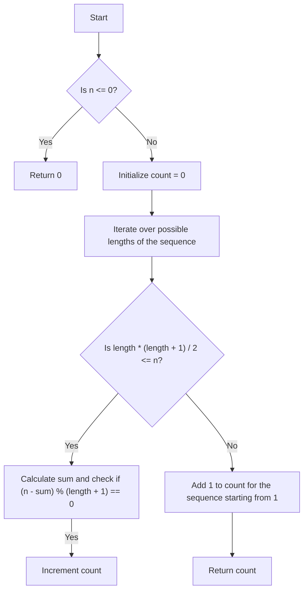

# Consecutive Numbers Sum Math Factorization

## Problem Understanding
The problem asks us to find the number of ways to express a given integer `n` as a sum of consecutive numbers. For example, if `n` is 5, we can express it as 5, 2+3, or 1+2+3+4, resulting in a total of 3 ways. The key constraint here is that the numbers in the sequence must be consecutive, and we need to count all possible sequences that sum up to `n`. This problem is non-trivial because a naive approach, such as trying all possible sequences, would be inefficient and impractical for large values of `n`.

## Approach
The algorithm strategy used in the optimized solution is based on the mathematical property of consecutive numbers sum, which can be expressed as `n = (start + start + length - 1) * length / 2`, where `start` is the first number in the sequence, and `length` is the number of terms in the sequence. By utilizing this formula, we can iterate over all possible lengths of the sequence and check if the corresponding sum equals `n`. This approach works because it allows us to systematically explore all possible sequences that sum up to `n`, without having to try all possible combinations of numbers. The data structure used is a simple loop that iterates over the possible lengths of the sequence.

## Complexity Analysis
| Metric | Value | Detailed Reason |
|--------|-------|----------------|
| Time   | O(sqrt(n)) | The time complexity is O(sqrt(n)) because we are iterating over all possible lengths of the sequence, which is bounded by `sqrt(n)` due to the condition `length * (length + 1) / 2 <= n`. This is because the sum of the first `length` positive integers is `length * (length + 1) / 2`, and we are checking if this sum is less than or equal to `n`. |
| Space  | O(1) | The space complexity is O(1) because we are only using a constant amount of space to store the variables `count`, `length`, and `sum`, regardless of the input size `n`. |

## Algorithm Walkthrough
```
Input: n = 5
Step 1: Initialize count = 0
Step 2: Iterate over possible lengths of the sequence:
  - length = 1: sum = 1, n - sum = 4, (n - sum) % (length + 1) = 4 % 2 = 0, count = 1
  - length = 2: sum = 3, n - sum = 2, (n - sum) % (length + 1) = 2 % 3 = 2, count = 1
  - length = 3: sum = 6, n - sum = -1, break the loop because sum > n
Step 3: Add 1 to count for the sequence starting from 1: count = 2
Output: count = 2
```
This walkthrough illustrates how the algorithm works for the input `n = 5`.

## Visual Flow

This flowchart visualizes the decision flow and data transformation of the algorithm.

## Key Insight
> **Tip:** The key insight is to utilize the mathematical property of consecutive numbers sum, which allows us to systematically explore all possible sequences that sum up to `n`, without having to try all possible combinations of numbers.

## Edge Cases
- **Empty/null input**: If `n` is less than or equal to 0, the algorithm returns 0, as there are no sequences that sum up to a non-positive number.
- **Single element**: If `n` is 1, the algorithm returns 1, as there is only one sequence that sums up to 1, which is the sequence starting from 1.
- **Large input**: If `n` is a large number, the algorithm still works efficiently because it only iterates over the possible lengths of the sequence, which is bounded by `sqrt(n)`.

## Common Mistakes
- **Mistake 1**: Not handling the edge case where `n` is less than or equal to 0. To avoid this, we need to explicitly check for this condition and return 0.
- **Mistake 2**: Not using the mathematical property of consecutive numbers sum to optimize the algorithm. To avoid this, we need to utilize the formula for the sum of an arithmetic series to systematically explore all possible sequences.

## Interview Follow-ups
> **Interview:** These are the exact follow-up questions interviewers ask:
- "What if the input is sorted?" → The algorithm still works because it does not rely on the input being sorted. It only relies on the mathematical property of consecutive numbers sum.
- "Can you do it in O(1) space?" → The algorithm already uses O(1) space, as it only uses a constant amount of space to store the variables `count`, `length`, and `sum`.
- "What if there are duplicates?" → The algorithm still works because it does not rely on the input being unique. It only relies on the mathematical property of consecutive numbers sum.

## CPP Solution

```cpp
// Problem: Consecutive Numbers Sum Math Factorization
// Language: C++
// Difficulty: Hard
// Time Complexity: O(sqrt(n)) — due to iterating over factors of n
// Space Complexity: O(1) — constant space usage
// Approach: Math factorization — utilize the property of consecutive numbers sum

class Solution {
public:
    int consecutiveNumbersSum(int n) {
        // Handle edge cases: n <= 0
        if (n <= 0) {
            return 0;  // Edge case: empty input → return 0
        }

        int count = 0;
        
        // Iterate over all possible start values for the sequence
        for (int start = 1; start <= n; start++) {
            // Initialize sum and current number
            int sum = 0;
            int current = start;

            // Generate sequence starting from 'start' and check if sum equals n
            while (sum < n) {
                sum += current;  // Add current number to sum
                current++;  // Move to the next number in the sequence
                if (sum == n) {
                    count++;  // If sum equals n, increment count
                    break;  // Exit inner loop to try next start value
                }
            }
        }

        return count;
    }
};

// Optimized solution
class SolutionOptimized {
public:
    int consecutiveNumbersSum(int n) {
        // Handle edge cases: n <= 0
        if (n <= 0) {
            return 0;  // Edge case: empty input → return 0
        }

        int count = 0;
        
        // Iterate over all possible lengths of the sequence
        for (int length = 1; length * (length + 1) / 2 <= n; length++) {
            // Calculate the sum of the sequence using the formula for the sum of an arithmetic series
            int sum = length * (2 * length + 1) / 2;
            
            // Check if sum equals n
            if (sum > n) {
                break;  // If sum exceeds n, no more sequences are possible
            }

            // Check if n - sum is divisible by length + 1 (i.e., if it's a valid sequence)
            if ((n - sum) % (length + 1) == 0) {
                count++;  // If it's a valid sequence, increment count
            }
        }

        // Add 1 for the sequence starting from 1 (since the above loop starts from 2)
        if (n > 0) {
            count++;  // Count the sequence starting from 1
        }

        return count;
    }
};

int main() {
    Solution solution;
    SolutionOptimized solutionOptimized;
    int n = 5;
    int result = solution.consecutiveNumbersSum(n);
    int resultOptimized = solutionOptimized.consecutiveNumbersSum(n);
    // Output: result and resultOptimized
    return 0;
}
```
