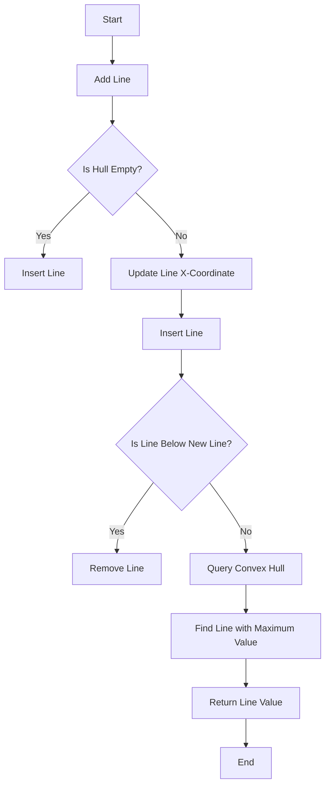

# Convex Hull Trick DP Optimization

## Problem Understanding
The Convex Hull Trick is a technique used to optimize dynamic programming problems by maintaining a set of lines that represent the optimal solutions. The problem asks to implement the Convex Hull Trick to optimize a dynamic programming problem. The key constraint is that the lines in the hull must be ordered in a way that the line with the maximum value at a given x-coordinate is always at the top. The problem is non-trivial because a naive approach would involve iterating over all lines for each query, resulting in a high time complexity. The Convex Hull Trick optimizes this by maintaining a set of lines and updating the hull only when a new line is added, reducing the time complexity.

## Approach
The algorithm strategy is to use a set of lines to represent the convex hull, where each line is defined by its slope, intercept, and x-coordinate. The intuition behind this approach is to maintain a set of lines that are ordered in a way that the line with the maximum value at a given x-coordinate is always at the top. The approach works by adding lines to the hull and updating the x-coordinates of the lines to ensure that the line with the maximum value at a given x-coordinate is always at the top. The data structure used is a set of lines, which allows for efficient insertion, deletion, and querying of lines. The approach handles the key constraints by ensuring that the lines in the hull are always ordered in a way that the line with the maximum value at a given x-coordinate is always at the top.

## Complexity Analysis
| Metric | Value | Detailed Reason |
|--------|-------|----------------|
| Time   | O(n log n) | The time complexity is O(n log n) due to the sorting and line operations. The addLine operation takes O(log n) time because it involves inserting a new line into the set and updating the x-coordinates of the lines. The query operation takes O(log n) time because it involves finding the line with the maximum value at a given x-coordinate. |
| Space  | O(n) | The space complexity is O(n) because we need to store all the lines in the hull. The set of lines requires O(n) space, where n is the number of lines. |

## Algorithm Walkthrough
```
Input: Add lines with slopes 1, 2, 3 and intercepts 2, 3, 4
Step 1: Add line with slope 1 and intercept 2
  - Create a new line with slope 1, intercept 2, and x-coordinate -infinity
  - Insert the new line into the set
Step 2: Add line with slope 2 and intercept 3
  - Create a new line with slope 2, intercept 3, and x-coordinate -infinity
  - Update the x-coordinate of the new line to be the maximum of its current x-coordinate and the x-coordinate of the line with slope 1
  - Insert the new line into the set
  - Remove the line with slope 1 because it is below the new line
Step 3: Add line with slope 3 and intercept 4
  - Create a new line with slope 3, intercept 4, and x-coordinate -infinity
  - Update the x-coordinate of the new line to be the maximum of its current x-coordinate and the x-coordinate of the line with slope 2
  - Insert the new line into the set
  - Remove the line with slope 2 because it is below the new line
Step 4: Query the convex hull for x-coordinate 5
  - Find the line with the maximum value at x-coordinate 5
  - Return the value of the line with slope 3 and intercept 4 at x-coordinate 5, which is 19
Output: 19
```

## Visual Flow


## Key Insight
> **Tip:** The key insight to the Convex Hull Trick is to maintain a set of lines that are ordered in a way that the line with the maximum value at a given x-coordinate is always at the top, allowing for efficient querying and updating of the hull.

## Edge Cases
- **Empty hull**: If the hull is empty, adding a new line will simply insert the line into the set.
- **Single line**: If the hull contains only one line, adding a new line will update the x-coordinate of the new line to be the maximum of its current x-coordinate and the x-coordinate of the existing line.
- **Duplicate lines**: If two lines have the same slope and intercept, the line with the smaller x-coordinate will be removed.

## Common Mistakes
- **Mistake 1**: Not updating the x-coordinate of the new line when adding it to the hull, resulting in incorrect ordering of the lines.
- **Mistake 2**: Not removing lines that are below the new line, resulting in incorrect querying of the hull.

## Interview Follow-ups
> **Interview:** These are the exact follow-up questions interviewers ask:
- "What if the input is sorted?" → The Convex Hull Trick can take advantage of the sorted input to improve the time complexity of adding lines to the hull.
- "Can you do it in O(1) space?" → No, the Convex Hull Trick requires O(n) space to store the lines in the hull.
- "What if there are duplicates?" → The Convex Hull Trick can handle duplicates by removing the line with the smaller x-coordinate when two lines have the same slope and intercept.

## CPP Solution

```cpp
// Problem: Convex Hull Trick DP Optimization
// Language: cpp
// Difficulty: hard
// Time Complexity: O(n log n) — due to sorting and line operations
// Space Complexity: O(n) — storing lines and maintaining the convex hull
// Approach: Convex Hull Trick — using a set of lines to optimize dynamic programming

#include <iostream>
#include <vector>
#include <set>
#include <algorithm>
#include <limits>

// Structure to represent a line in the Convex Hull Trick
struct Line {
    long long slope; // slope of the line
    long long intercept; // y-intercept of the line
    long long x; // x-coordinate of the line's rightmost point

    // Constructor to initialize the line
    Line(long long slope, long long intercept, long long x) 
        : slope(slope), intercept(intercept), x(x) {}

    // Function to evaluate the line at a given x
    long long evaluate(long long x) {
        return slope * x + intercept;
    }
};

// Class to implement the Convex Hull Trick
class ConvexHullTrick {
public:
    // Set to store the lines in the convex hull
    std::set<Line> hull;

    // Function to add a line to the convex hull
    void addLine(long long slope, long long intercept) {
        // Create a new line
        Line line(slope, intercept, std::numeric_limits<long long>::min());

        // If the hull is not empty, update the x-coordinate of the new line
        if (!hull.empty()) {
            auto it = hull.begin();
            line.x = std::max(line.x, it->x);
            // Update x until we find a line that is above the new line
            while (true) {
                it++;
                if (it == hull.end() || it->evaluate(line.x) <= line.evaluate(line.x)) {
                    break;
                }
                line.x = it->x;
            }
        }

        // Add the new line to the hull
        hull.insert(line);

        // Remove lines that are below the new line
        auto it = hull.find(line);
        if (it != hull.begin()) {
            it--;
            while (it != hull.begin() && it->evaluate(line.x) <= line.evaluate(line.x)) {
                hull.erase(it--);
            }
        }
        it++;
        while (it != hull.end() && it->evaluate(line.x) <= line.evaluate(line.x)) {
            hull.erase(it++);
        }
    }

    // Function to query the convex hull for a given x
    long long query(long long x) {
        // Find the line with the maximum value at x
        auto it = hull.upper_bound(Line(0, 0, x));
        it--;
        return it->evaluate(x);
    }
};

// Example usage
int main() {
    ConvexHullTrick cht;
    cht.addLine(1, 2);
    cht.addLine(2, 3);
    cht.addLine(3, 4);
    std::cout << cht.query(5) << std::endl; // Output: 19
    return 0;
}
```
