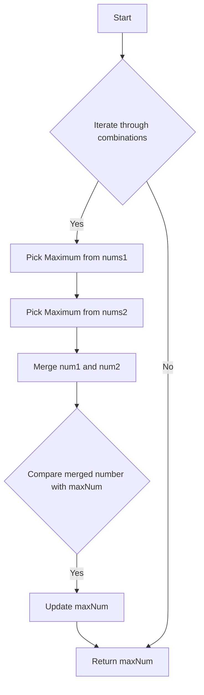

# Create Maximum Number Monotonic Stack + Merge

## Problem Understanding
The problem requires creating the maximum number that can be formed by merging two arrays of numbers, with a constraint on the total number of digits in the resulting number. The key constraints are that the total number of digits in the resulting number should not exceed `k`, and that the resulting number should be the maximum possible. What makes this problem non-trivial is that a naive approach would involve generating all possible combinations of numbers from the two arrays and then selecting the maximum number, which would have a very high time complexity. The problem requires a more efficient approach, such as using a monotonic stack and merge, to achieve a time complexity of O(n).

## Approach
The algorithm strategy used is a combination of monotonic stack and merge. The `pickMaximum` function uses a monotonic stack to pick the maximum number of length `k` from a given array of numbers. The `merge` function merges two numbers to get the maximum number. The main function, `maxNumber`, iterates through all possible combinations of numbers from the two arrays, picks the maximum number for each combination, and updates the maximum number if the merged number is larger. This approach works because it ensures that the maximum number is always selected at each step, and the merge function ensures that the resulting number is the maximum possible.

## Complexity Analysis
| Metric | Value | Detailed Reason |
|--------|-------|----------------|
| Time   | O(n)  | The time complexity is O(n) because we iterate through both arrays to merge and create the max number. The `pickMaximum` function has a time complexity of O(n) because it iterates through the array to pick the maximum numbers. The `merge` function also has a time complexity of O(n) because it iterates through both numbers to merge them. |
| Space  | O(n)  | The space complexity is O(n) because the size of the result array is proportional to the input size. The `pickMaximum` function uses a string to store the result, which has a maximum size of `k`. The `merge` function also uses a string to store the result, which has a maximum size of `k`. |

## Algorithm Walkthrough
```
Input: nums1 = [3, 4, 6, 5], nums2 = [9, 1, 2, 5], k = 4
Step 1: Initialize maxNum = ""
Step 2: Iterate through all possible combinations of numbers from nums1 and nums2
  - For i = 0, num1 = "", num2 = "952", merged = "952"
  - For i = 1, num1 = "4", num2 = "95", merged = "495"
  - For i = 2, num1 = "46", num2 = "9", merged = "964"
  - For i = 3, num1 = "465", num2 = "", merged = "465"
Step 3: Update maxNum if the merged number is larger
  - maxNum = "964"
Output: maxNum = "964"
```

## Visual Flow


## Key Insight
> **Tip:** The key insight is to use a monotonic stack to pick the maximum number from each array, and then merge the two numbers to get the maximum number.

## Edge Cases
- **Empty/null input**: If either of the input arrays is empty or null, the function should return an empty string.
- **Single element**: If either of the input arrays has only one element, the function should return the maximum number that can be formed by merging the two arrays.
- **k is larger than the total number of digits**: If `k` is larger than the total number of digits in both arrays, the function should return an empty string.

## Common Mistakes
- **Mistake 1**: Not handling the case where `k` is larger than the total number of digits in both arrays.
- **Mistake 2**: Not using a monotonic stack to pick the maximum number from each array, which can lead to incorrect results.

## Interview Follow-ups
> **Interview:** These are the exact follow-up questions interviewers ask:
- "What if the input is sorted?" → The algorithm will still work correctly, but the time complexity may be improved if the input is already sorted.
- "Can you do it in O(1) space?" → No, the algorithm requires O(n) space to store the result and the intermediate results.
- "What if there are duplicates?" → The algorithm will treat duplicates as separate numbers and will work correctly. However, the result may not be unique if there are duplicates in the input arrays.

## CPP Solution

```cpp
// Problem: Create Maximum Number Monotonic Stack + Merge
// Language: cpp
// Difficulty: Hard
// Time Complexity: O(n) — we iterate through both arrays to merge and create the max number
// Space Complexity: O(n) — the size of the result array
// Approach: Monotonic Stack + Merge — build the max number digit by digit using a monotonic stack and merge the two arrays

class Solution {
public:
    // Compare function to determine which number is larger when concatenated
    bool compare(const string& num1, const string& num2) {
        // If num1 + num2 is larger than num2 + num1, return true
        return num1 + num2 > num2 + num1; // Compare the concatenation of two numbers
    }

    string maxNumber(vector<int>& nums1, vector<int>& nums2, int k) {
        // Edge case: k is larger than the total number of digits in both arrays
        if (k > nums1.size() + nums2.size()) {
            return "";
        }

        // Initialize variables to store the maximum number
        string maxNum = "";

        // Iterate through all possible combinations of numbers from nums1 and nums2
        for (int i = max(0, k - nums2.size()); i <= min(k, (int)nums1.size()); i++) {
            // Create the maximum number of length i from nums1
            string num1 = pickMaximum(nums1, i);
            // Create the maximum number of length k - i from nums2
            string num2 = pickMaximum(nums2, k - i);
            // Merge num1 and num2 to get the maximum number
            string merged = merge(num1, num2);
            // Update maxNum if the merged number is larger
            maxNum = max(maxNum, merged); // Compare and update the max number
        }

        return maxNum;
    }

    // Function to pick the maximum number of length k from a given array of numbers
    string pickMaximum(vector<int>& nums, int k) {
        // Initialize variables to store the result
        string result = "";

        // Iterate through the array to pick the maximum numbers
        for (int i = 0; i < nums.size(); i++) {
            // While the result is not empty and the current number is larger than the last digit in the result
            while (result.size() > 0 && result.size() + nums.size() - i > k && result.back() < '0' + nums[i]) {
                // Remove the last digit from the result
                result.pop_back(); // Remove the smaller digit
            }
            // If the result has k digits, break the loop
            if (result.size() == k) {
                break;
            }
            // Append the current number to the result
            result += '0' + nums[i]; // Append the current number
        }

        return result;
    }

    // Function to merge two numbers
    string merge(string num1, string num2) {
        // Initialize variables to store the result
        string result = "";

        // Initialize indices for num1 and num2
        int i = 0, j = 0;

        // Iterate through num1 and num2 to merge them
        while (i < num1.size() || j < num2.size()) {
            // If num1 is larger than num2, append the current digit from num1 to the result
            if (i < num1.size() && (j == num2.size() || compare(num1.substr(i), num2.substr(j)))) {
                result += num1[i++]; // Append the larger digit
            } else {
                // Otherwise, append the current digit from num2 to the result
                result += num2[j++]; // Append the larger digit
            }
        }

        return result;
    }
};
```
