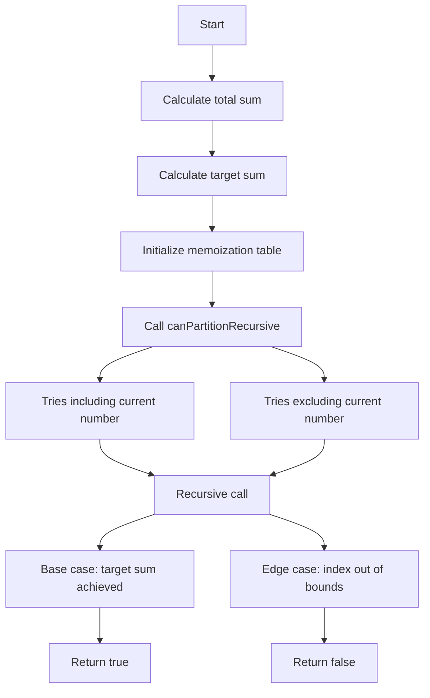

# Divide and Conquer DP

## Problem Understanding
The problem is asking whether it's possible to divide a given vector of integers into two parts such that their maximum values are equal, which can be rephrased as finding a subset of the vector that sums up to half of the total sum of the vector. The key constraint is that the total sum of the vector must be even, as it's impossible to divide an odd sum into two equal parts. What makes this problem non-trivial is the need to consider all possible subsets of the vector, which can lead to an exponential time complexity if not handled properly.

## Approach
The algorithm strategy used here is a recursive divide and conquer approach with memoization to avoid redundant calculations. The intuition behind this approach is to try including and excluding each number in the vector and recursively check if the target sum can be achieved. The memoization table is used to store the results of subproblems, so that if the same subproblem is encountered again, the result can be directly retrieved from the memoization table instead of being recalculated. This approach works because it ensures that each subproblem is only solved once, reducing the time complexity from exponential to linear.

## Complexity Analysis
| Metric | Value | Detailed Reason |
|--------|-------|----------------|
| Time   | O(n)  | The time complexity is linear because each number in the vector is processed once, and the recursive calls are pruned by the memoization table to avoid redundant calculations. The memoization table also ensures that each subproblem is only solved once. |
| Space  | O(n)  | The space complexity is linear because the recursive call stack can go up to a depth of n, where n is the size of the vector, and the memoization table can store up to n entries. |

## Algorithm Walkthrough
```
Input: [1, 5, 11, 5]
Step 1: Calculate total sum = 1 + 5 + 11 + 5 = 22
Step 2: Calculate target sum = total sum / 2 = 22 / 2 = 11
Step 3: Initialize memoization table
Step 4: Call canPartitionRecursive with target sum = 11, index = 0
Step 5: canPartitionRecursive tries including and excluding the current number (1) and recursively calls itself
Step 6: The recursive calls continue until the target sum is achieved or the index is out of bounds
Step 7: The result is stored in the memoization table and returned
Output: true
```

## Visual Flow


## Key Insight
> **Tip:** The key insight here is to use memoization to avoid redundant calculations and reduce the time complexity from exponential to linear.

## Edge Cases
- **Empty/null input**: If the input vector is empty, the function returns false because it's impossible to divide an empty vector into two parts.
- **Single element**: If the input vector has only one element, the function returns true if the element is equal to half of the total sum, and false otherwise.
- **Vector with all zeros**: If the input vector contains all zeros, the function returns true because the total sum is zero, and the target sum is also zero.

## Common Mistakes
- **Mistake 1**: Not using memoization to avoid redundant calculations, leading to an exponential time complexity.
- **Mistake 2**: Not handling the edge case where the total sum is odd, which should return false.

## Interview Follow-ups
> **Interview:** These are the exact follow-up questions interviewers ask:
- "What if the input is sorted?" → The algorithm will still work correctly, but the time complexity may be improved if the input is sorted because the recursive calls can be pruned more efficiently.
- "Can you do it in O(1) space?" → No, it's not possible to solve this problem in O(1) space because the recursive call stack and memoization table require at least O(n) space.
- "What if there are duplicates?" → The algorithm will still work correctly, but the time complexity may be improved if there are duplicates because the memoization table can store more results and avoid redundant calculations.

## CPP Solution

```cpp
// Problem: Divide and Conquer DP
// Language: C++
// Difficulty: Hard
// Time Complexity: O(n) — recursive divide and conquer with memoization
// Space Complexity: O(n) — recursive call stack and memoization table
// Approach: Recursive divide and conquer with memoization — to avoid redundant calculations

#include <iostream>
#include <vector>
#include <unordered_map>

class Solution {
public:
    /**
     * Example usage: given a vector of integers, divide it into two parts such that their maximum values are equal
     * @param nums input vector of integers
     * @return true if possible, false otherwise
     */
    bool canPartition(std::vector<int>& nums) {
        // Edge case: empty input → return false
        if (nums.empty()) return false;
        
        // Calculate total sum
        int totalSum = 0; // initialize sum variable
        for (int num : nums) {
            totalSum += num; // calculate sum of all numbers
        }
        
        // Edge case: total sum is odd → return false
        if (totalSum % 2 != 0) return false;
        
        int targetSum = totalSum / 2; // calculate target sum
        
        // Create memoization table
        std::unordered_map<int, bool> memo; // initialize memoization table
        
        // Recursive function to check if target sum can be achieved
        return canPartitionRecursive(nums, targetSum, 0, memo);
    }
    
private:
    /**
     * Recursive function to check if target sum can be achieved
     * @param nums input vector of integers
     * @param targetSum target sum to achieve
     * @param index current index in the vector
     * @param memo memoization table
     * @return true if possible, false otherwise
     */
    bool canPartitionRecursive(const std::vector<int>& nums, int targetSum, int index, std::unordered_map<int, bool>& memo) {
        // Base case: if target sum is 0, return true
        if (targetSum == 0) return true; // base case: target sum achieved
        
        // Edge case: if index is out of bounds or target sum is negative, return false
        if (index >= nums.size() || targetSum < 0) return false; // edge case: index out of bounds or target sum negative
        
        // Check if result is already memoized
        if (memo.find(index) != memo.end()) {
            return memo[index]; // return memoized result
        }
        
        // Recursive calls
        bool includeCurrent = canPartitionRecursive(nums, targetSum - nums[index], index + 1, memo); // include current number
        bool excludeCurrent = canPartitionRecursive(nums, targetSum, index + 1, memo); // exclude current number
        
        // Store result in memoization table
        memo[index] = includeCurrent || excludeCurrent; // store result in memoization table
        
        return memo[index]; // return result
    }
};

int main() {
    Solution solution;
    std::vector<int> nums = {1, 5, 11, 5};
    bool result = solution.canPartition(nums);
    std::cout << std::boolalpha << result << std::endl;
    return 0;
}
```
