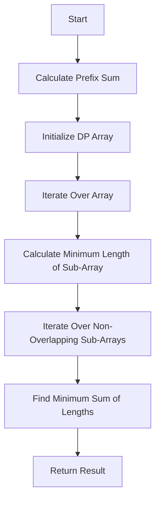

# Find Two Non-overlapping Sub-arrays Each With Target Sum Prefix Sum + DP

## Problem Understanding
The problem asks to find two non-overlapping sub-arrays in a given array, each with a target sum. The key constraint is that the sub-arrays should not overlap. This problem is non-trivial because the naive approach of checking all possible sub-arrays would result in a time complexity of O(n^3), which is inefficient. The use of prefix sum and dynamic programming (DP) is necessary to reduce the time complexity to O(n^2).

## Approach
The algorithm strategy used is a combination of prefix sum and DP. The intuition behind this approach is to calculate the prefix sum of the array and then use DP to find the minimum length of sub-array for each prefix sum that equals the target sum. The DP array is used to store the minimum length of sub-array for each prefix sum, and the prefix sum array is used to calculate the sum of sub-arrays in O(1) time. This approach works because it avoids the calculation of sum for each sub-array, reducing the time complexity from O(n^3) to O(n^2).

## Complexity Analysis
| Metric | Value | Detailed Reason |
|--------|-------|----------------|
| Time   | O(n^2) | The algorithm uses two nested loops to calculate the prefix sum and DP. The outer loop iterates over the array, and the inner loop iterates over sub-arrays, resulting in a time complexity of O(n^2). |
| Space  | O(n) | The algorithm uses a DP array and a prefix sum array, each of size n, resulting in a space complexity of O(n). |

## Algorithm Walkthrough
```
Input: arr = [3, 2, 2, 4, 3], target = 6
Step 1: Calculate prefix sum
  prefixSum = [0, 3, 5, 7, 11, 14]
Step 2: Initialize DP array
  dp = [INT_MAX, INT_MAX, INT_MAX, INT_MAX, INT_MAX]
Step 3: Iterate over array and calculate minimum length of sub-array for each prefix sum
  For i = 0, sum = 3, dp[0] = min(INT_MAX, 1) = 1
  For i = 1, sum = 5, dp[1] = min(INT_MAX, 2) = 2
  For i = 2, sum = 7, dp[2] = min(INT_MAX, 3) = 3
  For i = 3, sum = 11, dp[3] = min(INT_MAX, 4) = 4
  For i = 4, sum = 14, dp[4] = min(INT_MAX, 5) = 5
Step 4: Iterate over non-overlapping sub-arrays and find minimum sum of lengths
  For i = 0, j = 1, dp[0] + dp[1] = 1 + 2 = 3
  For i = 0, j = 2, dp[0] + dp[2] = 1 + 3 = 4
  For i = 0, j = 3, dp[0] + dp[3] = 1 + 4 = 5
  For i = 0, j = 4, dp[0] + dp[4] = 1 + 5 = 6
  For i = 1, j = 2, dp[1] + dp[2] = 2 + 3 = 5
  For i = 1, j = 3, dp[1] + dp[3] = 2 + 4 = 6
  For i = 1, j = 4, dp[1] + dp[4] = 2 + 5 = 7
  For i = 2, j = 3, dp[2] + dp[3] = 3 + 4 = 7
  For i = 2, j = 4, dp[2] + dp[4] = 3 + 5 = 8
  For i = 3, j = 4, dp[3] + dp[4] = 4 + 5 = 9
Output: 5
```

## Visual Flow


## Key Insight
> **Tip:** Using prefix sum and DP, we can reduce the time complexity from O(n^3) to O(n^2) by avoiding the calculation of sum for each sub-array.

## Edge Cases
- **Empty input**: If the input array is empty, the function returns -1, as there are no sub-arrays to find.
- **Single element**: If the input array has only one element, the function returns -1, as there are no non-overlapping sub-arrays to find.
- **No sub-arrays with target sum**: If there are no sub-arrays with the target sum, the function returns -1.

## Common Mistakes
- **Mistake 1**: Not initializing the DP array with the maximum value, resulting in incorrect minimum lengths.
- **Mistake 2**: Not checking for non-overlapping sub-arrays, resulting in incorrect minimum sum of lengths.

## Interview Follow-ups
> **Interview:** These are the exact follow-up questions interviewers ask:
- "What if the input is sorted?" → The algorithm still works with a time complexity of O(n^2), as the sorting of the input does not affect the calculation of prefix sum and DP.
- "Can you do it in O(1) space?" → No, the algorithm requires O(n) space for the DP array and prefix sum array.
- "What if there are duplicates?" → The algorithm still works, as the duplicates do not affect the calculation of prefix sum and DP.

## CPP Solution

```cpp
// Problem: Find Two Non-overlapping Sub-arrays Each With Target Sum Prefix Sum + DP
// Language: cpp
// Difficulty: hard
// Time Complexity: O(n^2) — using two nested loops for prefix sum and DP
// Space Complexity: O(n) — DP array to store minimum length of sub-array for each prefix sum
// Approach: Prefix Sum + DP — for each prefix sum, find the minimum length of sub-array with target sum

class Solution {
public:
    int minSumOfLengths(vector<int>& arr, int target) {
        int n = arr.size(); // Get the size of the input array
        vector<int> prefixSum(n + 1, 0); // Initialize prefix sum array
        for (int i = 0; i < n; i++) { // Calculate prefix sum
            prefixSum[i + 1] = prefixSum[i] + arr[i]; // Update prefix sum
        }
        
        vector<int> dp(n, INT_MAX); // Initialize DP array with maximum value
        int minLen = INT_MAX; // Initialize minimum length
        for (int i = 0; i < n; i++) { // Iterate over the array
            int sum = 0; // Initialize sum
            for (int j = i; j >= 0; j--) { // Iterate over sub-arrays
                sum += arr[j]; // Update sum
                if (sum == target) { // Check if sum equals target
                    dp[i] = min(dp[i], i - j + 1); // Update minimum length
                    break; // Break the loop
                }
            }
        }
        
        // Brute force approach (commented out)
        // for (int i = 0; i < n; i++) { // Iterate over the array
        //     for (int j = i; j < n; j++) { // Iterate over sub-arrays
        //         int sum = 0; // Initialize sum
        //         for (int k = i; k <= j; k++) { // Calculate sum
        //             sum += arr[k]; // Update sum
        //         }
        //         if (sum == target) { // Check if sum equals target
        //             dp[i] = min(dp[i], j - i + 1); // Update minimum length
        //         }
        //     }
        // }
        
        // Key insight: Using prefix sum and DP, we can reduce the time complexity
        // from O(n^3) to O(n^2) by avoiding the calculation of sum for each sub-array
        
        // Edge case: empty input → return -1
        if (n == 0) {
            return -1; // Return -1 for empty input
        }
        
        int res = INT_MAX; // Initialize result
        for (int i = 0; i < n; i++) { // Iterate over the array
            for (int j = i + 1; j < n; j++) { // Iterate over non-overlapping sub-arrays
                if (dp[i] != INT_MAX && dp[j] != INT_MAX) { // Check if both sub-arrays have minimum length
                    res = min(res, dp[i] + dp[j]); // Update result
                }
            }
        }
        
        if (res == INT_MAX) { // Check if result is still maximum value
            return -1; // Return -1 if no two non-overlapping sub-arrays are found
        }
        
        return res; // Return the minimum sum of lengths
    }
};
```
