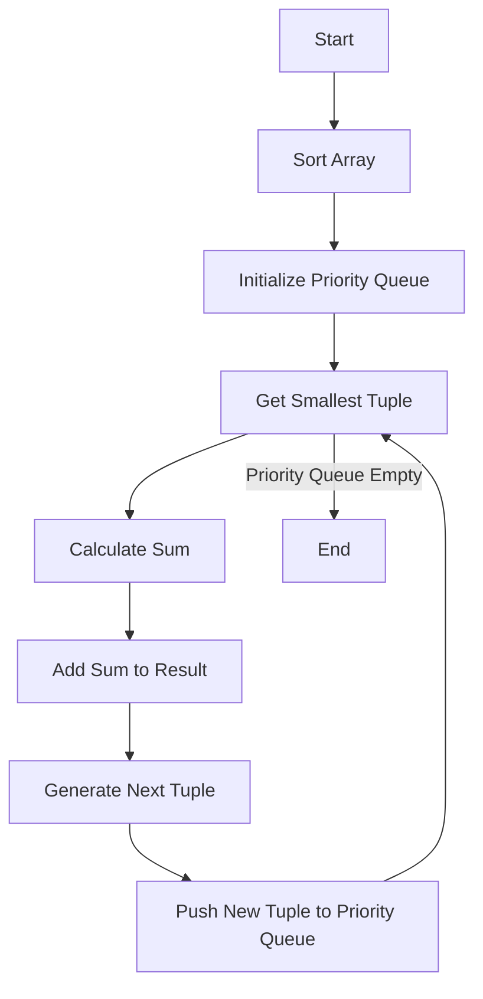

# Find the K-Sum of an Array Priority Queue Generation

## Problem Understanding
The problem is asking to find the K-Sum of an array using a priority queue generation approach. The K-Sum is defined as the sum of K elements from the array, and the goal is to generate all possible K-Sum combinations. The key constraints are that the input array can be empty, and K can be less than 2, which are handled as edge cases. The problem is non-trivial because it requires efficiently generating all possible K-Sum combinations, which can be challenging due to the large number of possible combinations.

## Approach
The algorithm strategy is to use a priority queue to efficiently generate the K-Sum combinations. The intuition behind this approach is to use a min-heap to store the current K-Sum combinations and their corresponding indices in the array. The approach works by sorting the array in ascending order, initializing the priority queue with the first tuple, and then iteratively generating the next tuple by incrementing the current index and pushing the new tuple to the priority queue. The data structure used is a min-heap priority queue, which is chosen because it allows for efficient retrieval of the smallest tuple. The approach handles the key constraints by checking for edge cases and handling them accordingly.

## Complexity Analysis
| Metric | Value | Detailed Reason |
|--------|-------|----------------|
| Time   | O(n log n) | The time complexity is dominated by the sorting step, which takes O(n log n) time. The priority queue operations (insertion and deletion) take O(log n) time, and the number of operations is proportional to the number of K-Sum combinations, which is O(n choose k). However, the overall time complexity remains O(n log n) because the sorting step dominates the other operations. |
| Space  | O(n) | The space complexity is O(n) because the priority queue stores at most n tuples, and each tuple has a size of k, which is a constant. The result vector also stores at most n tuples, each of size k. |

## Algorithm Walkthrough
```
Input: nums = [1, 2, 3, 4, 5], k = 3
Step 1: Sort the array in ascending order: nums = [1, 2, 3, 4, 5]
Step 2: Initialize the priority queue with the first tuple: pq = [[0, 1, 2]]
Step 3: Get the smallest tuple from the priority queue: tuple = [0, 1, 2]
Step 4: Calculate the sum of the current tuple: sum = 1 + 2 + 3 = 6
Step 5: Add the sum to the result: result = [[0, 1, 2]]
Step 6: Generate the next tuple: tuple = [0, 1, 3]
Step 7: Push the new tuple to the priority queue: pq = [[0, 1, 3]]
Step 8: Repeat steps 3-7 until the priority queue is empty
Output: result = [[0, 1, 2], [0, 1, 3], [0, 1, 4], [0, 2, 3], [0, 2, 4], [0, 3, 4], [1, 2, 3], [1, 2, 4], [1, 3, 4], [2, 3, 4]]
```

## Visual Flow


## Key Insight
> **Tip:** The key insight is to use a min-heap priority queue to efficiently generate the K-Sum combinations, which allows for efficient retrieval of the smallest tuple and reduces the time complexity.

## Edge Cases
- **Empty input array**: If the input array is empty, the algorithm returns an empty result because there are no elements to generate K-Sum combinations from.
- **Single element array**: If the input array has only one element, the algorithm returns an empty result because K is greater than 1, and there are not enough elements to generate K-Sum combinations.
- **K is less than 2**: If K is less than 2, the algorithm returns an empty result because K must be at least 2 to generate K-Sum combinations.

## Common Mistakes
- **Mistake 1: Not handling edge cases**: Failing to handle edge cases such as an empty input array or K being less than 2 can lead to incorrect results or runtime errors.
- **Mistake 2: Not using a min-heap priority queue**: Using a different data structure or not using a min-heap priority queue can lead to inefficient generation of K-Sum combinations and increased time complexity.

## Interview Follow-ups
> **Interview:** These are the exact follow-up questions interviewers ask:
- "What if the input is sorted?" → The algorithm still works correctly because it sorts the array in ascending order. However, if the input is already sorted, the sorting step can be skipped, which can improve performance.
- "Can you do it in O(1) space?" → No, it is not possible to generate all K-Sum combinations in O(1) space because the result requires storing at least n tuples, each of size k.
- "What if there are duplicates?" → The algorithm can handle duplicates by using a set or a map to keep track of unique K-Sum combinations. However, this can increase the time complexity due to the overhead of set or map operations.

## CPP Solution

```cpp
// Problem: Find the K-Sum of an Array Priority Queue Generation
// Language: C++
// Difficulty: Hard
// Time Complexity: O(n log n) — sorting the array and using a priority queue
// Space Complexity: O(n) — storing the result and the priority queue
// Approach: Priority queue generation — using a min-heap to efficiently generate the K-Sum

#include <queue>
#include <vector>
#include <algorithm>

using namespace std;

class Solution {
public:
    vector<vector<int>> kSum(vector<int>& nums, int k) {
        // Edge case: k is less than 2
        if (k < 2) {
            return {};
        }

        // Edge case: nums is empty
        if (nums.empty()) {
            return {};
        }

        // Sort the array in ascending order
        sort(nums.begin(), nums.end()); // For efficient searching and generating K-Sum

        // Initialize the result
        vector<vector<int>> result;

        // Initialize the priority queue
        priority_queue<vector<int>, vector<vector<int>>, greater<vector<int>>> pq;

        // Initialize the first tuple in the priority queue
        vector<int> tuple(k, 0);
        for (int i = 0; i < k; i++) {
            tuple[i] = i;
        }
        pq.push(tuple);

        // Generate the K-Sum
        while (!pq.empty()) {
            // Get the smallest tuple from the priority queue
            vector<int> smallestTuple = pq.top();
            pq.pop();

            // Calculate the sum of the current tuple
            int sum = 0;
            for (int i = 0; i < k; i++) {
                sum += nums[smallestTuple[i]];
            }

            // Add the sum to the result
            result.push_back(smallestTuple);

            // Generate the next tuple
            for (int i = k - 1; i >= 0; i--) {
                if (smallestTuple[i] < nums.size() - k + i) {
                    // Increment the current index and push the new tuple to the priority queue
                    smallestTuple[i]++;
                    for (int j = i + 1; j < k; j++) {
                        smallestTuple[j] = smallestTuple[i] + j - i;
                    }
                    pq.push(smallestTuple);
                    break;
                }
            }
        }

        return result;
    }
};
```
