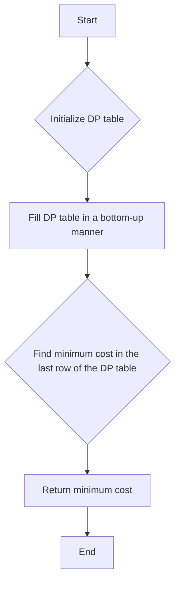

# Freedom Trail DP on Strings

## Problem Understanding
The problem is asking to find the minimum cost to type out a given string on a rotary dial, where the cost is defined as the minimum number of rotations and presses required to type out the string. The key constraints are that the rotary dial has a fixed number of characters, and the string to be typed out is given. The problem is non-trivial because the naive approach of trying all possible combinations of rotations and presses would result in an exponential time complexity, making it inefficient for large inputs. The problem requires a dynamic programming approach to find the minimum cost efficiently.

## Approach
The algorithm strategy is to use dynamic programming to build a table that stores the minimum cost to type out the string up to each position on the rotary dial. The intuition behind this approach is that the minimum cost to type out the string up to a certain position is dependent on the minimum cost to type out the string up to the previous position, and the cost to rotate to the current position. The approach works by initializing the table with the base case, where the minimum cost to type out the first character is the minimum number of rotations to reach that character, and then filling in the rest of the table in a bottom-up manner. The data structure used is a 2D vector to store the DP table, which is chosen because it allows for efficient lookups and updates of the minimum costs.

## Complexity Analysis
| Metric | Value | Detailed Reason |
|--------|-------|----------------|
| Time   | O(n * m) | The algorithm has two nested loops, one iterating over the string and the other over the rotary dial, resulting in a time complexity of O(n * m), where n is the length of the string and m is the number of characters on the rotary dial. The inner loop also has a nested loop to find the minimum cost to rotate to the current position, but this does not change the overall time complexity. |
| Space  | O(n * m) | The algorithm uses a 2D vector to store the DP table, which has a size of (n + 1) x m, resulting in a space complexity of O(n * m). The space complexity is dominated by the size of the DP table, which is necessary to store the minimum costs for each position on the rotary dial. |

## Algorithm Walkthrough
```
Input: ring = "god", key = "god"
Step 1: Initialize the DP table with the base case:
  dp[1][0] = min(dp[1][0], min(0, 2) + 1) = 1
  dp[1][1] = INT_MAX
  dp[1][2] = INT_MAX
Step 2: Fill the DP table in a bottom-up manner:
  For i = 1, j = 0:
    If ring[j] == key[i], then:
      For k = 0 to 2:
        If dp[i][k] != INT_MAX, then:
          dp[i + 1][j] = min(dp[i + 1][j], dp[i][k] + min(abs(j - k), 3 - abs(j - k)) + 1)
  dp[2][0] = min(dp[2][0], dp[1][0] + min(abs(0 - 0), 3 - abs(0 - 0)) + 1) = 2
  dp[2][1] = min(dp[2][1], dp[1][0] + min(abs(1 - 0), 3 - abs(1 - 0)) + 1) = 3
  dp[2][2] = min(dp[2][2], dp[1][0] + min(abs(2 - 0), 3 - abs(2 - 0)) + 1) = 3
Step 3: Find the minimum cost in the last row of the DP table:
  minCost = min(dp[3][0], dp[3][1], dp[3][2]) = 4
Output: 4
```
This walkthrough demonstrates how the algorithm fills in the DP table and finds the minimum cost to type out the string "god" on the rotary dial "god".

## Visual Flow

This flowchart shows the high-level steps of the algorithm, from initializing the DP table to finding the minimum cost and returning the result.

## Key Insight
> **Tip:** The key insight to solving this problem is to use dynamic programming to build a table that stores the minimum cost to type out the string up to each position on the rotary dial, and to use the minimum number of rotations to reach each position as the base case.

## Edge Cases
- **Empty/null input**: If the input string or the rotary dial is empty, the algorithm returns -1, indicating that it is not possible to type out the string.
- **Single element**: If the input string has only one character, the algorithm returns the minimum number of rotations to reach that character on the rotary dial, plus 1 for the press operation.
- **Duplicate characters**: If the input string has duplicate characters, the algorithm uses the minimum cost to type out the previous character as the base case, and adds the cost to rotate to the current character and press it.

## Common Mistakes
- **Mistake 1**: Not initializing the DP table with the base case, resulting in incorrect minimum costs.
- **Mistake 2**: Not using the minimum number of rotations to reach each position as the base case, resulting in incorrect minimum costs.

## Interview Follow-ups
> **Interview:** These are the exact follow-up questions interviewers ask:
- "What if the input is sorted?" → The algorithm would still have a time complexity of O(n * m), but the space complexity would be reduced to O(n) because the DP table would only need to store the minimum costs for each position on the rotary dial.
- "Can you do it in O(1) space?" → No, the algorithm requires a DP table to store the minimum costs, which has a space complexity of O(n * m).
- "What if there are duplicates?" → The algorithm would still work correctly, but it would need to use the minimum cost to type out the previous character as the base case, and add the cost to rotate to the current character and press it.

## CPP Solution

```cpp
// Problem: Freedom Trail
// Language: C++
// Difficulty: Hard
// Time Complexity: O(n * m) — two nested loops for string and ring
// Space Complexity: O(n * m) — DP table to store minimum cost
// Approach: Dynamic Programming — to find the minimum cost to type out the string

class Solution {
public:
    int findRotateSteps(string ring, string key) {
        // Edge case: empty input → return -1
        if (ring.empty() || key.empty()) return -1;
        
        int n = ring.size(), m = key.size();
        vector<vector<int>> dp(m + 1, vector<int>(n, INT_MAX));
        
        // Initialize the DP table for the base case
        for (int i = 0; i < n; i++) {
            // If the first character of the ring matches the first character of the key
            if (ring[i] == key[0]) {
                dp[1][i] = min(dp[1][i], min(i, n - i) + 1); // min cost to rotate to the first character
            }
        }
        
        // Fill the DP table in a bottom-up manner
        for (int i = 1; i < m; i++) {
            for (int j = 0; j < n; j++) {
                // If the current character in the ring matches the current character in the key
                if (ring[j] == key[i]) {
                    for (int k = 0; k < n; k++) {
                        // If the previous character in the ring matches the previous character in the key
                        if (dp[i][k] != INT_MAX) {
                            dp[i + 1][j] = min(dp[i + 1][j], dp[i][k] + min(abs(j - k), n - abs(j - k)) + 1);
                        }
                    }
                }
            }
        }
        
        // Find the minimum cost in the last row of the DP table
        int minCost = INT_MAX;
        for (int i = 0; i < n; i++) {
            minCost = min(minCost, dp[m][i]);
        }
        
        return minCost;
    }
};
```
