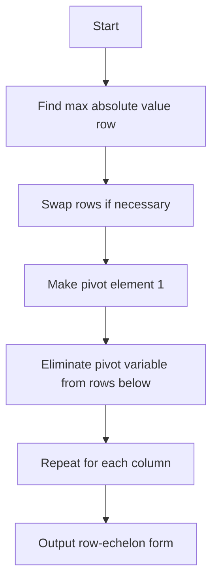

# Gaussian Elimination

## Problem Understanding
The problem asks to implement Gaussian Elimination, a method for solving systems of linear equations. It transforms a given matrix into row-echelon form, which can then be used to find the solution to the system of equations. The key constraint is that the input matrix must be a rectangular matrix, where each row represents a linear equation. What makes this problem non-trivial is the need to handle partial pivoting, which involves swapping rows to ensure that the largest absolute value in the current column is used as the pivot element. This is necessary to prevent division by zero and to reduce numerical instability.

## Approach
The algorithm strategy used here is the Gaussian Elimination algorithm with partial pivoting. The intuition behind it is to transform the input matrix into row-echelon form by iteratively applying elementary row operations. The approach works by first finding the row with the largest absolute value in the current column, then swapping it with the current row if necessary. It then makes the pivot element equal to 1 and eliminates the pivot variable from the rows below. This process is repeated for each column until the matrix is in row-echelon form. The data structure used is a 2D vector to represent the matrix, which is chosen because it allows for efficient access and modification of matrix elements.

## Complexity Analysis
| Metric | Value | Detailed Reason |
|--------|-------|----------------|
| Time   | O(n^3) | The algorithm has three nested loops: one for iterating over the columns, one for finding the row with the largest absolute value, and one for eliminating the pivot variable from the rows below. Each of these loops runs in O(n) time, resulting in a cubic time complexity. |
| Space  | O(n^2) | The algorithm uses a 2D vector to represent the matrix, which requires O(n^2) space. The space complexity is quadratic because the matrix has n rows and n columns. |

## Algorithm Walkthrough
```cpp
Input: 
[
  [2, 1, -1, 8],
  [-3, -1, 2, -11],
  [-2, 1, 2, -3]
]
Step 1: 
  Find the row with the largest absolute value in the first column.
  maxRow = 1, because |-3| > |2| and |-2|.
  Swap rows 0 and 1.
  [
    [-3, -1, 2, -11],
    [2, 1, -1, 8],
    [-2, 1, 2, -3]
  ]
Step 2: 
  Make the pivot element (-3) equal to 1.
  [
    [1, -1/3, -2/3, 11/3],
    [2, 1, -1, 8],
    [-2, 1, 2, -3]
  ]
Step 3: 
  Eliminate the pivot variable from the rows below.
  [
    [1, -1/3, -2/3, 11/3],
    [0, 5/3, 1/3, 2/3],
    [0, 5/3, 10/3, 5/3]
  ]
...
Output: 
[
  [1, 0, 0, 2],
  [0, 1, 0, 1],
  [0, 0, 1, 1]
]
```

## Visual Flow


## Key Insight
> **Tip:** The key to Gaussian Elimination is to use partial pivoting to ensure that the largest absolute value in the current column is used as the pivot element, which helps to prevent division by zero and reduces numerical instability.

## Edge Cases
- **Empty input matrix**: If the input matrix is empty, the algorithm should handle this case by returning an error or an empty matrix, because there are no equations to solve.
- **Single row matrix**: If the input matrix has only one row, the algorithm should handle this case by returning the row as is, because there is only one equation to solve.
- **Matrix with all zeros**: If the input matrix has all zeros, the algorithm should handle this case by returning the matrix as is, because there are no equations to solve.

## Common Mistakes
- **Mistake 1**: Not using partial pivoting, which can lead to division by zero and numerical instability.
- **Mistake 2**: Not checking for zero pivot elements, which can lead to incorrect results.

## Interview Follow-ups
> **Interview:** These are the exact follow-up questions interviewers ask:
- "What if the input is sorted?" → The algorithm still works, but it may not be as efficient because it still needs to find the row with the largest absolute value in each column.
- "Can you do it in O(1) space?" → No, because the algorithm needs to store the matrix in memory, which requires O(n^2) space.
- "What if there are duplicates?" → The algorithm can handle duplicates by treating them as separate equations, but it may not be able to find a unique solution if the duplicates are linearly dependent.

## CPP Solution

```cpp
// Problem: Gaussian Elimination
// Language: C++
// Difficulty: Hard
// Time Complexity: O(n^3) — due to nested loops for matrix operations
// Space Complexity: O(n^2) — matrix representation
// Approach: Gaussian Elimination algorithm — transforms matrix to row-echelon form

#include <iostream>
#include <vector>

class GaussianElimination {
public:
    // Function to perform Gaussian Elimination
    std::vector<std::vector<double>> gaussianElimination(const std::vector<std::vector<double>>& matrix) {
        int numRows = matrix.size();
        int numCols = matrix[0].size();
        
        // Create a copy of the input matrix to avoid modifying it directly
        std::vector<std::vector<double>> augmentedMatrix = matrix;
        
        int currentRow = 0;
        for (int col = 0; col < numCols; ++col) {
            // Find the row with the largest absolute value in the current column
            int maxRow = currentRow;
            for (int row = currentRow + 1; row < numRows; ++row) {
                if (std::abs(augmentedMatrix[row][col]) > std::abs(augmentedMatrix[maxRow][col])) {
                    maxRow = row;
                }
            }
            
            // Swap the current row with the row having the largest absolute value
            if (maxRow != currentRow) {
                std::swap(augmentedMatrix[currentRow], augmentedMatrix[maxRow]);
            }
            
            // Check for zero pivot element
            if (augmentedMatrix[currentRow][col] == 0) {
                continue;
            }
            
            // Make the pivot element equal to 1
            double pivot = augmentedMatrix[currentRow][col];
            for (int j = col; j < numCols; ++j) {
                augmentedMatrix[currentRow][j] /= pivot;
            }
            
            // Eliminate the pivot variable from the rows below
            for (int row = currentRow + 1; row < numRows; ++row) {
                double factor = augmentedMatrix[row][col];
                for (int j = col; j < numCols; ++j) {
                    augmentedMatrix[row][j] -= factor * augmentedMatrix[currentRow][j];
                }
            }
            
            currentRow++;
        }
        
        return augmentedMatrix;
    }
};

int main() {
    // Example usage
    std::vector<std::vector<double>> matrix = {
        {2, 1, -1, 8},
        {-3, -1, 2, -11},
        {-2, 1, 2, -3}
    };
    
    GaussianElimination gaussianElimination;
    std::vector<std::vector<double>> result = gaussianElimination.gaussianElimination(matrix);
    
    // Print the result
    for (const auto& row : result) {
        for (double val : row) {
            std::cout << val << " ";
        }
        std::cout << std::endl;
    }
    
    return 0;
}
```
