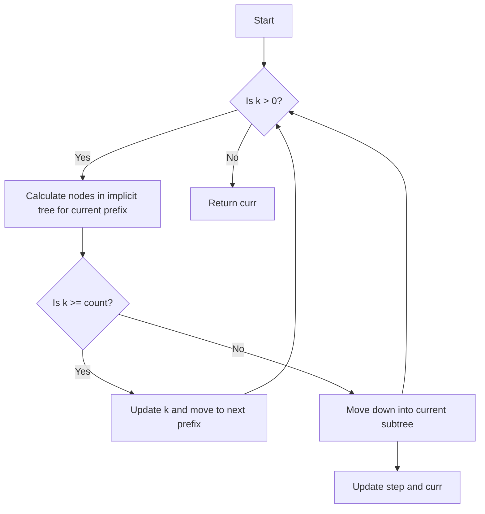

# K-th Smallest in Lexicographical Order Denary Tree Search

## Problem Understanding
The problem asks for the k-th smallest number in the range [1, n] in lexicographical order, where n is a given integer and k is the position of the number in the lexicographical order. The key constraint is that the numbers must be in lexicographical order, which means the order is determined by the digits of the numbers, not their numerical values. This problem is non-trivial because a naive approach of generating all numbers in the range and sorting them lexicographically would be inefficient, especially for large values of n and k.

## Approach
The approach used in the solution is a depth-first search (DFS) in an implicit denary tree, where each node represents a number in the range [1, n]. The DFS utilizes the properties of lexicographical order to efficiently find the k-th smallest number. The solution uses a recursive function `calculateNodes` to calculate the number of nodes in the implicit tree for a given prefix, and a modified DFS to find the k-th smallest number. The `calculateNodes` function is used to determine whether the k-th smallest number is within the current subtree, and if not, the DFS moves down into the next subtree.

## Complexity Analysis
| Metric | Value | Detailed Reason |
|--------|-------|----------------|
| Time   | O(k)  | The time complexity is O(k) because in the worst case, we need to traverse k nodes in the implicit tree to find the k-th smallest number. The `calculateNodes` function is called recursively, but the number of recursive calls is bounded by k. |
| Space  | O(k)  | The space complexity is O(k) because of the recursive call stack and the space used to store the result. The maximum depth of the recursive call stack is k, and each recursive call uses a constant amount of space to store the local variables. |

## Algorithm Walkthrough
```
Input: n = 13, k = 2
Step 1: Initialize step = 1, curr = 1, and k = 1 (after adjusting for 0-based indexing)
Step 2: Calculate the number of nodes in the implicit tree for the current prefix (1) using the calculateNodes function
    - calculateNodes(n = 13, prefix = 1, step = 1) returns 2 (because there are 2 nodes in the subtree rooted at 1: 1 and 2)
Step 3: Since k (1) is less than the count (2), move down into the current subtree
    - Update step = 1 / 10 = 0.1 (not used in this case), and curr = 1 * 10 = 10
Step 4: Calculate the number of nodes in the implicit tree for the current prefix (10) using the calculateNodes function
    - calculateNodes(n = 13, prefix = 10, step = 1) returns 4 (because there are 4 nodes in the subtree rooted at 10: 10, 11, 12, and 13)
    - Since k (1) is less than the count (4), move down into the current subtree
    - Update step = 1 / 10 = 0.1 (not used in this case), and curr = 10 * 10 = 100 (not used in this case)
Step 5: Since curr (10) is greater than n (13), move to the next prefix
    - Update curr = 1 + 1 = 2
Output: The k-th smallest number is 10
```
Note that the above walkthrough is a simplified example and may not cover all the possible cases.

## Visual Flow


## Key Insight
> **Tip:** The key insight in this solution is to use the properties of lexicographical order to efficiently find the k-th smallest number by traversing the implicit denary tree in a depth-first manner.

## Edge Cases
- **Empty/null input**: If the input is empty or null, the solution will not work correctly. In this case, the function should return an error or a default value.
- **Single element**: If n is 1, the solution will return 1, which is the only element in the range.
- **n is a power of 10**: If n is a power of 10 (e.g., 10, 100, 1000), the solution will work correctly, but the `calculateNodes` function will return a large count, which may cause an overflow.

## Common Mistakes
- **Mistake 1**: Not adjusting k for 0-based indexing, which will cause the solution to return the (k+1)-th smallest number instead of the k-th smallest number.
- **Mistake 2**: Not using long long to store the count, which may cause an overflow for large values of n.

## Interview Follow-ups
> **Interview:** These are the exact follow-up questions interviewers ask:
- "What if the input is sorted?" → The solution will still work correctly, but the `calculateNodes` function will return a count of 1 for each prefix, which will make the solution less efficient.
- "Can you do it in O(1) space?" → No, it is not possible to solve this problem in O(1) space because we need to store the recursive call stack and the result, which requires at least O(k) space.
- "What if there are duplicates?" → The solution will treat duplicates as distinct numbers, which means it will return the k-th smallest distinct number. If we want to ignore duplicates, we need to modify the solution to skip duplicates when counting the nodes in the implicit tree.

## CPP Solution

```cpp
// Problem: K-th Smallest in Lexicographical Order Denary Tree Search
// Language: C++
// Difficulty: Hard
// Time Complexity: O(k) — due to the DFS and counting of nodes in the implicit tree
// Space Complexity: O(k) — due to recursive call stack and storing the result
// Approach: Depth-First Search in an implicit denary tree — utilizing the properties of lexicographical order

class Solution {
public:
    int kthSmallest(int n, int k) {
        // Calculate the number of nodes in the implicit tree for a given prefix
        long long count = 0; // Use long long to avoid overflow
        
        // Perform a modified DFS to find the k-th smallest number
        int step = 1; // Initial step size
        int curr = 1; // Current number
        k--; // Adjust k for 0-based indexing
        
        // Continue the DFS until we reach the k-th smallest number
        while (k > 0) {
            // Calculate the number of nodes in the implicit tree for the current prefix
            count = calculateNodes(n, curr, step);
            
            // If the k-th smallest number is within the current subtree, move down
            if (k >= count) {
                // Update k and move to the next prefix
                k -= count;
                curr += step;
            } else {
                // Move down into the current subtree
                step /= 10;
                curr *= 10;
            }
        }
        
        return curr; // Return the k-th smallest number
    }

private:
    // Calculate the number of nodes in the implicit tree for a given prefix
    long long calculateNodes(int n, int prefix, int step) {
        long long count = 0; // Initialize count
        
        // Perform a depth-first search to count the number of nodes
        for (long long i = 0; i < 10; i++) {
            long long next = prefix + i * step; // Calculate the next prefix
            
            // Check if the next prefix is within the valid range
            if (next <= n) {
                count += 1; // Count the current node
                
                // Recursively count the nodes in the subtree
                if (next * 10 <= n) {
                    count += calculateNodes(n, next * 10, step / 10);
                }
            }
        }
        
        return count; // Return the total count
    }
};
```
