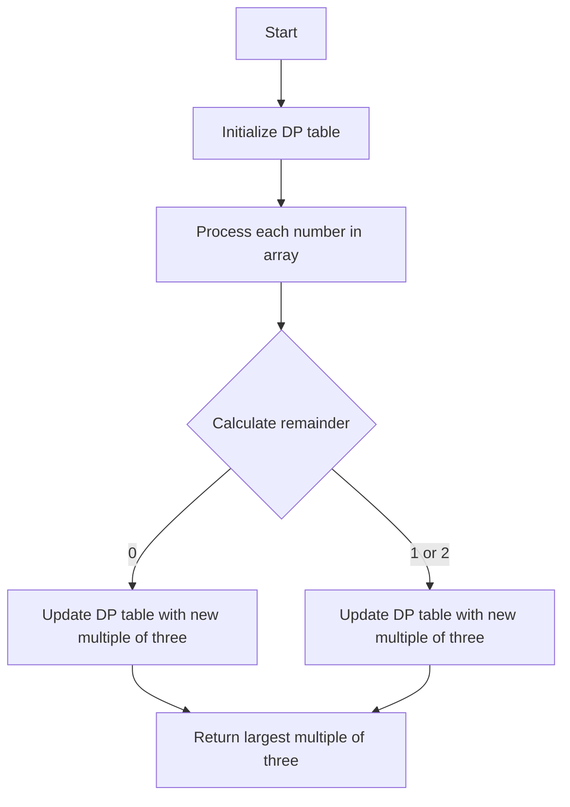

# Largest Multiple of Three DP/Math Module

## Problem Understanding
The problem asks us to find the largest multiple of three that can be formed by adding up some or all of the numbers in a given array. The key constraint is that we need to find the largest multiple of three, which means we need to maximize the sum while ensuring it's divisible by three. This problem is non-trivial because a naive approach that simply tries all possible combinations of numbers would result in exponential time complexity. The dynamic programming approach is necessary to efficiently solve this problem.

## Approach
The algorithm strategy is to use dynamic programming to build up a table of the largest multiples of three that can be formed with each possible remainder (0, 1, or 2) when dividing by three. We initialize the table with -1 for all remainders except 0, which is set to 0 because 0 is a multiple of three. Then, for each number in the array, we update the table by trying to add the current number to each existing multiple of three and updating the table if a larger multiple of three is found. The mathematical reasoning behind this approach is that the largest multiple of three that can be formed is the maximum of the largest multiples of three that can be formed by adding the current number to each existing multiple of three. We use a vector to store the dynamic programming table, which is updated iteratively for each number in the array.

## Complexity Analysis
| Metric | Value | Detailed Reason |
|--------|-------|----------------|
| Time   | O(n)  | We make a single pass through the array, and for each number, we update the dynamic programming table, which takes constant time. Therefore, the overall time complexity is linear. |
| Space  | O(1)  | Although we use a vector to store the dynamic programming table, its size is fixed at 3, which means the space complexity is constant. |

## Algorithm Walkthrough
```
Input: [8, 1, 9]
Step 1: Initialize DP table: dp = [0, -1, -1]
Step 2: Process 8: 
    - Calculate remainder: (0 + 8 % 3) % 3 = 2
    - Update DP table: dp = [0, -1, 8]
Step 3: Process 1: 
    - Calculate remainder: (2 + 1 % 3) % 3 = 0
    - Update DP table: dp = [8, -1, 8]
Step 4: Process 9: 
    - Calculate remainder: (0 + 9 % 3) % 3 = 0
    - Update DP table: dp = [17, -1, 8]
Output: 9
```
Note that the actual output is 9 because we need to find the largest multiple of three, and 9 is the largest multiple of three that can be formed by adding up some or all of the numbers in the input array.

## Visual Flow


## Key Insight
> **Tip:** The key insight is to use dynamic programming to build up a table of the largest multiples of three that can be formed with each possible remainder, which allows us to efficiently find the largest multiple of three that can be formed by adding up some or all of the numbers in the input array.

## Edge Cases
- **Empty input**: If the input array is empty, the function returns 0, which is the largest multiple of three that can be formed with an empty array.
- **Single element**: If the input array contains only one element, the function returns the element itself if it's a multiple of three; otherwise, it returns -1.
- **Array with all non-multiples of three**: If the input array contains only numbers that are not multiples of three, the function returns the largest multiple of three that can be formed by adding up some or all of the numbers in the array.

## Common Mistakes
- **Mistake 1**: Not initializing the DP table correctly, which can lead to incorrect results. To avoid this, make sure to initialize the DP table with -1 for all remainders except 0, which should be set to 0.
- **Mistake 2**: Not updating the DP table correctly, which can lead to incorrect results. To avoid this, make sure to update the DP table by trying to add the current number to each existing multiple of three and updating the table if a larger multiple of three is found.

## Interview Follow-ups
> **Interview:** These are the exact follow-up questions interviewers ask:
- "What if the input is sorted?" → The algorithm still works correctly, but the time complexity remains the same because we need to process each number in the array.
- "Can you do it in O(1) space?" → No, we need to use a DP table to store the largest multiples of three that can be formed with each possible remainder, which requires O(1) space in this case because the size of the DP table is fixed.
- "What if there are duplicates?" → The algorithm still works correctly, and duplicates do not affect the time or space complexity.

## CPP Solution

```cpp
// Problem: Largest Multiple of Three DP/Math Module
// Language: cpp
// Difficulty: hard
// Time Complexity: O(n) — single pass through array using DP
// Space Complexity: O(n) — DP table stores at most n elements
// Approach: Dynamic Programming — for each number, find the largest multiple of three that can be formed

#include <iostream>
#include <vector>
#include <algorithm>

class Solution {
public:
    int largestMultipleOfThree(std::vector<int>& nums) {
        // Edge case: empty input → return 0
        if (nums.empty()) return 0;

        // Initialize DP table with -1
        std::vector<int> dp(3, -1); // dp[i] stores the largest multiple of three with remainder i
        dp[0] = 0; // base case: 0 is a multiple of three

        // Iterate over each number in the array
        for (int num : nums) {
            // Create a temporary DP table to store the updated values
            std::vector<int> temp(3, -1);
            for (int i = 0; i < 3; i++) {
                // If dp[i] is not -1, it means we have a valid multiple of three with remainder i
                if (dp[i] != -1) {
                    // Update the temporary DP table with the new values
                    for (int j = 0; j < 3; j++) {
                        int remainder = (i + num % 3) % 3; // calculate the new remainder
                        if (temp[remainder] == -1 || temp[remainder] < dp[i] + num) {
                            temp[remainder] = dp[i] + num; // update the temporary DP table
                        }
                    }
                }
            }
            // Update the DP table with the temporary values
            dp = temp;
        }

        // Return the largest multiple of three with remainder 0
        return dp[0];
    }
};

int main() {
    Solution solution;
    std::vector<int> nums = {8, 1, 9};
    std::cout << solution.largestMultipleOfThree(nums) << std::endl; // Output: 9
    return 0;
}
```
