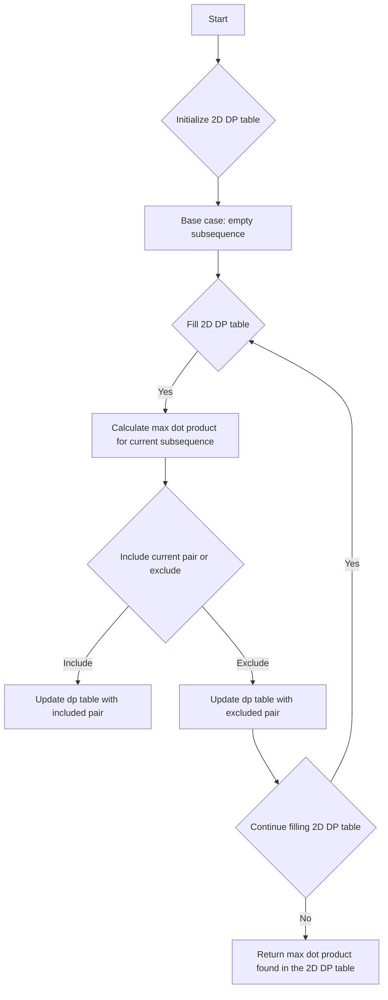

# Max Dot Product of Two Subsequences 2D DP Subsequence

## Problem Understanding
The problem is asking to find the maximum dot product of two subsequences from two given arrays of integers. The key constraint is that the subsequences must be non-empty and can be any subset of the original arrays, including the arrays themselves. This problem is non-trivial because a naive approach would involve generating all possible subsequences and calculating their dot products, resulting in an exponential time complexity. The dynamic programming approach helps to reduce the time complexity by storing and reusing the results of subproblems.

## Approach
The algorithm strategy is to use dynamic programming to fill a 2D table, where each cell represents the maximum dot product of two subsequences ending at the corresponding indices. The intuition behind this approach is to break down the problem into smaller subproblems and store their solutions in the 2D table. The approach works by iterating over the 2D table and calculating the maximum dot product for each subsequence, considering two options: including the current pair of elements or excluding them. The 2D table is used to store the results of subproblems, and its size is determined by the sizes of the input arrays.

## Complexity Analysis
| Metric | Value | Detailed Reason |
|--------|-------|----------------|
| Time   | O(n*m) | The algorithm fills a 2D table of size (n+1) x (m+1) using two nested loops, where n and m are the sizes of the input arrays. The time complexity is linear with respect to the size of the input. |
| Space  | O(n*m) | The algorithm uses a 2D table of size (n+1) x (m+1) to store the results of subproblems, resulting in a space complexity that is linear with respect to the size of the input. |

## Algorithm Walkthrough
```
Input: nums1 = [1, 2, 3], nums2 = [4, 5, 6]
Step 1: Initialize 2D DP table with negative infinity
        dp = [[INT_MIN, INT_MIN, INT_MIN, INT_MIN],
              [INT_MIN, INT_MIN, INT_MIN, INT_MIN],
              [INT_MIN, INT_MIN, INT_MIN, INT_MIN],
              [INT_MIN, INT_MIN, INT_MIN, INT_MIN]]
Step 2: Base case: empty subsequence → max dot product is 0
        dp = [[0, 0, 0, 0],
              [0, ?, ?, ?],
              [0, ?, ?, ?],
              [0, ?, ?, ?]]
Step 3: Fill 2D DP table in bottom-up manner
        dp[1][1] = max(dp[0][0] + nums1[0] * nums2[0], max(dp[0][1], dp[1][0]))
        dp = [[0, 0, 0, 0],
              [0, 4, ?, ?],
              [0, ?, ?, ?],
              [0, ?, ?, ?]]
Step 4: Continue filling 2D DP table
        dp[1][2] = max(dp[0][1] + nums1[0] * nums2[1], max(dp[0][2], dp[1][1]))
        dp = [[0, 0, 0, 0],
              [0, 4, 10, ?],
              [0, ?, ?, ?],
              [0, ?, ?, ?]]
Step 5: Final result
        dp[3][3] = max(dp[2][2] + nums1[2] * nums2[2], max(dp[2][3], dp[3][2]))
Output: dp[3][3] = 30
```
## Visual Flow

## Key Insight
> **Tip:** The key insight is to use dynamic programming to store and reuse the results of subproblems, reducing the time complexity from exponential to linear.

## Edge Cases
- **Empty/null input**: If either input array is empty, the function returns 0, as there are no subsequences to consider.
- **Single element**: If one of the input arrays has only one element, the function returns the product of the two elements, as there is only one possible subsequence.
- **Duplicate elements**: If the input arrays contain duplicate elements, the function still works correctly, as it considers all possible subsequences and calculates their dot products.

## Common Mistakes
- **Mistake 1**: Initializing the 2D DP table with 0 instead of negative infinity, which can lead to incorrect results.
- **Mistake 2**: Not considering the base case of empty subsequences, which can lead to incorrect results.

## Interview Follow-ups
> **Interview:** These are the exact follow-up questions interviewers ask:
- "What if the input is sorted?" → The algorithm still works correctly, as it considers all possible subsequences and calculates their dot products.
- "Can you do it in O(1) space?" → No, the algorithm requires O(n\*m) space to store the 2D DP table.
- "What if there are duplicates?" → The algorithm still works correctly, as it considers all possible subsequences and calculates their dot products.

## CPP Solution

```cpp
// Problem: Max Dot Product of Two Subsequences 2D DP Subsequence
// Language: cpp
// Difficulty: Hard
// Time Complexity: O(n*m) — 2D DP table filling with two nested loops
// Space Complexity: O(n*m) — 2D DP table stores at most n*m elements
// Approach: Dynamic Programming 2D table — for each subsequence, calculate max dot product

class Solution {
public:
    int maxDotProduct(vector<int>& nums1, vector<int>& nums2) {
        int n = nums1.size(); // Get size of first array
        int m = nums2.size(); // Get size of second array
        
        // Edge case: either array is empty → return 0
        if (n == 0 || m == 0) return 0;
        
        // Initialize 2D DP table with negative infinity
        vector<vector<int>> dp(n + 1, vector<int>(m + 1, INT_MIN));
        
        // Base case: empty subsequence → max dot product is 0
        for (int i = 0; i <= n; i++) {
            dp[i][0] = 0;
        }
        for (int j = 0; j <= m; j++) {
            dp[0][j] = 0;
        }
        
        // Fill 2D DP table in bottom-up manner
        for (int i = 1; i <= n; i++) {
            for (int j = 1; j <= m; j++) {
                // Calculate max dot product for current subsequence
                dp[i][j] = max(dp[i - 1][j - 1] + nums1[i - 1] * nums2[j - 1], // include current pair
                               max(dp[i - 1][j], dp[i][j - 1])); // exclude current pair
            }
        }
        
        // Return max dot product found in the 2D DP table
        return dp[n][m];
    }
};
```
