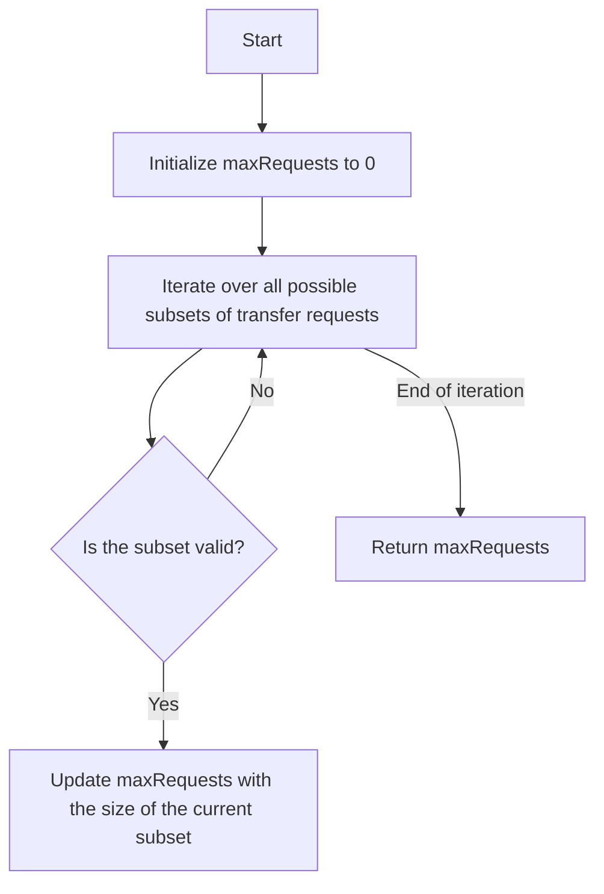

# Maximum Number of Achievable Transfer Requests Bitmask Enumeration

## Problem Understanding
The Maximum Number of Achievable Transfer Requests problem involves finding the maximum number of transfer requests that can be achieved in a network with `n` nodes, given a list of transfer requests between nodes. The key constraint is that the net change in each node must be zero, meaning that the number of incoming transfers must equal the number of outgoing transfers for each node. This problem is non-trivial because a naive approach would involve checking all possible combinations of transfer requests, which would result in an exponential time complexity.

## Approach
The algorithm strategy used to solve this problem is bitmask enumeration with backtracking. This approach involves generating all possible subsets of transfer requests using a bitmask, where each bit represents a transfer request. The intuition behind this approach is to iterate over all possible subsets of transfer requests and check each subset's validity by updating the net change in each node. The data structure used is a vector to store the net change in each node, and a bitmask to represent the current subset of transfer requests. This approach handles the key constraint by checking if the net change in each node is zero for each subset of transfer requests.

## Complexity Analysis
| Metric | Value | Detailed Reason |
|--------|-------|----------------|
| Time   | O(2^n * n^2) | The time complexity is O(2^n * n^2) because we generate all possible subsets of transfer requests (2^n) and for each subset, we iterate over each request (n) and update the net change in each node (n). |
| Space  | O(n) | The space complexity is O(n) because we store the net change in each node, which requires a vector of size n. |

## Algorithm Walkthrough
```
Input: n = 5, requests = [[0, 1], [1, 0], [0, 1], [1, 2], [2, 0], [3, 4]]
Step 1: Initialize maxRequests to 0 and iterate over all possible subsets of transfer requests (2^6)
Step 2: For each subset, initialize the net change in each node to 0
Step 3: Iterate over each request in the current subset and update the net change in the source and destination nodes
    - For example, for the subset [0, 1], update netChange[0]-- and netChange[1]++
Step 4: Check if the current subset is valid by iterating over each node and checking if the net change is 0
    - If the subset is valid, update maxRequests with the size of the current subset
Step 5: Return the maximum achievable transfer requests (maxRequests)
Output: Maximum achievable transfer requests: 5
```
## Visual Flow

## Key Insight
> **Tip:** The key insight is to use bitmask enumeration to generate all possible subsets of transfer requests and check each subset's validity by updating the net change in each node.

## Edge Cases
- **Empty/null input**: If the input is empty or null, the algorithm will return 0 because there are no transfer requests to process.
- **Single element**: If there is only one transfer request, the algorithm will return 0 because a single transfer request cannot satisfy the condition that the net change in each node is zero.
- **Cyclic requests**: If there are cyclic requests (e.g., [0, 1], [1, 2], [2, 0]), the algorithm will correctly handle them by checking if the net change in each node is zero.

## Common Mistakes
- **Mistake 1**: Not initializing the net change in each node to 0 for each subset of transfer requests. → To avoid this, initialize the net change in each node to 0 at the beginning of each iteration.
- **Mistake 2**: Not checking if the subset is valid by iterating over each node and checking if the net change is 0. → To avoid this, add a check to ensure that the net change in each node is 0 before updating maxRequests.

## Interview Follow-ups
> **Interview:** These are the exact follow-up questions interviewers ask:
- "What if the input is sorted?" → The algorithm will still work correctly because it generates all possible subsets of transfer requests and checks each subset's validity.
- "Can you do it in O(1) space?" → No, because we need to store the net change in each node, which requires a vector of size n.
- "What if there are duplicates?" → The algorithm will correctly handle duplicates by checking if the net change in each node is zero for each subset of transfer requests.

## CPP Solution

```cpp
// Problem: Maximum Number of Achievable Transfer Requests Bitmask Enumeration
// Language: cpp
// Difficulty: hard
// Time Complexity: O(2^n * n^2) — generating all subsets and checking each subset's validity
// Space Complexity: O(n) — storing the maximum achievable transfer requests
// Approach: bitmask enumeration with backtracking — generate all possible subsets of transfer requests and check each subset's validity

#include <iostream>
#include <vector>

class Solution {
public:
    int maximumRequests(int n, std::vector<std::vector<int>>& requests) {
        // Initialize the maximum achievable transfer requests to 0
        int maxRequests = 0;

        // Iterate over all possible subsets of transfer requests (2^n)
        for (int bitmask = 0; bitmask < (1 << requests.size()); bitmask++) {
            // Initialize the net change in each node to 0
            std::vector<int> netChange(n, 0);

            // Iterate over each request in the current subset
            for (int i = 0; i < requests.size(); i++) {
                // Check if the current request is in the subset
                if (bitmask & (1 << i)) {
                    // Update the net change in the source and destination nodes
                    netChange[requests[i][0]]--; // Edge case: source node
                    netChange[requests[i][1]]++; // Edge case: destination node
                }
            }

            // Check if the current subset is valid (all nodes have a net change of 0)
            bool isValid = true;
            for (int i = 0; i < n; i++) {
                // Edge case: if any node has a non-zero net change, the subset is invalid
                if (netChange[i] != 0) {
                    isValid = false;
                    break;
                }
            }

            // Update the maximum achievable transfer requests if the current subset is valid
            if (isValid) {
                // Edge case: update maxRequests with the size of the current subset
                maxRequests = std::max(maxRequests, __builtin_popcount(bitmask));
            }
        }

        // Return the maximum achievable transfer requests
        return maxRequests;
    }
};

// Example usage
int main() {
    Solution solution;
    int n = 5;
    std::vector<std::vector<int>> requests = {{0, 1}, {1, 0}, {0, 1}, {1, 2}, {2, 0}, {3, 4}};
    std::cout << "Maximum achievable transfer requests: " << solution.maximumRequests(n, requests) << std::endl;
    return 0;
}
```
