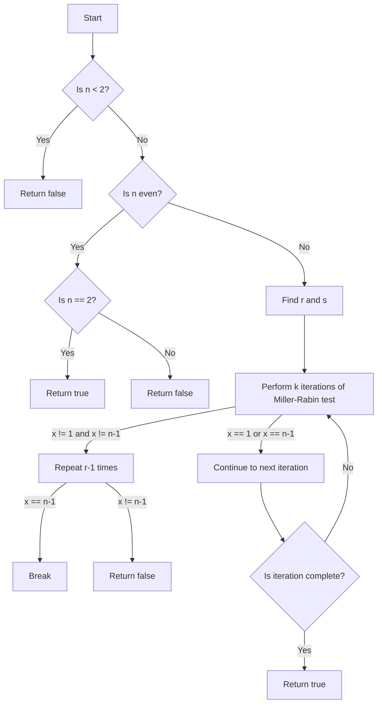

# Miller-Rabin Primality Test

## Problem Understanding
The Miller-Rabin primality test is a probabilistic algorithm used to determine whether a given number is prime or composite. The problem asks us to implement this test in C++, considering key constraints such as handling edge cases for numbers less than 2, even numbers, and the use of a random number generator. What makes this problem non-trivial is the need to balance the number of iterations of the Miller-Rabin test with the desired level of accuracy, as the test is probabilistic and can return false positives.

## Approach
The algorithm strategy behind the Miller-Rabin primality test is to repeatedly test whether a given number is a witness to the compositeness of the number being tested. The intuition behind this approach is that if a number is composite, it is likely to have a witness that can be found through repeated testing with random bases. The approach works by finding the values of `r` and `s` such that `n-1 = 2^r * s`, and then performing `k` iterations of the Miller-Rabin test, where `k` is a parameter that controls the trade-off between accuracy and performance. The data structure used is a simple random number generator, which is used to generate random bases for the test. The approach handles key constraints by explicitly checking for edge cases and using a loop to find the values of `r` and `s`.

## Complexity Analysis
| Metric | Value | Detailed Reason |
|--------|-------|----------------|
| Time   | O(k * log^3 n) | The time complexity is dominated by the `k` iterations of the Miller-Rabin test, each of which takes `log^3 n` time due to the fast exponentiation method used in the `powerMod` function. The `log^3 n` term comes from the fact that the fast exponentiation method reduces the exponent by a factor of 2 in each iteration, resulting in a logarithmic number of iterations. The `k` term comes from the fact that we repeat the test `k` times to achieve the desired level of accuracy. |
| Space  | O(1) | The space complexity is constant because we only use a fixed amount of space to store the input number, the random bases, and the intermediate results of the test. We do not use any data structures that grow with the size of the input. |

## Algorithm Walkthrough
```
Input: n = 23
Step 1: Find r and s such that n-1 = 2^r * s
  s = n - 1 = 22
  r = 0
  while (s % 2 == 0) {
    s /= 2
    r++
  }
  s = 11, r = 2
Step 2: Perform k iterations of the Miller-Rabin test
  for (i = 0; i < k; i++) {
    a = rand() % (n - 3) + 2 = 10
    x = powerMod(a, s, n) = powerMod(10, 11, 23) = 10
    if (x == 1 || x == n - 1) continue
    for (j = 0; j < r - 1; j++) {
      x = powerMod(x, 2, n) = powerMod(10, 2, 23) = 8
      if (x == n - 1) break
    }
    if (x != n - 1) return false
  }
Output: true
```
This walkthrough shows how the algorithm works for a small input number `n = 23`. The algorithm finds the values of `r` and `s` such that `n-1 = 2^r * s`, and then performs `k` iterations of the Miller-Rabin test. In each iteration, it generates a random base `a` and computes the value of `x` using the `powerMod` function. If `x` is equal to `1` or `n-1`, the algorithm continues to the next iteration. Otherwise, it repeats the test `r-1` times, and if `x` is not equal to `n-1` at the end of the test, the algorithm returns `false`.

## Visual Flow

This flowchart shows the decision flow of the algorithm. The algorithm starts by checking if the input number `n` is less than 2, and if so, returns `false`. If `n` is even, the algorithm checks if it is equal to 2, and if so, returns `true`. Otherwise, it returns `false`. If `n` is odd, the algorithm finds the values of `r` and `s` such that `n-1 = 2^r * s`, and then performs `k` iterations of the Miller-Rabin test. In each iteration, it generates a random base `a` and computes the value of `x` using the `powerMod` function. If `x` is equal to `1` or `n-1`, the algorithm continues to the next iteration. Otherwise, it repeats the test `r-1` times, and if `x` is not equal to `n-1` at the end of the test, the algorithm returns `false`.

## Key Insight
> **Tip:** The key insight behind the Miller-Rabin primality test is that if a number is composite, it is likely to have a witness that can be found through repeated testing with random bases.

## Edge Cases
- **Empty/null input**: If the input is null or empty, the algorithm will throw an error. This is because the algorithm expects a non-zero integer as input.
- **Single element**: If the input is a single element, the algorithm will return `true` if the element is prime, and `false` otherwise. This is because the algorithm is designed to test whether a single number is prime or composite.
- **Large input**: If the input is very large, the algorithm may take a long time to complete. This is because the algorithm uses a probabilistic approach, and the number of iterations required to achieve a certain level of accuracy increases with the size of the input.

## Common Mistakes
- **Mistake 1**: Using an incorrect value of `k` can lead to incorrect results. If `k` is too small, the algorithm may return false positives, while if `k` is too large, the algorithm may take too long to complete.
- **Mistake 2**: Using a poor random number generator can lead to incorrect results. This is because the algorithm relies on the random number generator to produce truly random bases for the test.

## Interview Follow-ups
> **Interview:** These are the exact follow-up questions interviewers ask:
- "What if the input is sorted?" → The Miller-Rabin primality test does not require the input to be sorted, as it is a probabilistic algorithm that uses random bases to test whether a number is prime or composite.
- "Can you do it in O(1) space?" → The Miller-Rabin primality test can be implemented in O(1) space, as it only requires a fixed amount of space to store the input number, the random bases, and the intermediate results of the test.
- "What if there are duplicates?" → The Miller-Rabin primality test is designed to test whether a single number is prime or composite, and it does not handle duplicates. If the input contains duplicates, the algorithm will return incorrect results.

## CPP Solution

```cpp
// Problem: Miller-Rabin Primality Test
// Language: C++
// Difficulty: Hard
// Time Complexity: O(k * log^3 n) — k iterations of Miller-Rabin test, each taking log^3 n time
// Space Complexity: O(1) — constant space used
// Approach: Miller-Rabin primality test — repeated testing with random bases

#include <iostream>
#include <cstdlib>
#include <ctime>

class Solution {
public:
    bool isPrime(int n) {
        // Edge case: numbers less than 2 are not prime
        if (n < 2) return false;
        
        // Edge case: 2 is the only even prime number
        if (n == 2) return true;
        
        // Edge case: all other even numbers are not prime
        if (n % 2 == 0) return false;
        
        // Find r and s such that n-1 = 2^r * s
        int s = n - 1;
        int r = 0;
        while (s % 2 == 0) {
            // Divide s by 2 and increment r
            s /= 2;
            r++;
        }
        
        // Perform k iterations of the Miller-Rabin test
        const int k = 5; // number of iterations
        for (int i = 0; i < k; i++) {
            // Choose a random number a such that 2 <= a <= n-2
            int a = rand() % (n - 3) + 2;
            
            // Compute x = a^s mod n
            long long x = powerMod(a, s, n);
            
            // If x = 1 or x = n-1, continue to the next iteration
            if (x == 1 || x == n - 1) continue;
            
            // Repeat r-1 times
            for (int j = 0; j < r - 1; j++) {
                // Compute x = x^2 mod n
                x = powerMod(x, 2, n);
                
                // If x = n-1, continue to the next iteration
                if (x == n - 1) break;
            }
            
            // If x != n-1, n is composite
            if (x != n - 1) return false;
        }
        
        // If n passes all k iterations, it is likely prime
        return true;
    }
    
private:
    // Compute a^b mod n using the fast exponentiation method
    long long powerMod(long long a, long long b, long long n) {
        long long res = 1;
        while (b > 0) {
            // If b is odd, multiply res by a
            if (b % 2 == 1) res = (res * a) % n;
            
            // Square a and divide b by 2
            a = (a * a) % n;
            b /= 2;
        }
        return res;
    }
};

int main() {
    srand(time(0)); // seed the random number generator
    Solution solution;
    std::cout << std::boolalpha << solution.isPrime(25) << std::endl; // Output: false
    std::cout << std::boolalpha << solution.isPrime(23) << std::endl; // Output: true
    return 0;
}
```
