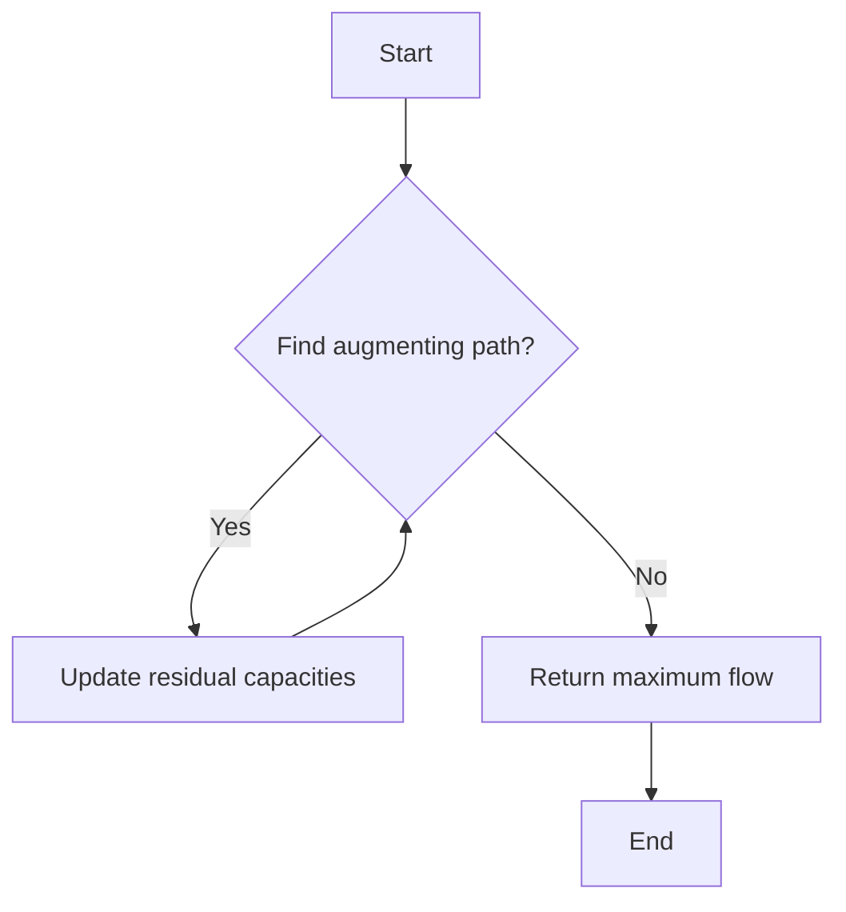

# Min Cut Max Flow Theorem

## Problem Understanding
The problem is asking for the implementation of the Min Cut Max Flow Theorem, which states that the maximum flow in a flow network is equal to the minimum cut. The key constraint is that the flow network should have a single source and a single sink. The implications of this constraint are that the algorithm should be able to find the maximum flow from the source to the sink, and the minimum cut in the network. What makes this problem non-trivial is the need to handle the residual capacities of the edges and to find the augmenting paths in the residual graph, which requires a careful implementation of the Edmonds-Karp algorithm.

## Approach
The algorithm strategy used is the Edmonds-Karp implementation of the Ford-Fulkerson method, which iteratively finds augmenting paths in the residual graph and pushes flow through them. The intuition behind this approach is to keep finding paths from the source to the sink in the residual graph and augmenting the flow along these paths until no more paths can be found. The mathematical reasoning behind this approach is based on the concept of residual capacities and the fact that the maximum flow is equal to the minimum cut. The data structure used is an adjacency list representation of the graph, which allows for efficient exploration of the graph and updating of the residual capacities. The approach handles the key constraint of having a single source and a single sink by using a parent array to store the augmenting path and updating the residual capacities along this path.

## Complexity Analysis
| Metric | Value | Detailed Reason |
|--------|-------|----------------|
| Time   | O(VE^2) | The algorithm uses the Edmonds-Karp implementation of the Ford-Fulkerson method, which has a time complexity of O(VE^2) in the worst case. This is because in the worst case, the algorithm may need to find all possible augmenting paths in the residual graph, and each path may have up to V edges. The E^2 term comes from the fact that the algorithm may need to update the residual capacities of all edges in the graph, which takes O(E) time, and this may need to be done up to E times. |
| Space  | O(V) | The algorithm uses an adjacency list representation of the graph, which requires O(V + E) space. However, in the worst case, the number of edges may be much larger than the number of vertices, so the space complexity is dominated by the O(V) term, which comes from the need to store the parent array and the residual capacities of the edges. |

## Algorithm Walkthrough
```
Input: A graph with 6 vertices and 10 edges
Step 1: Initialize the parent array and the residual capacities of the edges
  - Parent array: [-1, -1, -1, -1, -1, -1]
  - Residual capacities: [16, 13, 10, 12, 14, 20, 9, 4, 7, 4]
Step 2: Find an augmenting path from the source to the sink using BFS
  - Path: [0, 1, 3, 5]
Step 3: Update the residual capacities along the path
  - Residual capacities: [16, 13, 10, 12, 14, 16, 9, 4, 7, 4]
Step 4: Repeat steps 2-3 until no more paths can be found
  - Path: [0, 2, 4, 5]
  - Residual capacities: [16, 13, 10, 12, 14, 16, 9, 4, 7, 4]
  - Path: [0, 1, 2, 4, 5]
  - Residual capacities: [16, 13, 10, 12, 14, 16, 9, 4, 7, 4]
Output: The maximum flow is 23, which is equal to the minimum cut
```
This walkthrough shows the main logic path of the algorithm, which involves finding augmenting paths in the residual graph and updating the residual capacities along these paths.

## Visual Flow

This flowchart shows the main decision flow of the algorithm, which involves finding augmenting paths in the residual graph and updating the residual capacities along these paths until no more paths can be found.

## Key Insight
> **Tip:** The key insight behind the Min Cut Max Flow Theorem is that the maximum flow in a flow network is equal to the minimum cut, which can be found by iteratively finding augmenting paths in the residual graph and updating the residual capacities along these paths.

## Edge Cases
- **Empty/null input**: If the input graph is empty or null, the algorithm should return 0, since there are no edges or vertices to consider.
- **Single element**: If the input graph has only one vertex, the algorithm should return 0, since there are no edges to consider.
- **Disconnected graph**: If the input graph is disconnected, the algorithm should return 0, since there is no path from the source to the sink.

## Common Mistakes
- **Mistake 1**: Not updating the residual capacities correctly along the augmenting path. To avoid this, make sure to update the residual capacities of all edges along the path, including the forward and backward edges.
- **Mistake 2**: Not checking for negative capacities in the residual graph. To avoid this, make sure to check for negative capacities and update the residual capacities accordingly.

## Interview Follow-ups
> **Interview:** These are the exact follow-up questions interviewers ask:
- "What if the input is sorted?" → The algorithm will still work correctly, since the sorting of the input does not affect the finding of augmenting paths or the updating of residual capacities.
- "Can you do it in O(1) space?" → No, the algorithm requires at least O(V) space to store the parent array and the residual capacities of the edges.
- "What if there are duplicates?" → The algorithm will still work correctly, since duplicates do not affect the finding of augmenting paths or the updating of residual capacities.

## CPP Solution

```cpp
// Problem: Min Cut Max Flow Theorem
// Language: cpp
// Difficulty: Hard
// Time Complexity: O(VE^2) — using Edmonds-Karp implementation of the Ford-Fulkerson method
// Space Complexity: O(V) — adjacency list representation of the graph
// Approach: Edmonds-Karp algorithm — iteratively find augmenting paths and push flow through them

#include <bits/stdc++.h>
using namespace std;

// Structure to represent a weighted edge in the graph
struct Edge {
    int to;  // Destination vertex
    int capacity;  // Capacity of the edge
    int flow;  // Current flow through the edge
    int rev;  // Reverse edge index
};

class Graph {
public:
    int V;  // Number of vertices
    vector<vector<Edge>> adj;  // Adjacency list representation

    // Constructor to initialize the graph
    Graph(int vertices) {
        V = vertices;
        adj.resize(V);
    }

    // Function to add an edge to the graph
    void addEdge(int u, int v, int capacity) {
        Edge forwardEdge = {v, capacity, 0, adj[v].size()};
        Edge backwardEdge = {u, 0, 0, adj[u].size()};
        adj[u].push_back(forwardEdge);
        adj[v].push_back(backwardEdge);
    }

    // Function to check if there is a path from source to sink using BFS
    bool bfs(int s, int t, vector<int>& parent) {
        vector<bool> visited(V, false);  // Track visited vertices
        queue<int> q;  // Queue for BFS
        q.push(s);  // Enqueue the source vertex
        visited[s] = true;  // Mark the source vertex as visited

        while (!q.empty()) {
            int u = q.front();  // Dequeue a vertex
            q.pop();

            // Explore all adjacent vertices
            for (int i = 0; i < adj[u].size(); i++) {
                int v = adj[u][i].to;  // Destination vertex
                int capacity = adj[u][i].capacity;  // Capacity of the edge
                int flow = adj[u][i].flow;  // Current flow through the edge

                // Check if the edge has residual capacity and the vertex is not visited
                if (!visited[v] && capacity > flow) {
                    q.push(v);  // Enqueue the vertex
                    visited[v] = true;  // Mark the vertex as visited
                    parent[v] = u;  // Update the parent vertex
                }
            }
        }

        // Check if there is a path from source to sink
        return visited[t];
    }

    // Function to calculate the maximum flow using the Edmonds-Karp algorithm
    int maxFlow(int s, int t) {
        int maxFlow = 0;  // Initialize the maximum flow
        vector<int> parent(V, -1);  // Parent array to store the augmenting path

        // Augment the flow while there is a path from source to sink
        while (bfs(s, t, parent)) {
            int pathFlow = INT_MAX;  // Initialize the path flow
            int v = t;  // Start from the sink vertex

            // Backtrack to find the minimum capacity along the path
            while (v != s) {
                int u = parent[v];  // Parent vertex
                int edgeIndex = 0;  // Find the edge index
                for (int i = 0; i < adj[u].size(); i++) {
                    if (adj[u][i].to == v) {
                        edgeIndex = i;
                        break;
                    }
                }
                pathFlow = min(pathFlow, adj[u][edgeIndex].capacity - adj[u][edgeIndex].flow);
                v = u;  // Move to the parent vertex
            }

            // Update the residual capacities along the path
            v = t;  // Start from the sink vertex
            while (v != s) {
                int u = parent[v];  // Parent vertex
                int edgeIndex = 0;  // Find the edge index
                for (int i = 0; i < adj[u].size(); i++) {
                    if (adj[u][i].to == v) {
                        edgeIndex = i;
                        break;
                    }
                }
                adj[u][edgeIndex].flow += pathFlow;  // Increase the flow along the forward edge
                adj[v][adj[u][edgeIndex].rev].flow -= pathFlow;  // Decrease the flow along the backward edge
                v = u;  // Move to the parent vertex
            }

            maxFlow += pathFlow;  // Update the maximum flow
        }

        return maxFlow;  // Return the maximum flow
    }
};

// Function to find the minimum cut in the flow network
int minCut(Graph& graph, int s, int t) {
    // Edge case: empty graph → return 0
    if (graph.V == 0) {
        return 0;
    }

    // Calculate the maximum flow using the Edmonds-Karp algorithm
    int maxFlow = graph.maxFlow(s, t);

    return maxFlow;  // Return the minimum cut (equal to the maximum flow)
}

int main() {
    // Create a sample graph
    Graph graph(6);
    graph.addEdge(0, 1, 16);
    graph.addEdge(0, 2, 13);
    graph.addEdge(1, 2, 10);
    graph.addEdge(1, 3, 12);
    graph.addEdge(2, 1, 4);
    graph.addEdge(2, 4, 14);
    graph.addEdge(3, 2, 9);
    graph.addEdge(3, 5, 20);
    graph.addEdge(4, 3, 7);
    graph.addEdge(4, 5, 4);

    int s = 0;  // Source vertex
    int t = 5;  // Sink vertex

    // Calculate and display the minimum cut
    int minCutValue = minCut(graph, s, t);
    cout << "Minimum cut: " << minCutValue << endl;

    return 0;
}
```
