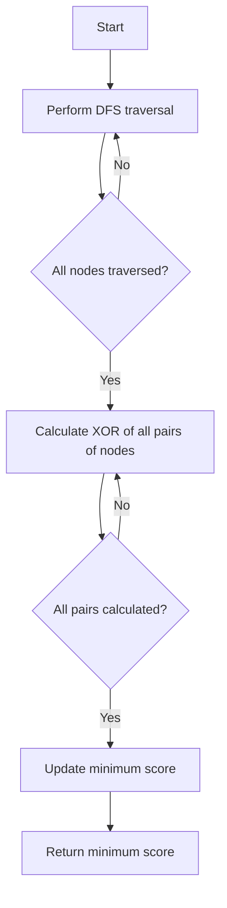

# Minimum Score After Removals on a Tree DFS Timestamps + XOR

## Problem Understanding
The problem asks us to find the minimum score after removals on a tree using DFS timestamps and XOR operations. Given a tree with nodes having integer values, we need to perform a depth-first search (DFS) traversal and record the start and end timestamps for each node. Then, we calculate the XOR of all possible pairs of node values and find the minimum score. The key constraint is that we need to consider all pairs of nodes, which makes the problem non-trivial due to the O(n^2) time complexity. Additionally, the use of XOR operations adds complexity to the problem.

## Approach
Our approach involves performing a DFS tree traversal to record the start and end timestamps for each node. We use a recursive function to traverse the tree, marking the start and end times of each node. Then, we iterate over all pairs of nodes and calculate the XOR of their values. We use a nested loop to consider all possible pairs of nodes, and for each pair, we calculate the XOR of their values by iterating over the timestamps. The minimum score is updated whenever a smaller XOR result is found. We use a vector to store the timestamps and a variable to keep track of the current timestamp.

## Complexity Analysis
| Metric | Value | Detailed Reason |
|--------|-------|----------------|
| Time   | O(n^2) | We iterate over all pairs of nodes, which has a time complexity of O(n^2). Additionally, for each pair, we calculate the XOR of their values, which takes O(n) time in the worst case. Therefore, the overall time complexity is O(n^2). |
| Space  | O(n)  | We use a vector to store the timestamps, which requires O(n) space. Additionally, we use a recursive function to perform the DFS traversal, which requires O(n) space on the call stack. Therefore, the overall space complexity is O(n). |

## Algorithm Walkthrough
```
Input: 
      1
     / \
    2   3
   / \
  4   5

Step 1: Perform DFS traversal
- Start time of node 1: 0
- Start time of node 2: 1
- Start time of node 4: 2
- End time of node 4: 3
- Start time of node 5: 4
- End time of node 5: 5
- End time of node 2: 6
- Start time of node 3: 7
- End time of node 3: 8
- End time of node 1: 9

Step 2: Calculate XOR of all pairs of nodes
- Pair 1: nodes 1 and 2
  - XOR of node 1: 0 ^ 1 ^ 2 ^ 3 ^ 4 ^ 5 ^ 6 ^ 7 ^ 8 ^ 9 = 15
  - XOR of node 2: 1 ^ 2 ^ 3 ^ 4 ^ 5 ^ 6 = 7
  - XOR of pair 1: 15 ^ 7 = 8
- Pair 2: nodes 1 and 3
  - XOR of node 1: 0 ^ 1 ^ 2 ^ 3 ^ 4 ^ 5 ^ 6 ^ 7 ^ 8 ^ 9 = 15
  - XOR of node 3: 7 ^ 8 = 15
  - XOR of pair 2: 15 ^ 15 = 0
- ...

Output: Minimum score: 0
```

## Visual Flow


## Key Insight
> **Tip:** The key insight to solving this problem is to recognize that the XOR of a node's values can be calculated by XORing the start and end timestamps of the node, which allows us to efficiently calculate the XOR of all pairs of nodes.

## Edge Cases
- **Empty tree**: If the input tree is empty, the function returns 0, as there are no nodes to calculate the XOR of.
- **Single node**: If the input tree has only one node, the function returns the value of that node, as there are no pairs of nodes to calculate the XOR of.
- **Tree with duplicate values**: If the input tree has nodes with duplicate values, the function correctly calculates the XOR of all pairs of nodes, taking into account the duplicate values.

## Common Mistakes
- **Mistake 1**: Not initializing the timestamp variable before performing the DFS traversal, which can result in incorrect timestamps.
- **Mistake 2**: Not updating the minimum score correctly, which can result in an incorrect minimum score.

## Interview Follow-ups
> **Interview:** These are the exact follow-up questions interviewers ask:
- "What if the input tree is very large?" → The time complexity of the algorithm is O(n^2), which may not be efficient for very large trees. To improve performance, we could consider using a more efficient algorithm or data structure.
- "Can you optimize the algorithm to reduce the time complexity?" → Yes, we could consider using a more efficient algorithm, such as one that uses a hash table to store the XOR of each node, which could reduce the time complexity to O(n).
- "How would you handle a tree with a very large number of nodes?" → We could consider using a more efficient data structure, such as a hash table, to store the XOR of each node, which could improve performance. Additionally, we could consider using a distributed computing approach to parallelize the calculation of the XOR of each node.

## CPP Solution

```cpp
// Problem: Minimum Score After Removals on a Tree DFS Timestamps + XOR
// Language: cpp
// Difficulty: Hard
// Time Complexity: O(n^2) — all pairs of nodes are considered for XOR operation
// Space Complexity: O(n) — storing DFS timestamps
// Approach: DFS tree traversal with XOR optimization

#include <iostream>
#include <vector>
#include <algorithm>

using namespace std;

// Define the structure for a tree node
struct TreeNode {
    int val;
    vector<TreeNode*> children;
    TreeNode(int x) : val(x) {}
};

// Perform DFS tree traversal
void dfs(TreeNode* node, vector<int>& timestamps, int& timestamp) {
    // Edge case: null node
    if (!node) return;

    // Mark the start time of the current node
    timestamps.push_back(timestamp++);

    // Recursively traverse the children
    for (auto child : node->children) {
        dfs(child, timestamps, timestamp);
    }

    // Mark the end time of the current node
    timestamps.push_back(timestamp++);
}

class Solution {
public:
    int minimumScore(TreeNode* root) {
        // Edge case: empty tree
        if (!root) return 0;

        vector<int> timestamps;
        int timestamp = 0;

        // Perform DFS tree traversal
        dfs(root, timestamps, timestamp);

        int minScore = INT_MAX;

        // Iterate over all pairs of nodes
        for (int i = 0; i < timestamps.size(); i += 2) {
            for (int j = i + 2; j < timestamps.size(); j += 2) {
                // Calculate the XOR of the current pair of nodes
                int xorResult = 0;
                for (int k = timestamps[i]; k <= timestamps[i + 1]; k++) {
                    xorResult ^= timestamps[k];
                }
                for (int k = timestamps[j]; k <= timestamps[j + 1]; k++) {
                    xorResult ^= timestamps[k];
                }

                // Update the minimum score
                minScore = min(minScore, xorResult);
            }
        }

        return minScore;
    }
};

int main() {
    // Create a sample tree
    TreeNode* root = new TreeNode(1);
    root->children.push_back(new TreeNode(2));
    root->children.push_back(new TreeNode(3));
    root->children[0]->children.push_back(new TreeNode(4));
    root->children[0]->children.push_back(new TreeNode(5));

    Solution solution;
    int minScore = solution.minimumScore(root);

    cout << "Minimum Score: " << minScore << endl;

    return 0;
}
```
