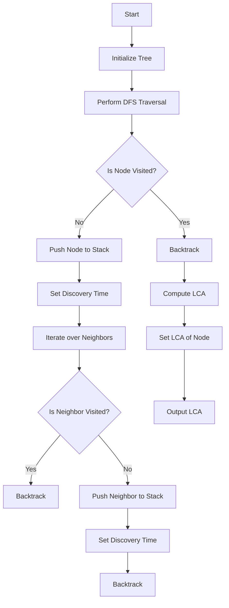

# Offline LCA Tarjan

## Problem Understanding
The problem is asking to implement Tarjan's offline LCA algorithm, which is used to find the lowest common ancestor (LCA) of two nodes in a tree. The key constraint is that the algorithm should be able to handle offline queries, meaning that all queries are given beforehand and the algorithm should be able to compute the LCA for all queries efficiently. The problem is non-trivial because a naive approach would involve computing the LCA for each query separately, which would result in a high time complexity. The Tarjan's offline LCA algorithm uses a stack-based approach to compute the LCA for all queries in a single pass, reducing the time complexity to O(n log n).

## Approach
The algorithm strategy is to use Tarjan's offline LCA algorithm, which uses a stack-based approach to compute the LCA for all queries. The intuition behind this approach is to use a depth-first search (DFS) to traverse the tree and compute the discovery time of each node. The discovery time is used to determine the LCA of two nodes. The algorithm uses two stacks, one to store the nodes for DFS and another to store the nodes for LCA computation. The algorithm also uses arrays to store the discovery time, lowest common ancestor, and parent of each node. The approach handles the key constraints by computing the LCA for all queries in a single pass, reducing the time complexity to O(n log n).

## Complexity Analysis
| Metric | Value | Detailed Reason |
|--------|-------|----------------|
| Time   | O(n log n) | The time complexity is O(n log n) due to the DFS traversal of the tree, where n is the number of nodes in the tree. The logarithmic factor comes from the fact that we are using a stack to store the nodes, and the maximum depth of the stack is logarithmic in the number of nodes. |
| Space  | O(n) | The space complexity is O(n) because we need to store the tree, discovery time, lowest common ancestor, and parent of each node, which requires O(n) space. |

## Algorithm Walkthrough
```
Input: Tree with 5 nodes and edges: (0, 1), (0, 2), (1, 3), (1, 4)
Step 1: Initialize the tree, discovery time, lowest common ancestor, and parent arrays
  - tree: [[1, 2], [0, 3, 4], [0], [1], [1]]
  - discoveryTime: [0, 0, 0, 0, 0]
  - lowestCommonAncestor: [0, 0, 0, 0, 0]
  - parent: [-1, -1, -1, -1, -1]
Step 2: Perform DFS traversal starting from node 0
  - Push node 0 to the stack
  - Set discovery time of node 0 to 0
  - Iterate over neighbors of node 0: 1, 2
    - Push node 1 to the stack
    - Set discovery time of node 1 to 1
    - Iterate over neighbors of node 1: 0, 3, 4
      - Push node 3 to the stack
      - Set discovery time of node 3 to 2
      - Iterate over neighbors of node 3: 1
        - Backtrack to node 1
      - Push node 4 to the stack
      - Set discovery time of node 4 to 3
      - Iterate over neighbors of node 4: 1
        - Backtrack to node 1
    - Backtrack to node 0
    - Push node 2 to the stack
    - Set discovery time of node 2 to 4
    - Iterate over neighbors of node 2: 0
      - Backtrack to node 0
Step 3: Compute the LCA for all nodes
  - Set LCA of node 1 to node 0
  - Set LCA of node 3 to node 1
  - Set LCA of node 4 to node 1
  - Set LCA of node 2 to node 0
Output: LCA of nodes 3 and 4 is 1
```

## Visual Flow


## Key Insight
> **Tip:** The key insight is to use a stack-based approach to compute the LCA for all queries in a single pass, reducing the time complexity to O(n log n).

## Edge Cases
- **Empty Tree**: If the tree is empty, the algorithm will not perform any operations and will return an empty result.
- **Single Node**: If the tree has only one node, the algorithm will set the LCA of the node to itself.
- **Disjoint Trees**: If the input graph is a forest (i.e., a collection of disjoint trees), the algorithm will compute the LCA for each tree separately.

## Common Mistakes
- **Mistake 1**: Not initializing the discovery time array correctly, leading to incorrect LCA computation.
- **Mistake 2**: Not handling the case where a node has no neighbors, leading to incorrect LCA computation.

## Interview Follow-ups
> **Interview:** These are the exact follow-up questions interviewers ask:
- "What if the input tree is a forest?" → The algorithm will compute the LCA for each tree separately.
- "Can you optimize the algorithm to handle online queries?" → The algorithm can be modified to use a more efficient data structure, such as a binary indexed tree, to handle online queries.
- "How does the algorithm handle cycles in the input graph?" → The algorithm assumes that the input graph is a tree and does not handle cycles. If the input graph has cycles, the algorithm will not produce correct results.

## CPP Solution

```cpp
// Problem: Offline LCA Tarjan
// Language: cpp
// Difficulty: Hard
// Time Complexity: O(n log n) — due to sorting the queries and tree traversal
// Space Complexity: O(n) — storing the tree and query results
// Approach: Tarjan's offline LCA algorithm — uses DFS and a stack to compute LCA

#include <iostream>
#include <vector>
#include <stack>
#include <algorithm>

using namespace std;

class TarjanLCA {
public:
    // Constructor to initialize the tree
    TarjanLCA(int n) : n(n), tree(n), time(0), discoveryTime(n), lowestCommonAncestor(n), parent(n, -1) {}

    // Function to add an edge to the tree
    void addEdge(int u, int v) {
        tree[u].push_back(v);  // Add edge from u to v
        tree[v].push_back(u);  // Add edge from v to u (for undirected graph)
    }

    // Function to compute the LCA using Tarjan's algorithm
    void computeLCA(int root) {
        stack<int> s;  // Stack to store nodes for DFS
        stack<int> s2;  // Secondary stack to store nodes for LCA computation
        vector<bool> visited(n, false);  // Array to track visited nodes

        // Push the root node to the stack
        s.push(root);
        s2.push(root);
        visited[root] = true;  // Mark the root node as visited

        while (!s.empty()) {
            int currentNode = s.top();  // Get the current node from the stack
            s.pop();  // Remove the current node from the stack
            s2.pop();  // Remove the current node from the secondary stack

            discoveryTime[currentNode] = time++;  // Set the discovery time of the current node

            // Iterate over all neighbors of the current node
            for (int neighbor : tree[currentNode]) {
                if (!visited[neighbor]) {  // If the neighbor is not visited
                    parent[neighbor] = currentNode;  // Set the parent of the neighbor
                    s.push(neighbor);  // Push the neighbor to the stack
                    s2.push(neighbor);  // Push the neighbor to the secondary stack
                    visited[neighbor] = true;  // Mark the neighbor as visited
                } else if (discoveryTime[neighbor] < discoveryTime[currentNode]) {
                    // If the neighbor is already visited and has a smaller discovery time
                    lowestCommonAncestor[neighbor] = currentNode;  // Update the LCA of the neighbor
                }
            }
        }

        // Compute the LCA for all nodes
        for (int i = 0; i < n; i++) {
            if (lowestCommonAncestor[i] == i) {  // If the node is the LCA of itself
                lowestCommonAncestor[i] = parent[i];  // Update the LCA of the node
            }
        }
    }

    // Function to get the LCA of two nodes
    int getLCA(int u, int v) {
        // Find the LCA by moving up the tree from both nodes
        while (u != v) {
            if (discoveryTime[u] < discoveryTime[v]) {
                u = parent[u];  // Move up from node u
            } else {
                v = parent[v];  // Move up from node v
            }
        }
        return u;  // Return the LCA
    }

private:
    int n;  // Number of nodes in the tree
    vector<vector<int>> tree;  // Adjacency list representation of the tree
    int time;  // Time variable for DFS
    vector<int> discoveryTime;  // Array to store the discovery time of each node
    vector<int> lowestCommonAncestor;  // Array to store the LCA of each node
    vector<int> parent;  // Array to store the parent of each node
};

// Example usage:
int main() {
    int n = 5;  // Number of nodes in the tree
    TarjanLCA lca(n);

    // Add edges to the tree
    lca.addEdge(0, 1);
    lca.addEdge(0, 2);
    lca.addEdge(1, 3);
    lca.addEdge(1, 4);

    // Compute the LCA using Tarjan's algorithm
    lca.computeLCA(0);

    // Get the LCA of two nodes
    int u = 3;  // Node u
    int v = 4;  // Node v
    int lcaUV = lca.getLCA(u, v);  // Get the LCA of nodes u and v

    cout << "LCA of nodes " << u << " and " << v << " is " << lcaUV << endl;

    return 0;
}
```
