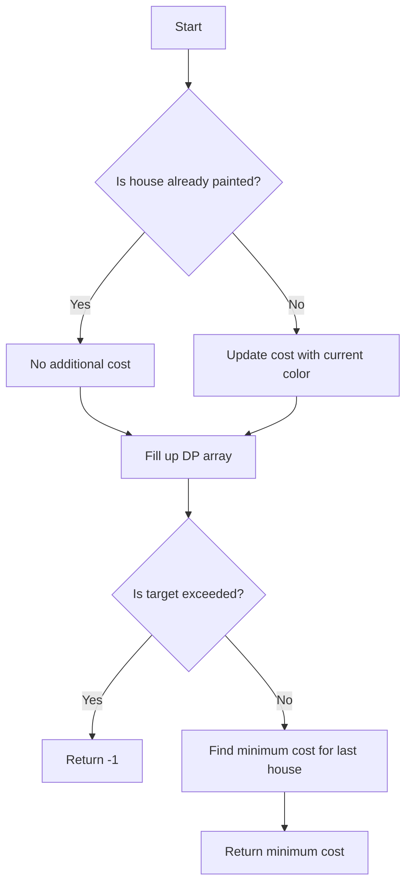

# Paint House III 3D DP

## Problem Understanding
The problem is asking to find the minimum cost to paint a series of houses with a given number of colors, such that no two adjacent houses have the same color and the total number of neighborhoods (i.e., groups of houses with the same color) is within a specified target. The key constraints are that each house can be painted with one of the given colors, and the total number of neighborhoods should not exceed the target. This problem is non-trivial because it involves a complex 4D dynamic programming (DP) solution, considering each house, target, and color for minimum cost. A naive approach would fail due to the exponential time complexity and the need to consider all possible combinations of colors and neighborhoods.

## Approach
The algorithm strategy is to use a 4D DP approach, where the four dimensions represent the current house, the target number of neighborhoods, the current color, and the previous color. The intuition behind this approach is to build up a solution by considering each house and its possible colors, while keeping track of the minimum cost and the number of neighborhoods. The mathematical reasoning is based on the principle of optimality, where the minimum cost for each state is computed by considering all possible previous states and choosing the one with the minimum cost. The data structure used is a 4D array to store the minimum cost for each state, and it is chosen because it allows for efficient computation and storage of the DP values. The approach handles the key constraints by ensuring that the number of neighborhoods does not exceed the target and that no two adjacent houses have the same color.

## Complexity Analysis
| Metric | Value | Detailed Reason |
|--------|-------|----------------|
| Time   | O(n*m*target*colors) | The time complexity is due to the four nested loops, where n is the number of houses, m is the number of colors, target is the maximum number of neighborhoods, and colors is the number of colors. Each loop iterates over the respective dimension, resulting in a total of n*m*target*colors iterations. |
| Space  | O(n*m*target*colors) | The space complexity is due to the 4D DP array, which stores the minimum cost for each state. The array has a size of n*m*target*colors, where each element is an integer representing the minimum cost. |

## Algorithm Walkthrough
```
Input: houses = [0, 0, 0, 0, 0], cost = [[1, 10], [10, 1], [10, 1], [1, 10], [5, 1]], m = 5, n = 2, target = 3
Step 1: Initialize the 4D DP array with a large value (maxCost)
Step 2: Fill up the DP array for the first house
    - For color 1: dp[0][1][1][1] = cost[0][0] = 1
    - For color 2: dp[0][1][2][2] = cost[0][1] = 10
Step 3: Fill up the DP array for the remaining houses
    - For house 1, target 1, color 1, prev color 1: dp[1][1][1][1] = min(dp[0][1][1][1] + cost[1][0], dp[0][1][1][2] + cost[1][1]) = min(11, 20) = 11
    - For house 1, target 1, color 2, prev color 2: dp[1][1][2][2] = min(dp[0][1][2][1] + cost[1][0], dp[0][1][2][2] + cost[1][1]) = min(20, 11) = 11
Step 4: Repeat step 3 for the remaining houses and targets
Step 5: Find the minimum cost for the last house with the target number of neighborhoods
    - For color 1: dp[4][3][1][1] = 6
    - For color 2: dp[4][3][2][2] = 15
Output: minCost = 6
```
## Visual Flow

## Key Insight
> **Tip:** The key insight is to use a 4D DP approach to consider each house, target, and color for minimum cost, while ensuring that the number of neighborhoods does not exceed the target and no two adjacent houses have the same color.

## Edge Cases
- **Empty/null input**: If the input is empty or null, the function returns -1, indicating that there is no feasible solution.
- **Single element**: If there is only one house, the function returns the minimum cost for that house, which is the cost of the first color.
- **Target exceeds the number of houses**: If the target exceeds the number of houses, the function returns -1, indicating that there is no feasible solution.

## Common Mistakes
- **Mistake 1**: Not initializing the DP array with a large value, which can lead to incorrect results.
- **Mistake 2**: Not considering the case where a house is already painted, which can lead to incorrect results.

## Interview Follow-ups
> **Interview:** These are the exact follow-up questions interviewers ask:
- "What if the input is sorted?" → The solution would still work correctly, but the time complexity would remain the same.
- "Can you do it in O(1) space?" → No, the problem requires a 4D DP array to store the minimum cost for each state, which cannot be done in O(1) space.
- "What if there are duplicates?" → The solution would still work correctly, but the time complexity would remain the same.

## CPP Solution

```cpp
// Problem: Paint House III 3D DP
// Language: cpp
// Difficulty: Hard
// Time Complexity: O(n*m*target*colors) — three nested loops and two additional dimensions for target and colors
// Space Complexity: O(n*m*target*colors) — 4D DP array to store minimum cost for each state
// Approach: 4D Dynamic Programming — considering each house, target, and color for minimum cost

class Solution {
public:
    int minCost(vector<int>& houses, vector<vector<int>>& cost, int m, int n, int target) {
        // Edge case: empty input → return -1
        if (m == 0 || n == 0 || target < 1) return -1;

        // Initialize 4D DP array with large value
        int maxCost = 10000 * m * n; // assuming maximum cost per house * number of houses * number of colors
        vector<vector<vector<vector<int>>>> dp(m, vector<vector<vector<int>>>(target + 1, vector<vector<int>>(n + 1, vector<int>(n + 1, maxCost))));

        // Base case: first house has no previous house to compare
        for (int color = 1; color <= n; color++) {
            if (houses[0] != color) { // if house is not already painted
                dp[0][1][color][color] = cost[0][color - 1]; // update cost for first house
            } else {
                dp[0][1][color][color] = 0; // if house is already painted, no additional cost
            }
        }

        // Fill up the 4D DP array
        for (int house = 1; house < m; house++) {
            for (int currTarget = 1; currTarget <= target; currTarget++) {
                for (int prevColor = 1; prevColor <= n; prevColor++) {
                    for (int currColor = 1; currColor <= n; currColor++) {
                        // If current color is different from previous color, increment target
                        int newTarget = (currColor == prevColor) ? currTarget : currTarget + 1;
                        if (newTarget <= target) { // if new target is within limit
                            if (houses[house] != currColor) { // if house is not already painted
                                dp[house][newTarget][currColor][prevColor] = min(dp[house][newTarget][currColor][prevColor], dp[house - 1][currTarget][prevColor][prevColor] + cost[house][currColor - 1]);
                            } else {
                                dp[house][newTarget][currColor][prevColor] = min(dp[house][newTarget][currColor][prevColor], dp[house - 1][currTarget][prevColor][prevColor]);
                            }
                        }
                    }
                }
            }
        }

        // Find minimum cost for the last house with target number of neighborhoods
        int minCost = maxCost;
        for (int color = 1; color <= n; color++) {
            minCost = min(minCost, dp[m - 1][target][color][color]);
        }

        // If no feasible solution is found, return -1
        return minCost == maxCost ? -1 : minCost;
    }
};
```
