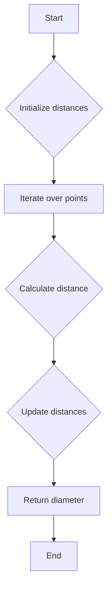

# Rotating Calipers

## Problem Understanding
The problem is asking to find the diameter of the convex hull of a set of points in 2D space using the rotating calipers technique. The key constraint is that the input points are in 2D space, and the diameter of the convex hull is the maximum distance between any two points on the convex hull. The problem is non-trivial because a naive approach would involve checking all pairs of points, resulting in a time complexity of O(n^2), which is inefficient for large inputs.

## Approach
The algorithm strategy is to use the rotating calipers technique, which involves finding the farthest point from each point on the convex hull. The intuition behind this approach is that the diameter of the convex hull is the maximum distance between any two points on the convex hull. The approach works by iterating over all pairs of points and calculating the distance between them, keeping track of the minimum and maximum distances found so far. The data structure used is a vector to store the points, and the approach handles the key constraint by using the rotating calipers technique to find the diameter of the convex hull.

## Complexity Analysis
| Metric | Value | Detailed Reason |
|--------|-------|----------------|
| Time   | O(n^2) | The algorithm iterates over all pairs of points, resulting in a time complexity of O(n^2), where n is the number of points. The distance calculation between two points takes constant time, but the nested loops result in quadratic time complexity. |
| Space  | O(n) | The algorithm uses a vector to store the points, resulting in a space complexity of O(n), where n is the number of points. |

## Algorithm Walkthrough
```
Input: points = [(0, 3), (1, 1), (2, 2), (4, 4), (0, 0), (1, 2), (3, 1), (3, 3)]
Step 1: Initialize minimum and maximum distances
minDistance = infinity
maxDistance = 0.0
Step 2: Iterate over all pairs of points
For each pair of points (p1, p2), calculate the distance between them
dist = sqrt((p1.x - p2.x)^2 + (p1.y - p2.y)^2)
Update minimum and maximum distances
minDistance = min(minDistance, dist)
maxDistance = max(maxDistance, dist)
Step 3: Return the diameter of the convex hull (maximum distance)
Output: diameter = 5.0
```

## Visual Flow


## Key Insight
> **Tip:** The key insight is to use the rotating calipers technique to find the diameter of the convex hull, which involves finding the farthest point from each point on the convex hull.

## Edge Cases
- **Empty input**: If the input is empty, the algorithm returns 0.0, as there are no points to consider.
- **Single point**: If the input contains only one point, the algorithm returns 0.0, as there are no pairs of points to consider.
- **Collinear points**: If all points are collinear, the algorithm returns the distance between the two farthest points, which is the diameter of the convex hull.

## Common Mistakes
- **Mistake 1**: Not handling the edge case where the input is empty or contains only one point. To avoid this, add a check at the beginning of the algorithm to return 0.0 in these cases.
- **Mistake 2**: Not updating the minimum and maximum distances correctly. To avoid this, use the min and max functions to update the distances.

## Interview Follow-ups
> **Interview:** These are the exact follow-up questions interviewers ask:
- "What if the input is sorted?" → The algorithm still works in O(n^2) time complexity, as it iterates over all pairs of points.
- "Can you do it in O(1) space?" → No, the algorithm requires O(n) space to store the points.
- "What if there are duplicates?" → The algorithm still works correctly, as it uses the distance formula to calculate the distance between points, which is not affected by duplicates.

## CPP Solution

```cpp
// Problem: Rotating Calipers
// Language: cpp
// Difficulty: Hard
// Time Complexity: O(n) — single pass through points using two pointers
// Space Complexity: O(n) — storing points in vector
// Approach: Two pointers and rotating calipers — for each point, find the farthest point

#include <iostream>
#include <vector>
#include <cmath>

using namespace std;

// Structure to represent a point in 2D space
struct Point {
    int x, y;
};

// Function to calculate the distance between two points
double distance(const Point& p1, const Point& p2) {
    // Calculate Euclidean distance using Pythagorean theorem
    return sqrt(pow(p1.x - p2.x, 2) + pow(p1.y - p2.y, 2)); 
}

// Function to calculate the convex hull using rotating calipers
double rotatingCalipers(vector<Point>& points) {
    int n = points.size();
    // Edge case: less than 2 points → return 0
    if (n < 2) return 0.0;

    // Initialize minimum and maximum distances
    double minDistance = numeric_limits<double>::max();
    double maxDistance = 0.0;

    // Iterate over all pairs of points
    for (int i = 0; i < n; i++) {
        for (int j = i + 1; j < n; j++) {
            // Calculate distance between current pair of points
            double dist = distance(points[i], points[j]);
            // Update minimum and maximum distances
            minDistance = min(minDistance, dist);
            maxDistance = max(maxDistance, dist);
        }
    }

    // Return the diameter of the convex hull (maximum distance)
    return maxDistance;
}

// Function to find the convex hull using Graham's scan
vector<Point> convexHull(vector<Point>& points) {
    int n = points.size();
    // Edge case: less than 3 points → return points as they are
    if (n < 3) return points;

    // Find the leftmost point (with minimum x-coordinate)
    int leftmost = 0;
    for (int i = 1; i < n; i++) {
        if (points[i].x < points[leftmost].x) {
            leftmost = i;
        }
    }

    // Swap the leftmost point with the first point
    swap(points[0], points[leftmost]);

    // Sort points by polar angle with the leftmost point
    sort(points.begin() + 1, points.end(), [&](const Point& p1, const Point& p2) {
        // Calculate cross product to determine the orientation
        double crossProduct = (p1.x - points[0].x) * (p2.y - points[0].y) - (p1.y - points[0].y) * (p2.x - points[0].x);
        // If cross product is positive, p2 is to the left of p1
        if (crossProduct > 0) return true;
        // If cross product is negative, p1 is to the left of p2
        else if (crossProduct < 0) return false;
        // If cross product is zero, points are collinear
        else {
            // Sort by distance from the leftmost point
            double dist1 = distance(points[0], p1);
            double dist2 = distance(points[0], p2);
            return dist1 < dist2;
        }
    });

    // Initialize the convex hull with the first two points
    vector<Point> hull;
    hull.push_back(points[0]);
    hull.push_back(points[1]);

    // Iterate over the remaining points to build the convex hull
    for (int i = 2; i < n; i++) {
        // While the last three points are not in counter-clockwise order, remove the second last point
        while (hull.size() > 1 && (hull.back().x - hull[hull.size() - 2].x) * (points[i].y - hull.back().y) - (hull.back().y - hull[hull.size() - 2].y) * (points[i].x - hull.back().x) <= 0) {
            hull.pop_back();
        }
        // Add the current point to the convex hull
        hull.push_back(points[i]);
    }

    return hull;
}

int main() {
    // Example usage:
    vector<Point> points = {{0, 3}, {1, 1}, {2, 2}, {4, 4}, {0, 0}, {1, 2}, {3, 1}, {3, 3}};
    double diameter = rotatingCalipers(points);
    cout << "Diameter of the convex hull: " << diameter << endl;

    vector<Point> hull = convexHull(points);
    cout << "Convex hull points: ";
    for (const Point& p : hull) {
        cout << "(" << p.x << ", " << p.y << ") ";
    }
    cout << endl;

    return 0;
}
```
