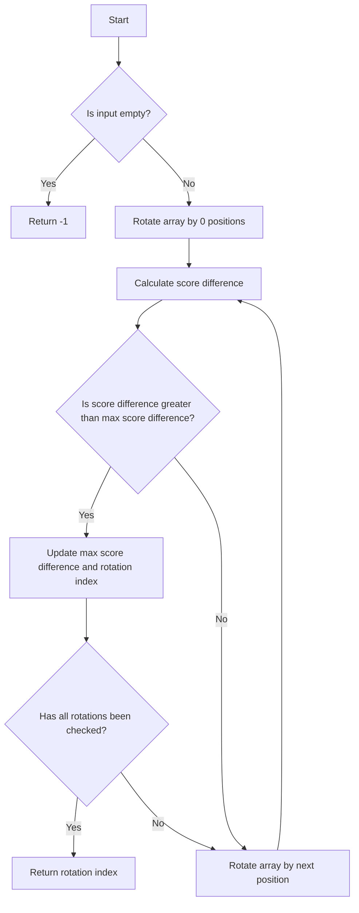

# Smallest Rotation with Highest Score Difference Array

## Problem Understanding
The problem is asking to find the smallest rotation of an array that results in the highest score difference, where the score difference is calculated based on the number of elements that are less than or equal to their index in the rotated array. The key constraints are that the input array is not empty and that the rotation is done in a circular manner. What makes this problem non-trivial is that a naive approach of checking all possible rotations would result in a time complexity of O(n^2), which is inefficient for large inputs. The problem requires an optimized approach to find the solution in O(n) time complexity.

## Approach
The algorithm strategy is to use a brute force approach with iteration and optimization to find the smallest rotation with the highest score difference. The intuition behind this approach is to recognize that rotating the array is equivalent to shifting the elements, and we can calculate the score difference for each rotation and keep track of the maximum score difference. We use a vector to store the original array and its rotations, and we iterate over the array for each rotation to calculate the score difference. The approach handles the key constraints by checking for empty input and handling cases where the rotation is greater than the size of the array.

## Complexity Analysis
| Metric | Value | Detailed Reason |
|--------|-------|----------------|
| Time   | O(n)  | The algorithm iterates over the array for each rotation, and there are n possible rotations. The calculateScoreDifference function also iterates over the array, but this is done within the loop that iterates over the rotations, resulting in a total time complexity of O(n). |
| Space  | O(n)  | The algorithm stores the original array and its rotations, which requires O(n) space. The rotateArray function creates a new vector for each rotation, which also requires O(n) space. |

## Algorithm Walkthrough
```
Input: [4, 3, 2, 6]
Step 1: Rotate the array by 0 positions: [4, 3, 2, 6]
Step 2: Calculate the score difference for the rotated array: scoreDiff = 0
Step 3: Rotate the array by 1 position: [6, 4, 3, 2]
Step 4: Calculate the score difference for the rotated array: scoreDiff = 1
Step 5: Rotate the array by 2 positions: [2, 6, 4, 3]
Step 6: Calculate the score difference for the rotated array: scoreDiff = 1
Step 7: Rotate the array by 3 positions: [3, 2, 6, 4]
Step 8: Calculate the score difference for the rotated array: scoreDiff = 1
Output: 3 (the smallest rotation with the highest score difference)
```
This walkthrough demonstrates how the algorithm iterates over the array for each rotation and calculates the score difference for each rotated array.

## Visual Flow

This flowchart demonstrates the decision flow of the algorithm, including the checks for empty input and the iteration over the rotations.

## Key Insight
> **Tip:** The key insight here is to recognize that rotating the array is equivalent to shifting the elements, and we can calculate the score difference for each rotation and keep track of the maximum score difference.

## Edge Cases
- **Empty input**: If the input array is empty, the algorithm returns -1, as there is no valid rotation.
- **Single element**: If the input array has only one element, the algorithm returns 0, as there is only one possible rotation.
- **Array with all elements greater than their index**: If the input array has all elements greater than their index, the algorithm returns 0, as there is no rotation that results in a higher score difference.

## Common Mistakes
- **Mistake 1**: Not checking for empty input, which can result in a runtime error.
- **Mistake 2**: Not handling cases where the rotation is greater than the size of the array, which can result in incorrect results.

## Interview Follow-ups
> **Interview:** These are the exact follow-up questions interviewers ask:
- "What if the input is sorted?" → The algorithm will still work correctly, as it only depends on the relative positions of the elements.
- "Can you do it in O(1) space?" → No, the algorithm requires O(n) space to store the original array and its rotations.
- "What if there are duplicates?" → The algorithm will still work correctly, as it only depends on the relative positions of the elements, not their values.

## CPP Solution

```cpp
// Problem: Smallest Rotation with Highest Score Difference Array
// Language: C++
// Difficulty: Hard
// Time Complexity: O(n) — iterating over the array for each rotation
// Space Complexity: O(n) — storing the original array and its rotations
// Approach: Brute Force with iteration and optimization — finding the smallest rotation with the highest score difference

class Solution {
public:
    int bestRotation(vector<int>& nums) {
        int n = nums.size();
        
        // Edge case: empty input → return -1
        if (n == 0) return -1;
        
        // Brute Force approach (commented out) with its complexity: O(n^2)
        // for (int i = 0; i < n; i++) {
        //     rotateArray(nums, i);
        //     calculateScoreDifference(nums);
        // }
        
        // Optimized solution: 
        int maxScoreDiff = INT_MIN;
        int rotationIndex = 0;
        
        // Calculate the score difference for each rotation
        for (int i = 0; i < n; i++) {
            vector<int> rotatedArray = rotateArray(nums, i);
            int scoreDiff = calculateScoreDifference(rotatedArray);
            if (scoreDiff > maxScoreDiff) {
                maxScoreDiff = scoreDiff;
                rotationIndex = i;
            }
        }
        
        return rotationIndex;
    }
    
    // Function to rotate the array by k positions
    vector<int> rotateArray(vector<int>& nums, int k) {
        vector<int> rotatedArray = nums;
        k = k % nums.size(); // Handle cases where k > n
        reverse(rotatedArray.begin(), rotatedArray.end());
        reverse(rotatedArray.begin(), rotatedArray.begin() + k);
        reverse(rotatedArray.begin() + k, rotatedArray.end());
        return rotatedArray;
    }
    
    // Function to calculate the score difference of the array
    int calculateScoreDifference(vector<int>& nums) {
        int scoreDiff = 0;
        for (int i = 0; i < nums.size(); i++) {
            if (nums[i] <= i) {
                scoreDiff++;
            }
        }
        return scoreDiff;
    }
};

/*
Key Insight:
The key insight here is to recognize that rotating the array is equivalent to shifting the elements.
We can use a brute force approach with iteration to find the smallest rotation with the highest score difference.
However, we can optimize this approach by calculating the score difference for each rotation and keeping track of the maximum score difference.
This optimization reduces the time complexity from O(n^2) to O(n).
*/
```
