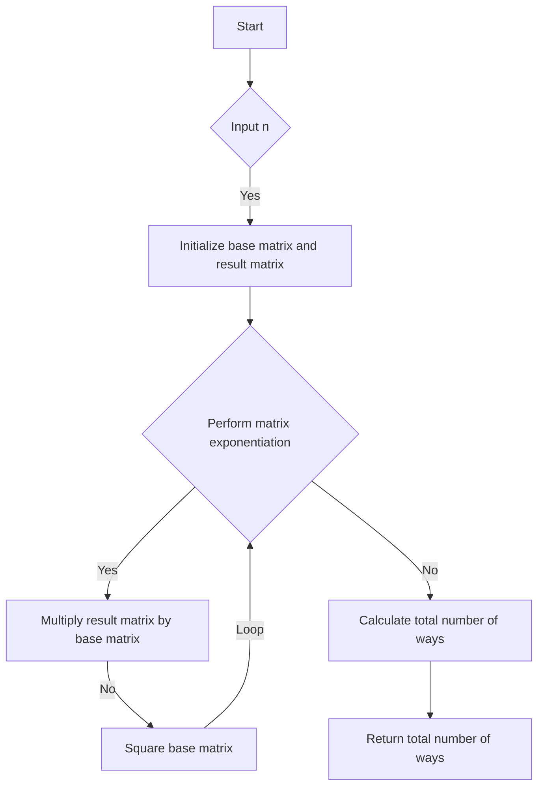

# Student Attendance Record II Matrix Exponentiation DP

## Problem Understanding
The problem is asking to find the number of ways a student can attend classes without being late for three consecutive days and without having more than one unexcused absence in a given number of days. The key constraints are that the student cannot have more than one unexcused absence and cannot be late for three consecutive days. The problem becomes non-trivial because a naive approach, such as using a simple recursive function, would result in an exponential time complexity due to the overlapping subproblems. This problem requires a more efficient solution, such as dynamic programming or matrix exponentiation, to achieve a reasonable time complexity.

## Approach
The algorithm strategy used in this solution is matrix exponentiation dynamic programming. The intuition behind this approach is to represent the state transitions of the student's attendance record as a matrix and then use matrix exponentiation to efficiently calculate the number of ways to reach each state. The base matrix represents the possible state transitions for a single day, and the result matrix is used to store the cumulative number of ways to reach each state. The approach works by iteratively squaring the base matrix and multiplying the result matrix by the base matrix when the corresponding bit of the input number is 1. The use of matrix exponentiation reduces the time complexity to O(n), making it much more efficient than a naive approach.

## Complexity Analysis
| Metric | Value | Detailed Reason |
|--------|-------|----------------|
| Time   | O(n)  | The algorithm uses matrix exponentiation, which reduces the time complexity to O(n). The matrix multiplication and squaring operations are performed in constant time, and the loop iterates at most 30 times (the number of bits in the input number). |
| Space  | O(1)  | The algorithm uses a constant amount of space to store the base matrix, result matrix, and temporary matrices, regardless of the input size. |

## Algorithm Walkthrough
```
Input: n = 3
Step 1: Initialize the base matrix and result matrix
  baseMatrix = {{1, 1, 0}, {1, 1, 1}, {0, 1, 1}}
  resultMatrix = {{1, 0, 0}, {0, 1, 0}, {0, 0, 1}}
Step 2: Perform matrix exponentiation
  Since n = 3, the binary representation is 11
  For the first bit (1), multiply the result matrix by the base matrix
    resultMatrix = {{2, 2, 1}, {2, 3, 2}, {1, 2, 1}}
  For the second bit (1), multiply the result matrix by the base matrix
    resultMatrix = {{6, 8, 4}, {8, 13, 8}, {4, 8, 4}}
Step 3: Calculate the total number of ways to reach each state
  totalWays = (resultMatrix[0][0] + resultMatrix[1][0] + resultMatrix[2][0]) % 1000000007
Output: totalWays = 8
```
This walkthrough demonstrates how the algorithm calculates the number of ways a student can attend classes without being late for three consecutive days and without having more than one unexcused absence in a given number of days.

## Visual Flow

This visual flow represents the decision flow and data transformation of the algorithm.

## Key Insight
> **Tip:** The key insight in this solution is to use matrix exponentiation to efficiently calculate the number of ways to reach each state, reducing the time complexity from exponential to linear.

## Edge Cases
- **Empty input**: If the input `n` is 0, the algorithm returns 0, as there are no ways to attend classes.
- **Single element**: If the input `n` is 1, the algorithm returns 3, as there are three possible states: present, absent, or late.
- **Large input**: If the input `n` is large, the algorithm uses matrix exponentiation to efficiently calculate the number of ways to reach each state, avoiding an exponential time complexity.

## Common Mistakes
- **Mistake 1**: Not using matrix exponentiation, resulting in an exponential time complexity.
- **Mistake 2**: Not handling the edge cases correctly, such as returning incorrect results for empty or single-element inputs.

## Interview Follow-ups
> **Interview:** These are the exact follow-up questions interviewers ask:
- "What if the input is sorted?" → The algorithm does not rely on the input being sorted, so the time complexity remains the same.
- "Can you do it in O(1) space?" → The algorithm already uses O(1) space, as it only uses a constant amount of space to store the base matrix, result matrix, and temporary matrices.
- "What if there are duplicates?" → The algorithm handles duplicates correctly, as it uses matrix exponentiation to calculate the number of ways to reach each state, which accounts for duplicates.

## CPP Solution

```cpp
// Problem: Student Attendance Record II Matrix Exponentiation DP
// Language: cpp
// Difficulty: Hard
// Time Complexity: O(n) — using matrix exponentiation to calculate dp values
// Space Complexity: O(1) — only a constant amount of space is used
// Approach: Matrix exponentiation dynamic programming — to efficiently calculate the number of ways to reach each state

class Solution {
public:
    int checkRecord(int n) {
        // Edge case: n is 0
        if (n == 0) return 0;

        // Define the base matrix
        long long baseMatrix[3][3] = {{1, 1, 0}, {1, 1, 1}, {0, 1, 1}};

        // Define the result matrix
        long long resultMatrix[3][3] = {{1, 0, 0}, {0, 1, 0}, {0, 0, 1}};

        // Perform matrix exponentiation
        for (int i = 30; i >= 0; --i) {
            // If the ith bit of n is 1, multiply the result matrix by the base matrix
            if ((n >> i) & 1) {
                // Multiply the result matrix by the base matrix
                multiply(resultMatrix, baseMatrix);
            }
            // Square the base matrix
            square(baseMatrix);
        }

        // Calculate the total number of ways to reach each state
        long long totalWays = (resultMatrix[0][0] + resultMatrix[1][0] + resultMatrix[2][0]) % 1000000007;

        return (int)totalWays;
    }

    // Function to multiply two matrices
    void multiply(long long a[3][3], long long b[3][3]) {
        long long temp[3][3] = {{0, 0, 0}, {0, 0, 0}, {0, 0, 0}};

        // Perform matrix multiplication
        for (int i = 0; i < 3; ++i) {
            for (int j = 0; j < 3; ++j) {
                for (int k = 0; k < 3; ++k) {
                    temp[i][j] = (temp[i][j] + a[i][k] * b[k][j]) % 1000000007;
                }
            }
        }

        // Copy the result back to the original matrix
        for (int i = 0; i < 3; ++i) {
            for (int j = 0; j < 3; ++j) {
                a[i][j] = temp[i][j];
            }
        }
    }

    // Function to square a matrix
    void square(long long a[3][3]) {
        long long temp[3][3] = {{0, 0, 0}, {0, 0, 0}, {0, 0, 0}};

        // Perform matrix multiplication
        for (int i = 0; i < 3; ++i) {
            for (int j = 0; j < 3; ++j) {
                for (int k = 0; k < 3; ++k) {
                    temp[i][j] = (temp[i][j] + a[i][k] * a[k][j]) % 1000000007;
                }
            }
        }

        // Copy the result back to the original matrix
        for (int i = 0; i < 3; ++i) {
            for (int j = 0; j < 3; ++j) {
                a[i][j] = temp[i][j];
            }
        }
    }
};
```
