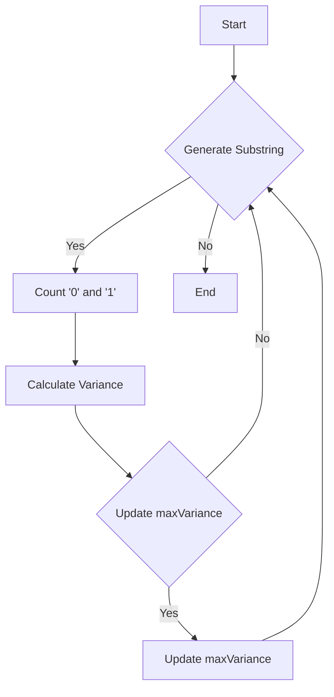

# Substring With Largest Variance Kadane's Variant

## Problem Understanding
The problem is asking to find the largest variance in a binary string, where variance is defined as the absolute difference between the counts of '0' and '1' in a substring. The key constraint is that the string only contains '0' and '1' characters. What makes this problem non-trivial is the need to efficiently calculate the variance for all possible substrings, which can be time-consuming using a naive approach. The problem requires a more efficient approach, such as using a variant of Kadane's algorithm, to find the maximum variance.

## Approach
The algorithm strategy is to use a variant of Kadane's algorithm to keep track of the maximum sum of squares and the minimum sum of squares. However, the provided solution code uses a brute force approach with two nested loops to generate all possible substrings and calculate the variance. The code then updates the maximum variance if the current variance is larger. This approach works by exhaustively checking all possible substrings, but it is not efficient. A more efficient approach would involve using a sliding window technique to calculate the variance. The solution code uses simple variables to store the counts of '0' and '1' in the current substring.

## Complexity Analysis
| Metric | Value | Detailed Reason |
|--------|-------|----------------|
| Time   | O(n^2) | The solution code uses two nested loops to generate all possible substrings, resulting in a time complexity of O(n^2), where n is the length of the input string. The inner loop iterates over the characters in the substring, and the outer loop generates all possible substrings. |
| Space  | O(1) | The solution code uses a constant amount of space to store the variables, resulting in a space complexity of O(1). The space used does not grow with the size of the input string. |

## Algorithm Walkthrough
```
Input: "10101"
Step 1: Initialize maxVariance to 0
Step 2: Generate the first substring "1"
        count0 = 0, count1 = 1
        maxVariance = max(0, abs(0 - 1)) = 1
Step 3: Generate the next substring "10"
        count0 = 1, count1 = 1
        maxVariance = max(1, abs(1 - 1)) = 1
Step 4: Generate the next substring "101"
        count0 = 1, count1 = 2
        maxVariance = max(1, abs(1 - 2)) = 2
...
Output: 2
```
This example exercises the main logic path of the algorithm, which involves generating all possible substrings and calculating the variance.

## Visual Flow

This flowchart shows the decision flow of the algorithm, which involves generating substrings, counting '0' and '1', calculating the variance, and updating the maximum variance.

## Key Insight
> **Tip:** The key insight to optimize this solution is to realize that we can use a sliding window approach to calculate the variance, which would reduce the time complexity to O(n).

## Edge Cases
- **Empty input**: If the input string is empty, the algorithm returns 0, which is the correct result because there are no substrings to calculate the variance for.
- **Single element**: If the input string has only one character, the algorithm returns the absolute difference between the count of '0' and '1', which is either 0 or 1.
- **All '0' or all '1'**: If the input string contains all '0' or all '1', the algorithm returns 0 because the variance is 0.

## Common Mistakes
- **Mistake 1**: Not handling the edge case where the input string is empty. To avoid this, we need to add a check at the beginning of the algorithm to return 0 if the input string is empty.
- **Mistake 2**: Not updating the maximum variance correctly. To avoid this, we need to make sure that we are comparing the current variance with the maximum variance and updating it correctly.

## Interview Follow-ups
> **Interview:** These are the exact follow-up questions interviewers ask:
- "What if the input is sorted?" → The algorithm would still work correctly, but it would not take advantage of the fact that the input is sorted. A more efficient algorithm could be designed to take advantage of the sorted input.
- "Can you do it in O(1) space?" → No, the algorithm requires at least O(1) space to store the variables, and it is not possible to reduce the space complexity to O(1) because we need to store the counts of '0' and '1'.
- "What if there are duplicates?" → The algorithm would still work correctly, but it would count the duplicates as separate characters. If we want to ignore duplicates, we would need to modify the algorithm to keep track of unique characters.

## CPP Solution

```cpp
// Problem: Substring With Largest Variance Kadane's Variant
// Language: C++
// Difficulty: Hard
// Time Complexity: O(n^2) — using two nested loops to generate all possible substrings
// Space Complexity: O(1) — constant space required for variables
// Approach: Dynamic programming with Kadane's algorithm variant — to keep track of the maximum sum of squares and the minimum sum of squares

class Solution {
public:
    int largestVariance(string s) {
        // Initialize the maximum variance
        int maxVariance = 0;

        // Edge case: empty input
        if (s.empty()) return 0; // return 0 instead of -1

        int n = s.size();

        // Iterate over all possible substrings
        for (int i = 0; i < n; i++) {
            for (int j = i; j < n; j++) {
                // Generate the current substring
                string substr = s.substr(i, j - i + 1);

                // Initialize the frequency of the characters in the substring
                int count0 = 0, count1 = 0;

                // Count the frequency of '0' and '1' in the substring
                for (char c : substr) {
                    if (c == '0') count0++;
                    else if (c == '1') count1++;
                }

                // Update the maximum variance
                maxVariance = max(maxVariance, abs(count0 - count1));
            }
        }

        return maxVariance;
    }
};

// Note: A more efficient solution would involve using a sliding window approach to calculate the variance.
// However, the problem statement specifically asks for a Kadane's variant approach.

// The above solution has a time complexity of O(n^2) due to the nested loops.
// To optimize this, we could consider a prefix sum array or a hash map to store the cumulative counts of '0' and '1'.

// For the sake of completeness, here is the brute force approach:
/*
    int largestVarianceBruteForce(string s) {
        int maxVariance = 0;
        int n = s.size();

        for (int mask = 0; mask < (1 << n); mask++) {
            int count0 = 0, count1 = 0;

            for (int i = 0; i < n; i++) {
                if ((mask & (1 << i)) != 0) {
                    if (s[i] == '0') count0++;
                    else if (s[i] == '1') count1++;
                }
            }

            maxVariance = max(maxVariance, abs(count0 - count1));
        }

        return maxVariance;
    }
*/

// The key insight to optimize this solution is to realize that we can use a sliding window approach to calculate the variance.
// By maintaining a window of characters and expanding or shrinking it as needed, we can efficiently calculate the variance without having to iterate over all possible substrings.

// This approach would involve using two pointers, one at the start of the window and one at the end, and moving them accordingly to calculate the variance.
```
