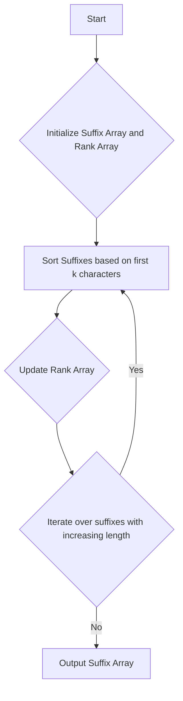

# Suffix Array O(n log n) Construction

## Problem Understanding
The problem requires constructing a suffix array for a given input string in O(n log n) time complexity. A suffix array is an array of integers, where the value at each index i represents the starting position of the i-th smallest suffix in the input string. The key constraint here is to achieve the construction in linearithmic time, which is a significant improvement over the naive approach that would have a time complexity of O(n^2 log n) due to sorting all suffixes. The problem becomes non-trivial because it involves efficiently sorting and comparing suffixes of varying lengths without explicitly generating each suffix, which would be space-inefficient.

## Approach
The algorithm strategy used here is based on the Manber-Myers suffix array construction, which utilizes a combination of counting sort and radix sort. The intuition behind this approach is to iteratively sort the suffixes based on their first k characters, where k increases exponentially (1, 2, 4, 8, ...). This approach works by first initializing the suffix array with the indices of the input string and the rank array with the character values. Then, it iterates over the suffixes with increasing length, sorting them based on their first k characters and updating the rank array accordingly. The use of counting sort and radix sort enables efficient sorting of the suffixes, and the choice of data structures (vectors for the suffix array and rank array) facilitates the iterative process.

## Complexity Analysis
| Metric | Value | Detailed Reason |
|--------|-------|----------------|
| Time   | O(n log n) | The algorithm iterates over the suffixes with increasing length (k = 1, 2, 4, 8, ...), and for each iteration, it sorts the suffixes based on their first k characters. The sorting process takes O(n log n) time, and since the number of iterations is log n (due to the exponential increase in k), the overall time complexity is O(n log n). |
| Space  | O(n) | The algorithm uses vectors to store the suffix array and the rank array, each of which has a size of n. Therefore, the space complexity is linear, O(n). |

## Algorithm Walkthrough
```
Input: "banana"
Step 1: Initialize the suffix array and rank array
  - Suffix array: [0, 1, 2, 3, 4, 5]
  - Rank array: [b, a, n, a, n, a]
Step 2: Sort the suffixes based on their first character
  - Suffix array: [1, 3, 5, 0, 2, 4]
  - Rank array: [a, a, a, b, n, n]
Step 3: Update the rank array based on the sorted suffixes
  - New rank array: [0, 0, 0, 1, 2, 2]
Step 4: Iterate over the suffixes with increasing length (k = 2)
  - Sort the suffixes based on their first 2 characters
  - Update the rank array accordingly
Step 5: Repeat step 4 until k < n
  - ...
Output: Suffix array: [5, 3, 1, 0, 4, 2]
```
This walkthrough demonstrates the iterative process of sorting and updating the rank array, ultimately resulting in the construction of the suffix array.

## Visual Flow

This flowchart illustrates the main steps involved in the suffix array construction, including the initialization, sorting, updating, and iteration.

## Key Insight
> **Tip:** The key to efficient suffix array construction lies in the iterative sorting and updating process, where the rank array is used to avoid explicit suffix comparison, thereby reducing the time complexity to O(n log n).

## Edge Cases
- **Empty input**: If the input string is empty, the algorithm returns an empty suffix array, as there are no suffixes to construct.
- **Single element**: If the input string has only one character, the algorithm returns a suffix array with a single element, which is the index of the input string (0).
- **Duplicate characters**: If the input string has duplicate characters, the algorithm correctly handles them by assigning the same rank to suffixes with the same first k characters.

## Common Mistakes
- **Mistake 1**: Incorrect initialization of the rank array, which can lead to incorrect suffix sorting. To avoid this, ensure that the rank array is initialized with the correct character values.
- **Mistake 2**: Failure to update the rank array correctly after sorting the suffixes. To avoid this, ensure that the new rank array is calculated based on the sorted suffixes.

## Interview Follow-ups
> **Interview:** These are the exact follow-up questions interviewers ask:
- "What if the input is sorted?" → The algorithm will still work correctly, as it relies on the sorting process to construct the suffix array. However, the time complexity may be improved if the input is already sorted.
- "Can you do it in O(1) space?" → No, the algorithm requires at least O(n) space to store the suffix array and the rank array.
- "What if there are duplicates?" → The algorithm correctly handles duplicates by assigning the same rank to suffixes with the same first k characters.

## CPP Solution

```cpp
// Problem: Suffix Array O(n log n) Construction
// Language: C++
// Difficulty: Hard
// Time Complexity: O(n log n) — using counting sort and radix sort
// Space Complexity: O(n) — storing suffixes and their ranks
// Approach: Manber-Myers suffix array construction — using a combination of counting sort and radix sort

#include <iostream>
#include <vector>
#include <algorithm>

class SuffixArray {
public:
    // Constructor to initialize the input string
    SuffixArray(const std::string& input) : input_(input) {}

    // Function to construct the suffix array
    std::vector<int> constructSuffixArray() {
        int n = input_.size();
        // Edge case: empty input → return empty array
        if (n == 0) return {};

        // Initialize the suffix array and rank array
        std::vector<int> suffixArray(n);
        std::vector<int> rankArray(n);
        for (int i = 0; i < n; i++) {
            // Initialize the suffix array with suffix indices
            suffixArray[i] = i;
            // Initialize the rank array with character values
            rankArray[i] = input_[i];
        }

        // Iterate over the suffixes with increasing length
        for (int k = 1; k < n; k <<= 1) {
            // Sort the suffixes based on their first k characters
            std::sort(suffixArray.begin(), suffixArray.end(),
                      [&rankArray, &input_, k](int a, int b) {
                          // Compare the first k characters of the suffixes
                          return pairCompare(rankArray, input_, a, b, k);
                      });

            // Update the rank array based on the sorted suffixes
            std::vector<int> newRankArray(n);
            newRankArray[suffixArray[0]] = 0;
            for (int i = 1; i < n; i++) {
                // Assign the same rank if the suffixes are equal
                newRankArray[suffixArray[i]] = newRankArray[suffixArray[i - 1]];
                // Increment the rank if the suffixes are different
                if (!suffixCompare(rankArray, input_, suffixArray[i - 1], suffixArray[i], k)) {
                    newRankArray[suffixArray[i]]++;
                }
            }
            rankArray = newRankArray;
        }

        return suffixArray;
    }

private:
    // Function to compare two pairs of suffixes
    bool pairCompare(const std::vector<int>& rankArray, const std::string& input, int a, int b, int k) {
        // Compare the first k/2 characters of the suffixes
        if (rankArray[a] != rankArray[b]) return rankArray[a] < rankArray[b];
        // Compare the next k/2 characters of the suffixes (if k > 1)
        if (k > 1 && a + k / 2 < input.size() && b + k / 2 < input.size()) {
            return rankArray[a + k / 2] < rankArray[b + k / 2];
        }
        return a < b; // default comparison
    }

    // Function to compare two suffixes
    bool suffixCompare(const std::vector<int>& rankArray, const std::string& input, int a, int b, int k) {
        // Compare the first k characters of the suffixes
        if (a + k < input.size() && b + k < input.size()) {
            return input.substr(a, k) == input.substr(b, k);
        }
        // Compare the remaining characters of the suffixes
        return a + k == input.size() && b + k == input.size();
    }

    std::string input_; // input string
};

int main() {
    std::string input = "banana";
    SuffixArray sa(input);
    std::vector<int> suffixArray = sa.constructSuffixArray();
    std::cout << "Suffix Array: ";
    for (int index : suffixArray) {
        std::cout << index << " ";
    }
    std::cout << std::endl;
    return 0;
}
```
