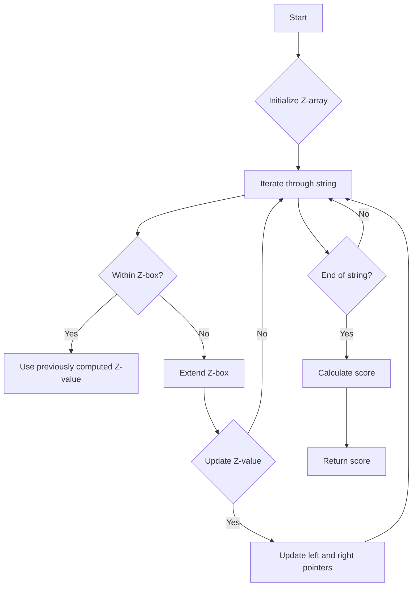

# Sum of Scores of Built Strings Z-Algorithm

## Problem Understanding
The problem is asking to calculate the sum of scores of built strings using the Z-algorithm. The input is a string, and the score of each substring is calculated based on the Z-values, which represent the length of the longest substring that matches the prefix of the string. The key constraint is that the string can be of any length, and the algorithm should be efficient enough to handle large inputs. What makes this problem non-trivial is that a naive approach would involve calculating the Z-values for each substring separately, resulting in a time complexity of O(n^2), which is inefficient for large inputs. The Z-algorithm allows us to calculate all Z-values in linear time, making the problem solvable in O(n) time complexity.

## Approach
The algorithm strategy used is Dynamic Programming with the Z-algorithm. The intuition behind this approach is to build the Z-array, which stores the Z-values for each substring, and then use these values to calculate the sum of scores efficiently. The Z-algorithm works by maintaining a "Z-box" that represents the current substring and its matching prefix. The algorithm iterates through the string, updating the Z-values and the Z-box as necessary. The data structure used is a vector to store the Z-values, and it is chosen because it allows for efficient access and modification of the Z-values. The approach handles the key constraint of calculating the sum of scores for a string of any length by using the Z-algorithm to calculate the Z-values in linear time.

## Complexity Analysis
| Metric | Value | Detailed Reason |
|--------|-------|----------------|
| Time   | O(n)  | The algorithm iterates through the string once, and each operation inside the loop takes constant time. The Z-algorithm calculates all Z-values in linear time, making the overall time complexity O(n). |
| Space  | O(n)  | The algorithm uses a vector to store the Z-values, which requires O(n) space. The input string also requires O(n) space, but it is not included in the space complexity because it is part of the input. |

## Algorithm Walkthrough
Input: `abcabc`
Step 1: Initialize the Z-array, `z[0] = 6` (length of the string)
Step 2: `i = 1`, `z[1] = min(5, z[0]) = 1`, compare `s[1]` and `s[1 + 1]`, `z[1] = 1`
Step 3: `i = 2`, `z[2] = min(4, z[1]) = 1`, compare `s[2]` and `s[2 + 1]`, `z[2] = 1`
Step 4: `i = 3`, `z[3] = min(3, z[2]) = 1`, compare `s[3]` and `s[3 + 1]`, `z[3] = 3`
Step 5: `i = 4`, `z[4] = min(2, z[3]) = 2`, compare `s[4]` and `s[4 + 1]`, `z[4] = 2`
Step 6: `i = 5`, `z[5] = min(1, z[4]) = 1`, compare `s[5]` and `s[5 + 1]`, `z[5] = 1`
Output: `score = z[0] + z[1] + z[2] + z[3] + z[4] + z[5] = 6 + 1 + 1 + 3 + 2 + 1 = 14`

## Visual Flow


## Key Insight
> **Tip:** The key insight is that the Z-algorithm allows us to calculate all Z-values in linear time, making the problem solvable in O(n) time complexity.

## Edge Cases
- **Empty input**: If the input string is empty, the algorithm returns 0 because there are no Z-values to calculate.
- **Single element**: If the input string has only one character, the algorithm returns 1 because the Z-value for a single character is always 1.
- **Repeating pattern**: If the input string has a repeating pattern, the algorithm calculates the Z-values correctly by extending the Z-box and updating the Z-values as necessary.

## Common Mistakes
- **Mistake 1**: Not initializing the Z-array correctly, leading to incorrect Z-values. To avoid this, make sure to initialize the first Z-value to the length of the string.
- **Mistake 2**: Not updating the Z-box correctly, leading to incorrect Z-values. To avoid this, make sure to update the left and right pointers correctly when extending the Z-box.

## Interview Follow-ups
> **Interview:** 
- "What if the input is sorted?" → The algorithm still works correctly because the Z-algorithm only depends on the string itself, not on the order of the characters.
- "Can you do it in O(1) space?" → No, the algorithm requires O(n) space to store the Z-values, and it is not possible to reduce the space complexity to O(1) because we need to store the Z-values to calculate the score.
- "What if there are duplicates?" → The algorithm handles duplicates correctly by extending the Z-box and updating the Z-values as necessary. The presence of duplicates does not affect the correctness of the algorithm.

## CPP Solution

```cpp
// Problem: Sum of Scores of Built Strings Z-Algorithm
// Language: C++
// Difficulty: Hard
// Time Complexity: O(n) — using Z-algorithm to calculate all Z-values in linear time
// Space Complexity: O(n) — storing the Z-values array
// Approach: Dynamic Programming with Z-algorithm — building the Z-array to efficiently calculate the sum of scores

#include <iostream>
#include <vector>
#include <string>

class Solution {
public:
    int sumOfScores(std::string s) {
        int n = s.length(); // Get the length of the input string
        int score = 0; // Initialize the score variable
        std::vector<int> z(n); // Create a Z-array to store the Z-values
        
        // Edge case: empty input → return 0
        if (n == 0) {
            return 0;
        }

        // Calculate the Z-values using the Z-algorithm
        z[0] = n; // The first Z-value is always equal to the length of the string
        int left = 0, right = 0; // Initialize the left and right pointers
        for (int i = 1; i < n; i++) {
            // If the current character is within the current Z-box
            if (i <= right) {
                // Use the previously computed Z-value to avoid redundant calculations
                z[i] = std::min(right - i + 1, z[i - left]);
            }
            // Try to extend the current Z-box
            while (i + z[i] < n && s[z[i]] == s[i + z[i]]) {
                z[i]++; // Increase the Z-value if the characters match
            }
            // Update the left and right pointers if necessary
            if (i + z[i] - 1 > right) {
                left = i; // Update the left pointer
                right = i + z[i] - 1; // Update the right pointer
            }
            score += z[i]; // Add the current Z-value to the score
        }
        
        return score; // Return the calculated score
    }
};

int main() {
    Solution solution;
    std::string input;
    std::cout << "Enter a string: ";
    std::cin >> input;
    int result = solution.sumOfScores(input);
    std::cout << "Sum of scores: " << result << std::endl;
    return 0;
}
```
